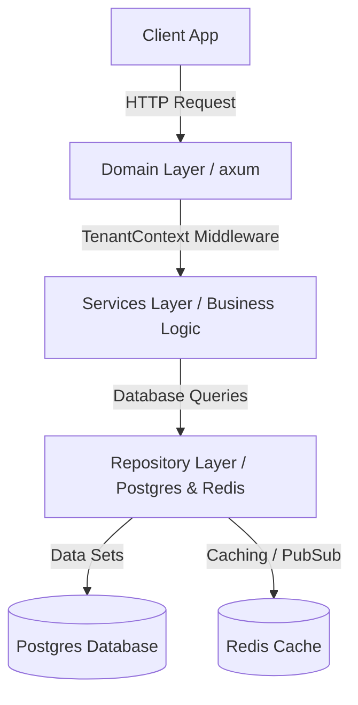

# 📘 Vidhyam Developer Manual & API Guidebook

**Vidhyam Developer Manual & API Guidebook** mein aapka swagat hai. Yeh guidebook Vidhyam School Management System backend ke architecture, data layers, aur API specifications ke liye ek matra source of truth (sahi jankari ka strot) hai.

> [!IMPORTANT]
> **RUST CODE KO PADHNE YA MODIFY KARNE SE PEHLE IS MANUAL KO ZAROOR PADHEIN.**
> Yeh guidebook backend ke exact working mechanics, routes, data flows, aur constraints ko samjhane ke liye design kiya gaya hai. Isse padh kar, developers aur AI coding agents ko backend se interact karne ki poori clarity mil jayegi, aur unhe source files ko reverse-engineer karne ki zaroorat nahi padegi.

---

## 🏗️ Core Architectural Principles (Buniyadi Dhaancha)

Vidhyam backend ek high-performance, multitenant school management platform hai jise Rust aur **Axum** framework se banaya gaya hai. Yeh ek strict 3-tier architecture follow karta hai:
1. **Domain Layer (`src/domain/`)**: Axum routing nodes declare karta hai, incoming requests validate karta hai, aur HTTP response serialization handle karta hai.
2. **Services Layer (`src/services/`)**: Business logic implement karta hai (jaise syllabus planning, geofenced tracking, aur exam autogeneration).
3. **Repository Layer (`src/repository/`)**: Postgres database se contact aur Redis caches ko manage karta hai.



### 🔑 Multitenancy aur Row-Level Security (RLS)
System ek shared-database multitenant structure par bana hai. Har ek school (tenant) ko alag karne ke liye unique `schoolId` ka use hota hai. 
- Axum route handlers `schoolId` parameter ya `X-School-ID` header ko extract karte hain.
- `TenantContext` middleware isse transaction-level Row-Level Security context mein convert karta hai.
- Saari database queries mein active tenant ka `school_id` filter hona **MUST** hai.

---

## 🚦 The Developer Laws (Niyam jo follow karne hain)

Code saaf rakhne aur bugs se bachne ke liye, har developer (chahe human ho ya AI) ko inn **Developer Laws** ko follow karna hoga:

### 🚫 Law 1: Duplicate Endpoints banana sakht mana hai
Agar pehle se koi endpoint exist karta hai jo kaam kar sakta hai, toh naya endpoint **MAT** banayein. 
*Naya route banane se pehle [router_index.md](file:///c:/Users/User/Documents/modernisum/Backend/guides/intro/router_index.md) ko search karein.* Agar route pehle se hai, toh usi ko update karein.

### 🛡️ Law 2: Tenant Context Compliance compulsory hai
Bina tenant identity verify kiye database tables ko query ya change na karein. Har query school context se bound honi chahiye. Isse bypass karna ek badi security vulnerability hai.

### 🔄 Law 3: Code aur Guidebook hamesha match hone chahiye
Agar aap Rust domain handlers mein route, request payload ya response change karte hain, toh aapko `.md` guide file ko bhi turant update karna **HOGA**. Guides hamesha code se sync rehni chahiye.

### 📦 Law 4: Standard Response format follow karein
Har HTTP endpoint se standardized response hi return hona chahiye:
- **Success:** `200 OK` or `201 Created` with body:
  ```json
  { "success": true, "data": { ... } }
  ```
- **Error:** Standard HTTP status codes (e.g., `400 Bad Request`, `401 Unauthorized`, `429 Too Many Requests`, `500 Internal Error`) with body:
  ```json
  { "success": false, "message": "Detailed error message" }
  ```

---

## 🔒 Data Classification aur Privacy Policy (DPDPA 2023 / GDPR Compliance)

Vidhyam backend system modern data privacy and safety regulations (jaise India's DPDPA 2023 aur GDPR) ko fully comply karta hai. System ke andar saare database fields ko **7 Major Categories** aur **5 Sensitivity Levels** mein divide kiya gaya hai:

### 1. Data Categories:
- **Student Data (Highly Restricted/Confidential):** Aadhaar numbers, health records, contact details, aur home address jaise sensitive details AES-256-GCM ke zariye encrypted rehte hain.
- **Employee Data (Highly Restricted/Restricted):** Staff bank details, Aadhaar, PAN card numbers, aur salaries fully encrypted rehte hain.
- **Academic & Curriculum Data (Restricted/Confidential):** Question papers, answer keys, and student scorecards secure encryption limits ke under store hote hain.
- **Financial & Administrative Data (Restricted/Confidential):** Transactions ledger details, payments invoices aur accounting entries ko safe check records mein store kiya jata hai.
- **Infrastructure & Operations (Internal/Confidential):** CCTV/Security system access checks, vehicle tracking GPS locations, aur assets lists ko internal limits par rakha jata hai.
- **Communication & Documentation (Internal/Public):** Real-time chats, notifications alerts, aur official documents.
- **Compliance & Legal (Restricted/Confidential):** Legal agreements, system audits, aur settings modification logs.

### 2. Encryption Levels:
- **Highly Restricted / Restricted:** Inhe strictly AES-256-GCM encryption with HSM-backed keys aur rotation policies ke sath secure kiya jata hai (jaise Aadhaar, PAN, Bank Accounts, aur Exam Papers).
- **Confidential / Internal:** Basic encrypt standards (AES-128-GCM) apply kiye jate hain (jaise student performance, contact details, aur geofence checks).
- **Public:** Plaintext records (jaise blog posts, general announcements, aur testimonials).

---

## 📖 Guidebook Directory Index (Sari Guides ki List)

Apna chahita domain select karein aur details dekhein:

- **1. Core Directory:**
  - [router_index.md](file:///c:/Users/User/Documents/modernisum/Backend/guides/intro/router_index.md) — Universal map of all registered endpoints
  - [architecture.md](file:///c:/Users/User/Documents/modernisum/Backend/guides/intro/architecture.md) — System data flow, RLS propagation, and DB models
- **2. Security & Onboarding:**
  - [auth_guide.md](file:///c:/Users/User/Documents/modernisum/Backend/guides/auth/auth_guide.md) — User login, multi-role selector, and support channels
  - [admin_guide.md](file:///c:/Users/User/Documents/modernisum/Backend/guides/admin/admin_guide.md) — Super-admin panel controls, promotions, and school CRUD
  - [cms_guide.md](file:///c:/Users/User/Documents/modernisum/Backend/guides/cms/cms_guide.md) — Public pages, blogs management, and testimonials
- **3. School Operations:**
  - [people_guide.md](file:///c:/Users/User/Documents/modernisum/Backend/guides/people/people_guide.md) — Student/Employee registries, validations, and payroll stubs
  - [academic_guide.md](file:///c:/Users/User/Documents/modernisum/Backend/guides/academic/academic_guide.md) — Exams, grading, timetable conflicts, and syllabus microplanning
  - [finance_guide.md](file:///c:/Users/User/Documents/modernisum/Backend/guides/finance/finance_guide.md) — Fee billing structures, Razorpay webhooks, and coupons
  - [attendance_guide.md](file:///c:/Users/User/Documents/modernisum/Backend/guides/attendance/attendance_guide.md) — Roll call, geofenced QR check-in, leave workflows, and coverage
  - [resources_guide.md](file:///c:/Users/User/Documents/modernisum/Backend/guides/resources/resources_guide.md) — Classroom spaces, asset stock inventory, and file storage
- **4. Communications & Integration:**
  - [communication_guide.md](file:///c:/Users/User/Documents/modernisum/Backend/guides/communication/communication_guide.md) — WebSockets channels, chat history, and webhooks push logs
  - [operations_guide.md](file:///c:/Users/User/Documents/modernisum/Backend/guides/operations/operations_guide.md) — Task boards, responsibilities utilization metrics, and transport GPS
  - [system_guide.md](file:///c:/Users/User/Documents/modernisum/Backend/guides/system/system_guide.md) — Recovery audits, developer sandbox permissions, and health status