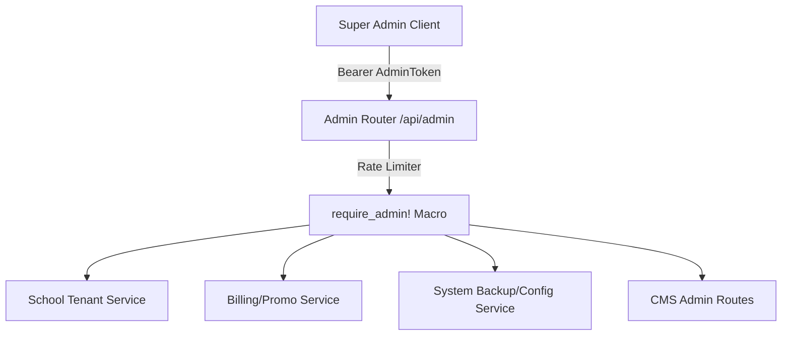

# 👑 Chapter 3: Platform Admin Domain Manual

Yeh manual super-administrator control panel, school tenant onboarding managers, billing adjustments, database backups, support tickets, global notifications, aur CMS administration APIs ko manage aur describe karta hai.

## Fresher Developer Quick Links

- `README.md` — Admin guide index aur auth/response conventions.
- `endpoint_reference.md` — `rust/src/domain/admin/mod.rs` ke har endpoint ki expected request/response details.
- `test_cases.md` — Har admin endpoint ke liye manual/API test cases aur curl examples.
- `implementation_plan.md` — Naya admin endpoint add/modify karte waqt follow karne wala implementation plan.

---

## 📖 Overview aur Features (Udeshya aur Suvidhayein)

### 🎯 Feature Purpose (Kyun banaya gaya hai)

Super-admins ko school instances manage karne, tenant settings configure karne, aur cross-school analytics dekhne ki suvidha deta hai. Yeh platform owners ke liye control room ki tarah kaam karta hai.

Platform Admin domain Vidhyam multi-tenant SaaS platform ko manage karne ke liye tools aur settings provide karta hai:

- **Tenant Management:** School tenants ko list/get/update/delete, suspend/block, password reset, session expiry, aur notification management.
- **Billing Controls:** Promo codes, school promo application, wallet ledger, aur manual refunds.
- **System Backups:** School/all-school JSON export, school import, aur manual backup trigger.
- **Support Resolutions:** Onboarding/login support tickets ko list aur resolve karna.
- **Global Notifications:** Sabhi schools ke liye global notification set/clear karna.
- **CMS Control:** Blogs, testimonials, aur school access requests ko admin side se manage karna.

---

## 🏗️ Architecture aur Data Flow

### 🛠️ Tech Stack aur Dependencies

- **Framework:** Axum
- **Database:** Postgres (sqlx)
- **Macros:** Custom `require_admin!` macro for admin bearer token authorization.
- **Rate Limit:** Admin route group has an admin rate limiter middleware.

### 🌊 Deep Code aur Data Flow

1. **Request:** Super-admin `/api/admin/...` route par request bhejta hai.
2. **Middleware:** Admin rate limiter request ko throttle karta hai.
3. **Authorization:** Protected handlers `require_admin!` se `Authorization: Bearer <token>` verify karte hain.
4. **Handler:** `rust/src/domain/admin/*.rs` request validate karta hai aur service/repository flow call karta hai.
5. **Service:** `rust/src/services/admin/*.rs` business logic handle karta hai.
6. **Response:** Most endpoints `{"success": true, "data": ...}` return karte hain; exports file attachment return karte hain.

- **Route Module:** `rust/src/domain/admin/mod.rs`
- **Handler Files:** `rust/src/domain/admin/auth.rs`, `school.rs`, `promo.rs`, `billing.rs`, `support.rs`, `system.rs`
- **Nested CMS Routes:** `rust/src/domain/cms/admin_routes`
- **Services:** `rust/src/services/admin/`
- **Repositories:** `rust/src/repository/admin/`, `rust/src/repository/traits/`, `rust/src/repository/cms/`
- **Database Tables:** `schools`, `school_billing_ledgers`, `support_tickets`, `referral_coupons`, `active_user_sessions`, `blogs`, `testimonials`, `school_access_requests`



---

## 🚦 Developer Laws (Do's aur Don'ts - Kya karein aur kya na karein)

- **DO:** Protect all endpoints under `/api/admin` using `require_admin!`, except `POST /api/admin/login`.
- **DO:** Keep route declarations in `rust/src/domain/admin/mod.rs` grouped by domain: Auth, Stats, Promos, Config, Schools, Support, System, CMS.
- **DO:** Return `ok_json!` for success and `err_json!` for service/repository failures unless the endpoint intentionally returns a file.
- **DO:** Validate required fields in handlers before calling services.
- **DO:** Mark destructive tests as disposable/test-only, especially delete school, expire sessions, backup, and import.
- **DON'T:** Hardcode platform administrator credentials. Use migrations/seeds/env for super-admin initialization.
- **DON'T:** Execute bulk deletion of tenant data without verifying the school id and non-deleted status.
- **DON'T:** Assume all service failures are `400`; many current handlers return `500 INTERNAL_SERVER_ERROR` through `err_json!`.

---

## 🔌 API Reference aur Specs (API Ki Jankari)

`rust/src/domain/admin/mod.rs` ke har endpoint ka detailed request contract, expected success/error response, status-code notes, aur test case ids in files mein maintain hote hain:

- [Endpoint Reference](./endpoint_reference.md)
- [Test Cases](./test_cases.md)
- [Implementation Plan](./implementation_plan.md)

Current-code notes:

- `POST /api/admin/login` returns `accessToken` and `message` at top level, not inside `data`.
- `POST /api/admin/promos` returns `data.success` and `data.message` because the service returns a wrapped success object.
- `POST /api/admin/schools/:schoolId/apply-promo` returns `data.success` and `data.message`.
- `POST /api/admin/schools/:schoolId/refund` returns `data.success`, `data.newBalance`, and `data.message`.
- `POST /api/admin/schools/:schoolId/import` returns `data.success`, `data.imported`, and `data.message`.
- `GET /api/admin/schools/export/all` and `GET /api/admin/schools/:schoolId/export` return JSON file attachments with `Content-Disposition`.
- `POST /api/admin/schools/:schoolId/refund` currently returns `500` for invalid amount because the handler uses `err_json!`.

---

## 🧪 Testing Guidance

Use `guides/admin/test_cases.md` as the manual/API checklist. Minimum coverage for any changed admin endpoint:

1. Success case with valid admin bearer token.
2. Missing/invalid auth case for protected endpoints.
3. Missing required field case for request-body endpoints.
4. Invalid value case for validated fields.
5. Service/repository failure case when easy to simulate.

Run local checks after code changes:

```bash
cargo fmt
cargo check
```

If a test database setup exists, run migrations/seeds before executing manual API tests.
