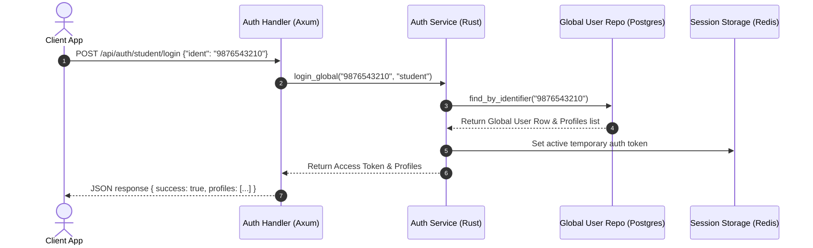

# 🔑 Chapter 2: Authentication & Onboarding Domain Manual

Yeh manual authentication, role profile selection, credentials management, school onboarding, aur device registry APIs ke liye single source of truth (sahi jankari ka strot) hai. Frontend developers is guide se sahi endpoints identify kar sakte hain, aur AI agents isse exact request/response schemas samajh sakte hain.

---

## 📖 Overview aur Features (Udeshya aur Suvidhayein)

### 🎯 Feature Purpose (Kyun banaya gaya hai)
Secure authentication, session management, aur role-based access control (RBAC) provide karta hai. Yeh isliye banaya gaya hai taaki sirf verified users (students, teachers, admins) hi system access kar sakein aur data safe rahe.


Authentication domain credential validation, security verification, role resolving, aur onboarding workflow processes ko handle karta hai.
- **Login Gateways:** Users ko unke type (`student`, `employee`, `schooladmin`) ke basis par authenticate karta hai.
- **Profile Selector:** Ek single global login (email/phone) ko multiple user profiles mein resolve karne ki suvidha deta hai (jaise koi employee jo parent bhi hai, ya multiple schools mein padhata hai).
- **Onboarding Setup:** Naye school accounts setup karta hai aur checklists initialize karta hai.
- **Device Registries:** Push notifications ke liye FCM/device tokens ko register karne deta hai.

---

## 🏗️ Architecture aur Data Flow

### 🛠️ Tech Stack aur Dependencies
- **Framework:** Axum
- **Database:** Postgres (sqlx)
- **Caching/Sessions:** Redis (redis-rs)
- **Security:** Argon2 for password hashing, JWT (jsonwebtoken) for stateless auth tokens, OAuth2 crates for SSO.
- **Utilities:** uuid for token tracking.

### 🌊 Deep Code aur Data Flow
1. **Request:** Client user details/token `auth.rs` par bhejta hai.
2. **Validation:** `auth.rs` payload nikalta hai aur middleware `schoolId` verify karta hai.
3. **Service Logic:** `services/auth/` Argon2 password hash check karta hai ya Redis session verify karta hai.
4. **Database:** Postgres se user role aur permissions check hoti hain.
5. **Response:** Naya JWT generate hokar return hota hai aur session Redis mein cache ho jata hai.


- **Route Module:** `src/domain/auth/mod.rs`
- **Handler Files:** `src/domain/auth/auth.rs`, `src/domain/auth/setup.rs`, `src/domain/auth/school.rs`
- **Services:** `src/services/auth/`, `src/services/setup/`, `src/services/school/`
- **Repositories:** `src/repository/auth/auth_repo.rs`, `src/repository/auth/global_user_repo.rs`
- **Database Tables:** `users`, `schools`, `user_device_tokens`, `onboarding_status`, `user_activity_logs`



---

## 🚦 Developer Laws (Do's aur Don'ts - Kya karein aur kya na karein)

- **DO:** Block brute-force attacks se bachne ke liye check karein ki `/api/auth` routes par auth rate limit configured hai. Current code mein auth limiter `5 requests/minute/IP` hai aur 429 response deta hai.
- **DO:** Request bodies mein email aur phone number formats ko validate karein.
- **DON'T:** API responses mein password hashes, salt values, ya internal security answers jaise sensitive details kabhi return na karein.
- **DON'T:** Passwords ko kabhi cleartext mein store na karein. Hashing services layer mein Bcrypt/Argon2 ke zariye hoti hai.

---

## 🔌 API Reference aur Specs (API Ki Jankari)

Detailed expected response contracts aur test cases split docs mein maintain hote hain. Freshers ko pehle `guides/auth/api/00-index.md` read karna chahiye, phir endpoint group files read karni chahiye.

- [Auth API Contract Index](./api/00-index.md)
- [Login](./api/01-login.md)
- [Profile Selection](./api/02-profile-selection.md)
- [Support Request](./api/03-support.md)
- [Token, Logout, Security](./api/04-token-logout-security.md)
- [Password Recovery](./api/05-password-recovery.md)
- [Device Registration](./api/06-device-registration.md)
- [Setup](./api/07-setup.md)
- [School Self Management](./api/08-school-self-management.md)
- [Test Case Format](./api/09-test-case-format.md)
- [Test Data](./api/10-test-data.md)

Important current-code notes:

- `POST /api/auth/school/change-password` is public in current RLS middleware, but business logic still validates old password. Treat this as a credential-mutation surface that must be rate-limited and monitored.
- `POST /api/auth/school/support` is handled by `admin::create_support_request`.
- `POST /api/auth/setup/school` returns raw setup data if automatic login fails; public setup responses must not expose credentials and should be hardened before production rollout.
- `POST /api/auth/register-device` requires bearer auth under current RLS; handler can resolve `schoolId` and `userId` from that token when they are not supplied.

Below is a compact overview. For implementation and test source-of-truth, use the split API contract files above.

### 1. User Login Gateway
User ko authenticate karta hai aur ek bearer access token issue karta hai.
- **Endpoint:** `POST /api/auth/:userType/login`
- **Authentication:** None (Public)
- **Path Parameters:**
  - `userType` (string, required): Options are `student`, `employee`, `schooladmin`, or `school`.
- **Request Body (For `student` / `employee`):**
  ```json
  {
    "ident": "9876543210"
  }
  ```
- **Request Body (For `schooladmin` / `school`):**
  ```json
  {
    "schoolId": "SCH-00021",
    "password": "mySecurePassword"
  }
  ```
- **Success Response (Student/Employee):**
  ```json
  {
    "success": true,
    "message": "Login successful",
    "accessToken": "eyJhbGciOiJIUzI1Ni...",
    "expiresIn": "24h",
    "profiles": [
      {
        "schoolId": "SCH-00021",
        "userId": "STD-99882",
        "userType": "student",
        "name": "Jane Doe"
      }
    ]
  }
  ```
- **Success Response (School Admin):**
  ```json
  {
    "success": true,
    "message": "Login successful",
    "schoolId": "SCH-00021",
    "schoolName": "Vidhyam High School",
    "accessToken": "eyJhbGciOiJIUzI1Ni...",
    "expiresIn": "1h"
  }
  ```
- **Error Response (401 Unauthorized):**
  ```json
  {
    "success": false,
    "message": "Invalid password"
  }
  ```
- **Curl Verification:**
  ```bash
  curl -s -X POST http://localhost:8080/api/auth/schooladmin/login \
    -H "Content-Type: application/json" \
    -d '{"schoolId":"SCH-00021","password":"mySecurePassword"}' | jq .
  ```

---

### 2. Multi-Profile Selection
Multiple profiles wale user (jaise do branches mein padhane wale) ko apna active session select karne deta hai.
- **Endpoint:** `POST /api/auth/:schoolId/user/select-profile`
- **Authentication:** Bearer Token
- **Path Parameters:**
  - `schoolId` (string, required): Target school ID.
- **Request Body:**
  ```json
  {
    "ident": "9876543210",
    "userId": "EMP-00109",
    "userType": "employee"
  }
  ```
- **Success Response:**
  ```json
  {
    "success": true,
    "token": "eyJhbGciOiJIUzI1Ni..."
  }
  ```
- **Curl Verification:**
  ```bash
  curl -s -X POST http://localhost:8080/api/auth/SCH-00021/user/select-profile \
    -H "Authorization: Bearer <token>" \
    -H "Content-Type: application/json" \
    -d '{"ident":"9876543210","userId":"EMP-00109","userType":"employee"}'
  ```

---

### 3. File Onboarding Support Ticket
Agar onboarding ya login fail hota hai, toh users ko support ticket file karne deta hai.
- **Endpoint:** `POST /api/auth/school/support`
- **Authentication:** None (Public)
- **Request Body:**
  ```json
  {
    "schoolId": "SCH-00021",
    "contactInfo": "help@school.com",
    "issueCategory": "onboarding_failure",
    "description": "Stuck on setting up standard calendar templates."
  }
  ```
- **Success Response:**
  ```json
  {
    "success": true,
    "data": "Support request submitted"
  }
  ```

---

### 4. Verify Authorization Token
JWT authenticity ko verify karta hai.
- **Endpoint:** `POST /api/auth/school/verify-token`
- **Authentication:** None
- **Request Body:**
  ```json
  {
    "token": "eyJhbGciOiJIUzI1Ni..."
  }
  ```
- **Success Response:**
  ```json
  {
    "success": true,
    "message": "Token valid",
    "token": {
      "sub": "admin_test",
      "role": "school-admin",
      "schoolId": "SCH-00021"
    }
  }
  ```

---

### 5. Session Logout
User session ko terminate karta hai aur JWT token ko revoke karta hai.
- **Endpoint:** `POST /api/auth/school/logout`
- **Authentication:** Bearer Token
- **Success Response:**
  ```json
  {
    "success": true,
    "message": "Logged out, token revoked"
  }
  ```

---

### 6. Set Security Question
Password recovery ke liye security details setup karta hai.
- **Endpoint:** `POST /api/auth/school/set-security`
- **Authentication:** Bearer Token
- **Request Body:**
  ```json
  {
    "schoolId": "SCH-00021",
    "question": "What was the name of your first school?",
    "answer": "St. Marys"
  }
  ```
- **Success Response:**
  ```json
  {
    "success": true,
    "message": "Security question set"
  }
  ```

---

### 7. Verify Multi-Factor OTP
Login OTP ya identity token ko validate karta hai.
- **Endpoint:** `POST /api/auth/school/verify-otp`
- **Authentication:** None
- **Request Body:**
  ```json
  {
    "idToken": "123456"
  }
  ```
- **Success Response:**
  ```json
  {
    "success": true,
    "message": "OTP verified successfully",
    "user": {
      "uid": "STD-99882",
      "email": "jane.doe@school.com"
    }
  }
  ```

---

### 8. Forgot Password Recovery
Agar security answer match karta hai, toh temporary login password generate karta hai.
- **Endpoint:** `POST /api/auth/school/forgot-password`
- **Authentication:** None
- **Request Body:**
  ```json
  {
    "schoolId": "SCH-00021",
    "answer": "St. Marys"
  }
  ```
- **Success Response:**
  ```json
  {
    "success": true,
    "message": "Temporary password generated. Use it to login and change your password.",
    "tempPassword": "TEMP-992-XYZ"
  }
  ```

---

### 9. Change Password
School portal administrative credentials ko change karta hai.
- **Endpoint:** `POST /api/auth/school/change-password`
- **Authentication:** Public according to current RLS middleware; relies on old-password validation and should be rate-limited/monitored.
- **Request Body:**
  ```json
  {
    "schoolId": "SCH-00021",
    "oldPassword": "tempPassword",
    "newPassword": "superNewPassword123"
  }
  ```
- **Success Response:**
  ```json
  {
    "success": true,
    "message": "Password updated successfully"
  }
  ```

---

### 10. Register Device Token
Push notifications receive karne ke liye device FCM token register karta hai.
- **Endpoint:** `POST /api/auth/register-device`
- **Authentication:** Bearer Token required by current RLS; identity parameters can be resolved from token.
- **Request Body:**
  ```json
  {
    "schoolId": "SCH-00021",
    "userId": "STD-99882",
    "fcmToken": "fcm_token_string_here",
    "deviceType": "android",
    "deviceId": "dev_id_hash"
  }
  ```
- **Success Response:**
  ```json
  {
    "success": true,
    "message": "Device registered successfully"
  }
  ```

---

### 11. Complete Onboarding Setup
Naye registered school setup ko initialize karta hai.
- **Endpoint:** `POST /api/auth/setup/school`
- **Authentication:** Bearer Token required by current RLS middleware.
- **Request Body:**
  ```json
  {
    "schoolName": "Green Valley Academy",
    "schoolAddress": "128 Main Street, City",
    "password": "adminPassword123",
    "adminEmail": "admin@greenvalley.com",
    "adminPhone": "+919876543210",
    "classLevelStart": 1,
    "classLevel": 10
  }
  ```
- **Success Response:**
  ```json
  {
    "success": true,
    "schoolId": "123456",
    "schoolCode": "SCH0025",
    "accessToken": "eyJhbGciOiJIUzI1Ni...",
    "message": "School setup completed and signed in automatically"
  }
  ```

---

### 12. Retrieve School Details
School tenant parameters ke metadata specs ko fetch karta hai.
- **Endpoint:** `GET /api/school/:schoolId`
- **Authentication:** Bearer Token
- **Path Parameters:**
  - `schoolId` (string, required): School tenant.
- **Query Parameters:**
  - `filter` (string, optional): Filter sub-properties (e.g. `billing` or `contacts`).
- **Success Response:**
  ```json
  {
    "success": true,
    "data": {
      "schoolId": "SCH-00021",
      "schoolName": "Vidhyam High School",
      "address": "74 Park Avenue, City",
      "contactEmail": "admin@school.com",
      "sessionDurationHours": 720
    }
  }
  ```

---

### 13. Update School Profile
School details ko update karta hai.
- **Endpoint:** `PUT /api/school/:schoolId`
- **Authentication:** Bearer Token required by current RLS. Current code does not enforce same-tenant path/token matching; treat this as a current-code gap until guarded.
- **Path Parameters:**
  - `schoolId` (string, required): School tenant.
- **Request Body:**
  ```json
  {
    "schoolName": "Vidhyam High School - East Branch",
    "address": "78 Park Avenue, City"
  }
  ```
- **Success Response:**
  ```json
  {
    "success": true,
    "message": "School profile updated successfully"
  }
  ```

---

### 14. Change School Password (Self Reset)
Logged in school administrator ko credentials directly update karne deta hai.
- **Endpoint:** `PATCH /api/school/:schoolId`
- **Authentication:** Bearer Token required by current RLS. Current handler does not verify the token school matches `schoolId`; treat this as a current-code gap until guarded.
- **Path Parameters:**
  - `schoolId` (string, required): School tenant.
- **Request Body:**
  ```json
  {
    "newPassword": "newSecretPassword2026"
  }
  ```
- **Success Response:**
  ```json
  {
    "success": true,
    "message": "Password updated successfully"
  }
  ```

---

## 🕒 Update History aur Status (Badlavo ki History)

*Is section mein hum saare bade badlavo, design decisions, aur future plans ko track karte hain.*

- **Auto-Login:** Onboarding workflow endpoint `POST /api/auth/setup/school` now automatically generates a JWT bearer token and logs the user in upon successful bootstrapping.
- **Device tokens conflict safety:** Updated `ON CONFLICT` constraints in database insert for FCM tokens to correctly update `last_seen_at` without duplicate constraints.
