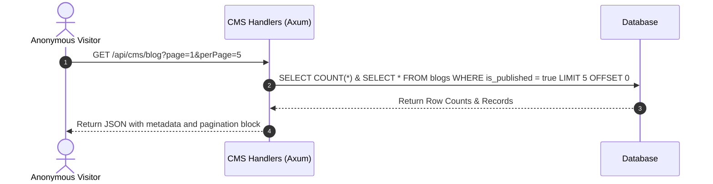

# 🌐 Chapter 4: Public CMS Domain Manual

This manual public Content Management System (CMS) endpoints ke liye hai, jo public landing pages, school onboarding inquiry forms, blogs, aur client testimonials ko handle karte hain.

---

## 📖 Overview aur Features (Udeshya aur Suvidhayein)

### 🎯 Feature Purpose (Kyun banaya gaya hai)
Website content, announcements, aur blogs manage karta hai. Yeh isliye hai taaki schools bina kisi mushkil ke apni online website par updates publish kar sakein.


Public CMS domain ke zariye unauthenticated visitors aur prospective school clients marketing content dekh sakte hain aur onboarding demo requests bhej sakte hain:
- **Blogs catalog:** Paginated blog posts ki list show karta hai jo tags aur categories ke hisab se filtered hoti hain.
- **Slug reader:** Clean URL links (slugs) ko fetch karke complete blog article content load karta hai.
- **Testimonial feed:** Purane clients (schools) ke reviews aur rating feedback display karta hai.
- **Onboarding form:** Landing page contact forms ke zariye data capture karke super-admin review pipeline mein forward karta hai.

---

## 🏗️ Architecture aur Data Flow

### 🛠️ Tech Stack aur Dependencies
- **Framework:** Axum
- **Database:** Postgres (sqlx) for storing HTML/Markdown content.
- **Storage:** S3/Local for media assets.

### 🌊 Deep Code aur Data Flow
1. **Request:** User blog posts padhne ya content update karne ki request bhejta hai.
2. **Service Logic:** `services/cms/` HTML/Markdown content ko sanitize aur fetch karta hai.
3. **Database:** `school_id` ke hisab se `cms_posts` query karta hai.
4. **Response:** Blog post list ya page content return hota hai.


- **Route Module:** `src/domain/cms/mod.rs`
- **Handler File:** `src/domain/cms/cms.rs`
- **Database Tables:** `blogs`, `testimonials`, `school_access_requests`



---

## 🚦 Developer Laws (Do's aur Don'ts - Kya karein aur kya na karein)

- **DO:** Sanitize input strings in the onboarding contact request form to prevent SQL Injection or Cross-Site Scripting (XSS).
- **DO:** Return empty arrays instead of 404 errors if a blog query returns no records for a specific category.
- **DON'T:** Never return draft or unpublished blog posts on the public `/api/cms/blog` route. Only administrators accessing `/api/admin/cms/` can retrieve unpublished logs.

---

## 🔌 API Reference aur Specs (API Ki Jankari)

### 1. List Public Blog Posts
Retrieves a paginated list of published blog posts.
- **Endpoint:** `GET /api/cms/blog`
- **Authentication:** None (Public)
- **Query Parameters:**
  - `page` (integer, optional): Page index (Default: `1`).
  - `per_page` (integer, optional): Count per feed (Default: `10`, clamped between `1` and `50`).
  - `published` (boolean, optional): Default is `true`.
  - `category` (string, optional): Filter by domain topic.
- **Success Response:**
  ```json
  {
    "success": true,
    "data": [
      {
        "id": "7ca8362d-089c-4613-bb1e-a4b5d23ad992",
        "slug": "empowering-education-via-ai-timetabling",
        "title": "Empowering Education via AI Timetabling",
        "excerpt": "How artificial intelligence is resolving class double bookings.",
        "cover_image_url": "http://cdn.school.com/images/blog1.jpg",
        "author_name": "Admin Team",
        "category": "EdTech",
        "tags": ["AI", "Timetables"],
        "created_at": "2026-06-05T09:00:00Z"
      }
    ],
    "pagination": {
      "total": 1,
      "page": 1,
      "per_page": 10,
      "total_pages": 1
    }
  }
  ```
- **Curl Verification:**
  ```bash
  curl -s "http://localhost:8080/api/cms/blog?page=1&per_page=5" | jq .
  ```

---

### 2. Get Single Blog Article
Resolves a specific blog post by its URL slug parameter.
- **Endpoint:** `GET /api/cms/blog/:slug`
- **Authentication:** None (Public)
- **Path Parameters:**
  - `slug` (string, required): Clean URL string identifier.
- **Success Response:**
  ```json
  {
    "success": true,
    "data": {
      "id": "7ca8362d-089c-4613-bb1e-a4b5d23ad992",
      "slug": "empowering-education-via-ai-timetabling",
      "title": "Empowering Education via AI Timetabling",
      "excerpt": "How artificial intelligence is resolving class double bookings.",
      "content": "Full Markdown/HTML article body content goes here...",
      "cover_image_url": "http://cdn.school.com/images/blog1.jpg",
      "author_name": "Admin Team",
      "category": "EdTech",
      "tags": ["AI", "Timetables"],
      "created_at": "2026-06-05T09:00:00Z"
    }
  }
  ```
- **Error Response (404 Not Found):**
  ```json
  {
    "success": false,
    "message": "Blog post not found"
  }
  ```

---

### 3. List Client Testimonials
Retrieves reviews from existing system administrators.
- **Endpoint:** `GET /api/cms/testimonials`
- **Authentication:** None (Public)
- **Query Parameters:**
  - `featured` (boolean, optional): Set to `true` to list only featured quotes.
- **Success Response:**
  ```json
  {
    "success": true,
    "data": [
      {
        "id": "d09a0a03-75b1-419b-a010-09fa481e18d9",
        "client_name": "Dr. Sarah Paul",
        "client_title": "Principal",
        "school_name": "St. Xavier School",
        "avatar_url": "http://cdn.school.com/avatars/sarah.jpg",
        "rating": 5,
        "content": "Vidhyam has resolved all our scheduling conflicts!",
        "is_featured": true,
        "display_order": 1
      }
    ]
  }
  ```

---

### 4. Submit School Access Request
Registers an onboarding inquiry from the landing page.
- **Endpoint:** `POST /api/cms/school-request`
- **Authentication:** None (Public)
- **Request Body:**
  ```json
  {
    "schoolName": "Global International School",
    "contactName": "Robert Vance",
    "email": "robert.vance@global.com",
    "phone": "+919988223311",
    "employeeCount": 80,
    "studentCount": 1200,
    "message": "We would like to request a demo of the fee collection module."
  }
  ```
- **Success Response:**
  ```json
  {
    "success": true,
    "data": {
      "id": "8fa838e1-d2f1-4822-a9b0-a23112d8a0c2",
      "status": "pending"
    }
  }
  ```
- **Error Response (400 Bad Request):**
  ```json
  {
    "success": false,
    "message": "School name, contact name, and email are required"
  }
  ```
- **Curl Verification:**
  ```bash
  curl -s -X POST http://localhost:8080/api/cms/school-request \
    -H "Content-Type: application/json" \
    -d '{"schoolName":"Global School","contactName":"Robert","email":"robert@global.com"}' | jq .
  ```

---

## 🕒 Update History aur Status (Badlavo ki History)

*Is section mein hum saare bade badlavo, design decisions, aur future plans ko track karte hain.*

- **Validation Checks:** Added fields completeness validations for `/school-request` in the domain layer, throwing a `400 Bad Request` prior to database writes.
