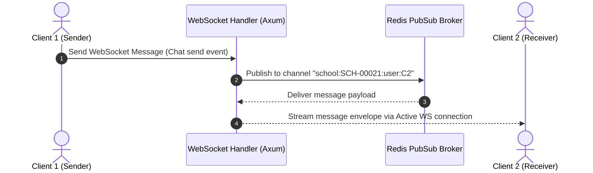

# 📣 Chapter 10: Communication Domain Manual

Yeh manual real-time instant messaging (WebSockets), announcement broadcasting, notification center, aur webhooks ko explain karta hai.

---

## 📖 Overview aur Features (Udeshya aur Suvidhayein)

### 🎯 Feature Purpose (Kyun banaya gaya hai)
Real-time chat, announcements, push notifications, aur emails handle karta hai. Iska udeshya parents aur school administration ko connected rakhna hai.


Communication domain messages deliver, real-time alerts, aur external event callbacks ko manage karta hai:
- **Real-Time WebSockets (`/ws`):** Real-time chats aur alerts ke liye direct connections provide karta hai.
- **Peer-to-Peer Chat:** Users ke beech chat messages bhejta hai aur purani history fetch karta hai.
- **Announcements Broadcast:** Main school announcements aur news screens par display karta hai.
- **Notifications Center:** Unread messages count batata hai aur notifications read status manage karta hai.
- **Webhooks Callback System:** Third-party integrations ke liye event webhooks notify karta hai.

---

## 🏗️ Architecture aur Data Flow

### 🛠️ Tech Stack aur Dependencies
- **Framework:** Axum
- **Database:** Postgres (sqlx) for message history.
- **Real-time:** WebSockets (axum/ws), Redis Pub/Sub for cross-node message routing.
- **Push:** Firebase Cloud Messaging (FCM), SMTP for emails.

### 🌊 Deep Code aur Data Flow
1. **Request:** User real-time WebSocket connection ke zariye chat message bhejta hai.
2. **Service Logic:** Message Redis Pub/Sub system par broadcast kiya jata hai.
3. **Database:** Chat history database table mein content save hota hai.
4. **Response:** Subscriber nodes recipient ko real-time socket delivery karte hain.


- **Route Module:** `src/domain/communication/mod.rs`
- **Handler Files:** `src/domain/communication/chat.rs`, `src/domain/communication/announcement.rs`, `src/domain/communication/notification.rs`, `src/domain/communication/ws.rs`, `src/domain/communication/webhook.rs`
- **Services:** `src/services/communication/`
- **Repositories:** `src/repository/communication/`
- **Database Tables:** `chat_messages`, `notifications`, `webhooks_registry`, `webhooks_delivery_logs`



---

## 🚦 Developer Laws (Do's aur Don'ts - Kya karein aur kya na karein)

- **DO:** Saare outgoing WebSocket data ko `WsEnvelope` (type, version, payload) format mein send karein.
- **DO:** Webhooks security ke liye payload signature (`x-webhook-signature`) zaroor verify karein.
- **DON'T:** Purane idle websocket connections ko active na rakhein; ping/pong heartbeat se clean-up karein.
- **DON'T:** Public channels par sensitive student profiles data kabhi leak/share na karein.

---

## 🔌 API Reference aur Specs (API Ki Jankari)

### 1. Peer-to-Peer Chat

#### A. Send Real-Time Chat Message
- **Endpoint:** `POST /api/school/:schoolId/comm/chat/:schoolId/send`
- **Request Body:**
  ```json
  {
    "senderId": "EMP-00109",
    "senderType": "employee",
    "receiverId": "STD-99882",
    "receiverType": "student",
    "content": "Kripya apne homework sheet submit karein.",
    "attachmentUrl": "http://cdn.school.com/attachments/homework.pdf"
  }
  ```
- **Success Response:**
  ```json
  {
    "success": true,
    "data": {
      "messageId": 29881,
      "createdAt": "2026-06-08T08:35:00Z"
    }
  }
  ```

#### B. Get Peer Chat History Feed
- **Endpoint:** `GET /api/school/:schoolId/comm/chat/:schoolId/history/:user1/:user2`
- **Success Response:**
  ```json
  {
    "success": true,
    "data": [
      {
        "messageId": 29881,
        "senderId": "EMP-00109",
        "senderType": "employee",
        "receiverId": "STD-99882",
        "receiverType": "student",
        "content": "Kripya apne homework sheet submit karein.",
        "createdAt": "2026-06-08T08:35:00Z"
      }
    ]
  }
  ```

---

### 2. WebSocket Real-Time Handshake

- **Endpoint:** `GET /api/school/:schoolId/comm/ws`
- **Authentication:** Query parameter token (since WebSockets handshake does not support custom headers easily).
- **Handshake URL:**
  ```
  ws://localhost:8080/api/school/SCH-00021/comm/ws?token=eyJhbGciOiJIUzI1Ni...
  ```
- **Standardized Client-to-Server Event Envelope:**
  ```json
  {
    "version": "1.0",
    "type": "chat_message",
    "id": "event_uuid_123",
    "timestamp": "2026-06-08T08:35:00Z",
    "payload": {
      "receiverId": "STD-99882",
      "content": "Hello Jane!"
    }
  }
  ```

---

### 3. Notification Center APIs

#### A. List Active Center Notifications
- **Endpoint:** `GET /api/school/:schoolId/comm/notifications`
- **Query Parameters:**
  - `unreadOnly` (boolean, optional): Default: `false`.
  - `limit` (integer, optional): Pagination size.
- **Success Response:**
  ```json
  {
    "success": true,
    "data": [
      {
        "notificationId": "notif_009823",
        "title": "Grade Published",
        "message": "Physics Midterm results are out.",
        "unread": true,
        "created_at": "2026-06-07T14:30:00Z"
      }
    ]
  }
  ```

#### B. Mark Notification as Read
- **Endpoint:** `POST /api/school/:schoolId/comm/notifications/:notification_id/read`
- **Success Response:**
  ```json
  {
    "success": true,
    "message": "Notification marked as read"
  }
  ```

#### C. Legacy Notifications (Backward Compatibility)
- **Endpoints:**
  - `GET /api/school/:schoolId/notification`
  - `DELETE /api/school/:schoolId/notification`
  - `GET /api/global/notification`
- **Description:** Legacy alerts for backward compatibility with older client builds.

---

### 4. Webhook Integrations

#### A. Register Webhook Callback
Allows third-party systems to receive event push streams.
- **Endpoint:** `POST /api/school/:schoolId/comm/webhooks`
- **Request Body:**
  ```json
  {
    "url": "https://client-endpoint.com/webhook",
    "secret": "myWebhookSecretKey",
    "eventTypes": ["attendance.present", "fees.paid"]
  }
  ```
- **Success Response:**
  ```json
  {
    "success": true,
    "data": {
      "webhookId": "wh_009983",
      "url": "https://client-endpoint.com/webhook"
    }
  }
  ```

#### B. List Delivery Logs for Webhook
Provides debug statistics of webhook retry counts and callback responses.
- **Endpoint:** `GET /api/school/:schoolId/comm/webhooks/:webhookId/logs`
- **Success Response:**
  ```json
  {
    "success": true,
    "data": [
      {
        "deliveryId": "dlv_99812",
        "eventType": "fees.paid",
        "httpStatus": 200,
        "payloadSent": "{...}",
        "sentAt": "2026-06-08T08:00:00Z"
      }
    ]
  }
  ```

---

## 🕒 Update History aur Status (Badlavo ki History)

*Is section mein hum saare bade badlavo, design decisions, aur future plans ko track karte hain.*

- **WebSocket Handshake Validation:** Websockets handler `/comm/ws` now extracts authentication tokens from the URL query string if headers are not sent, verifying user session validity before establishing TCP connections.
- **Webhook push logs:** Added `/webhooks/:webhookId/logs` to allow integration debugging from the developer dashboard.
