# 🗄️ Database ER Diagrams

Yahan par saare PostgreSQL tables ke Entity-Relationship (ER) diagrams diye gaye hain, jo alag-alag modules (domains) ke hisaab se categorized hain. Isse aapko tables ke beech ke relationships easily samajh aa jayenge.

## Miscellaneous

```mermaid
erDiagram
    schema_migrations {
        character_varying version
    }
    salaries {
        numeric due_amount
        character_varying salary_id
        numeric advance_adjusted
        integer month
        character_varying status
        integer absent_days
        character_varying school_id
        numeric increment_percent
        character_varying employee_id
        timestamp_with_time_zone updated_at
        integer id
        numeric total_salary
        timestamp_with_time_zone created_at
        integer year
        numeric bonus
        numeric base_salary
    }
    communication {
        timestamp_with_time_zone created_at
        character_varying type
        text title
        integer id
        character_varying school_id
        text content
    }
    scheduled_reports {
        USER-DEFINED status
        text file_path
        timestamp_with_time_zone generated_at
        timestamp_with_time_zone created_at
        integer scheduled_report_id
        date period_start
        text error_message
        USER-DEFINED report_type
        date period_end
        character_varying school_id
        timestamp_with_time_zone updated_at
    }
    events {
        text name
        integer id
        character_varying school_id
        character_varying event_id
        text description
        timestamp_with_time_zone created_at
        timestamp_with_time_zone event_date
        jsonb items
    }
    reminders {
        timestamp_with_time_zone remind_at
        character_varying status
        jsonb items
        character_varying reminder_id
        text description
        character_varying school_id
        timestamp_with_time_zone created_at
        text title
        integer id
    }
    items {
        character_varying school_id
        character_varying room_number
        text item_name
        character_varying space_name
        character_varying id
        character_varying name
        character_varying class_id
        text space_id
        text item_id
    }
    announcements {
        character_varying school_id
        integer id
        character_varying target_type
        character_varying announcement_id
        character_varying target_id
        text title
        timestamp_with_time_zone created_at
        text content
    }
    webhook_endpoints {
        ARRAY event_types
        character_varying school_id
        text secret
        integer id
        text url
        timestamp_with_time_zone created_at
        timestamp_with_time_zone updated_at
        character_varying status
    }
    document_embeddings {
        character_varying school_id
        USER-DEFINED chunk_embedding
        character_varying document_id
        text chunk_text
        integer id
        timestamp_with_time_zone created_at
    }
    global_notifications {
        jsonb notification
        timestamp_with_time_zone created_at
        integer id
        boolean active
    }
    encryption_keys {
        integer rotation_count
        timestamp_with_time_zone deactivated_at
        character_varying key_status
        character_varying key_usage
        timestamp_with_time_zone created_at
        character_varying created_by
        character_varying key_type
        timestamp_with_time_zone expires_at
        jsonb metadata
        integer key_version
        bytea key_material
        timestamp_with_time_zone last_rotated_at
        timestamp_with_time_zone activated_at
        text key_material_encrypted_with
        character_varying key_id
    }
    system_config {
        timestamp_with_time_zone updated_at
        text config_key
        text config_value
    }
    conditional_approvals {
        boolean auto_reject
        timestamp_with_time_zone updated_at
        character_varying leave_id
        timestamp_with_time_zone response_deadline
        uuid id
        jsonb conditions
        character_varying status
        timestamp_with_time_zone created_at
        jsonb employee_response
        timestamp_with_time_zone responded_at
        text admin_notes
    }
    awards {
        timestamp_with_time_zone created_at
        text award_name
        text position
        text award_type
        timestamp_with_time_zone updated_at
        character_varying award_id
        character_varying parent_id
        character_varying school_id
        text description
        character_varying type
        integer id
    }
    conditional_approval_templates {
        character_varying created_by
        boolean is_default
        timestamp_with_time_zone created_at
        jsonb conditions
        character_varying school_id
        timestamp_with_time_zone updated_at
        character_varying template_name
        uuid template_id
        text description
    }
    workload_assessment {
        character_varying leave_id
        timestamp_with_time_zone created_at
        date assessment_date
        uuid assessment_id
        character_varying employee_id
        jsonb suggested_coverages
        character_varying school_id
        text notes
        boolean coverage_needed
        integer impact_score
        character_varying workload_category
    }
    teacher_availability {
        timestamp_with_time_zone created_at
        boolean is_available
        integer period_number
        character_varying school_id
        character_varying teacher_id
        integer day_of_week
        integer id
    }
    dsar_requests {
        timestamp_with_time_zone completed_date
        character_varying priority
        character_varying data_subject_id
        ARRAY requested_data_categories
        character_varying status
        timestamp_with_time_zone due_date
        uuid request_id
        text completion_notes
        character_varying updated_by
        character_varying school_id
        character_varying legal_basis
        character_varying request_type
        timestamp_with_time_zone verification_date
        character_varying data_subject_type
        bigint id
        character_varying response_format
        character_varying created_by
        character_varying verification_method
        jsonb response_data
        character_varying assigned_to
        text request_description
        timestamp_with_time_zone created_at
        timestamp_with_time_zone updated_at
        character_varying data_subject_email
        character_varying response_delivery_method
        character_varying data_subject_name
        character_varying data_subject_phone
    }
    consent_records {
        inet ip_address
        timestamp_with_time_zone given_at
        character_varying recorded_by
        text consent_text
        ARRAY purposes
        character_varying consent_version
        character_varying consent_type
        character_varying collection_method
        character_varying school_id
        timestamp_with_time_zone last_verified_at
        timestamp_with_time_zone withdrawn_at
        timestamp_with_time_zone expires_at
        bigint id
        character_varying subject_id
        text user_agent
        character_varying status
        character_varying collection_point
        character_varying subject_type
    }
    retention_policies {
        timestamp_with_time_zone applies_to
        character_varying school_id
        timestamp_with_time_zone applies_from
        boolean is_active
        character_varying data_category
        character_varying disposition_trigger
        character_varying policy_name
        timestamp_with_time_zone created_at
        bigint id
        timestamp_with_time_zone updated_at
        text description
        text legal_reference
        character_varying updated_by
        character_varying created_by
        integer retention_period_months
        character_varying disposition_action
        character_varying retention_basis
    }
    grading_rubrics {
        jsonb criteria
        character_varying class_name
        numeric total_score
        boolean is_active
        numeric passing_score
        character_varying rubric_name
        uuid rubric_id
        character_varying rubric_type
        character_varying subject_name
        timestamp_with_time_zone updated_at
        character_varying school_id
        timestamp_with_time_zone created_at
    }
    plagiarism_cache {
        character_varying content_type
        uuid cache_id
        character_varying content_hash
        character_varying school_id
        character_varying source_id
        jsonb metadata
        timestamp_with_time_zone indexed_at
    }
    common_error_patterns {
        text pattern_text
        character_varying school_id
        character_varying subject_name
        boolean is_active
        character_varying error_type
        uuid pattern_id
        timestamp_with_time_zone created_at
        text feedback_template
        text description
        character_varying severity
    }
    form_templates {
        character_varying name
        timestamp_without_time_zone created_at
        boolean approval_required
        character_varying created_by
        text description
        uuid id
        jsonb notification_settings
        boolean is_active
        character_varying school_id
        integer version
        character_varying form_type
        jsonb form_schema
        jsonb workflow_steps
        jsonb validation_rules
        character_varying updated_by
        jsonb approval_roles
        timestamp_without_time_zone updated_at
    }
    form_submissions {
        jsonb workflow_history
        timestamp_without_time_zone updated_at
        jsonb metadata
        character_varying submitted_by_role
        character_varying status
        jsonb form_data
        character_varying school_id
        text reviewer_notes
        jsonb approval_history
        character_varying submitted_by
        character_varying processed_by
        integer current_step
        timestamp_without_time_zone processed_at
        uuid template_id
        uuid id
        character_varying form_type
        timestamp_without_time_zone created_at
    }
    notification_preferences {
        boolean push_enabled
        timestamp_with_time_zone created_at
        boolean in_app_enabled
        character_varying user_id
        timestamp_with_time_zone updated_at
        boolean email_enabled
        integer id
        character_varying school_id
        boolean sms_enabled
    }
    document_box {
        text file_url
        character_varying school_id
        character_varying doc_type
        integer id
        character_varying user_id
        timestamp_with_time_zone created_at
    }
    developer_access_requests {
        character_varying approver_id
        timestamp_with_time_zone created_at
        ARRAY requested_tables
        integer duration_hours
        ARRAY requested_columns
        character_varying developer_id
        text approval_notes
        character_varying approver_email
        text justification
        timestamp_with_time_zone approved_at
        character_varying status
        timestamp_with_time_zone expires_at
        character_varying developer_email
        integer id
        character_varying requested_role
        timestamp_with_time_zone updated_at
    }
    developer_access_grants {
        text revocation_reason
        timestamp_with_time_zone end_time
        boolean is_active
        timestamp_with_time_zone start_time
        character_varying pg_role_name
        integer request_id
        timestamp_with_time_zone created_at
        integer id
        character_varying granted_role
        timestamp_with_time_zone revoked_at
        character_varying developer_id
    }
    setup_templates {
        timestamp_with_time_zone created_at
        timestamp_with_time_zone updated_at
        character_varying created_by
        boolean is_default
        character_varying name
        boolean is_active
        uuid id
        text description
        jsonb metadata
    }
    setup_template_configs {
        jsonb default_value
        boolean auto_fill_enabled
        jsonb validation_rules
        character_varying frontend_input_type
        character_varying frontend_label
        character_varying section
        uuid id
        character_varying field_name
        character_varying data_type
        timestamp_with_time_zone updated_at
        uuid template_id
        timestamp_with_time_zone created_at
        integer display_order
    }
    setup_template_assignments {
        text notes
        timestamp_with_time_zone assigned_at
        character_varying school_id
        character_varying assigned_by
        uuid id
        uuid template_id
    }
    automated_reports {
        text description
        timestamp_without_time_zone next_scheduled_at
        character_varying template_path
        character_varying school_id
        timestamp_without_time_zone last_generated_at
        boolean is_active
        character_varying report_type
        jsonb recipient_roles
        character_varying report_name
        timestamp_without_time_zone updated_at
        uuid id
        timestamp_without_time_zone created_at
        character_varying created_by
        jsonb report_config
        jsonb schedule_config
        character_varying schedule_type
        jsonb recipient_emails
    }
    email_processing_queue {
        text subject
        text body_html
        text body_text
        jsonb metadata
        timestamp_without_time_zone received_at
        timestamp_without_time_zone processed_at
        character_varying assigned_to
        character_varying email_id
        jsonb attachments
        character_varying sender_email
        jsonb processing_result
        uuid id
        character_varying processing_status
        character_varying school_id
        character_varying category
        character_varying recipient_email
        integer priority
    }
    email_processing_rules {
        character_varying category
        character_varying assign_to_role
        jsonb actions
        boolean is_active
        text description
        uuid id
        character_varying rule_name
        text auto_reply_template
        jsonb match_conditions
        timestamp_without_time_zone updated_at
        integer priority
        character_varying school_id
        timestamp_without_time_zone created_at
    }
    grading_config {
        character_varying subject_name
        timestamp_with_time_zone updated_at
        character_varying rigor_level
        uuid config_id
        character_varying school_id
        numeric fuzzy_threshold
        boolean ai_feedback_enabled
        timestamp_with_time_zone created_at
        numeric manual_review_threshold
    }
    testimonials {
        uuid id
        character_varying school_name
        integer display_order
        character_varying client_title
        character_varying client_name
        timestamp_with_time_zone updated_at
        timestamp_with_time_zone created_at
        character_varying avatar_url
        boolean is_featured
        smallint rating
        text content
        boolean is_published
    }
    promo_codes {
        integer max_uses
        timestamp_with_time_zone expires_at
        integer current_uses
        character_varying code
        numeric discount_percentage
        timestamp_with_time_zone created_at
        numeric credit_amount
        integer id
        integer free_days
    }
    support_requests {
        integer id
        text message
        text contact_info
        character_varying status
        character_varying school_name
        timestamp_with_time_zone resolved_at
        timestamp_with_time_zone created_at
    }
    districts {
        character_varying name
        integer id
        integer state_id
    }
    chapters {
        text quarter
        timestamp_with_time_zone created_at
        jsonb data
        boolean is_taught
        text chapter_name
        integer periods_allocated
        character_varying school_id
        character_varying class_name
        integer weightage
        character_varying subject_name
        integer id
    }
    app_files {
        character_varying content_type
        character_varying file_name
        bigint file_size
        text public_url
        character_varying school_id
        text file_path
        character_varying user_id
        integer id
        timestamp_with_time_zone updated_at
        character_varying user_type
        boolean is_permanent
        timestamp_with_time_zone created_at
        character_varying file_hash
    }
    schedule_change_requests {
        timestamp_with_time_zone created_at
        integer block_cap_minutes
        text target_subject_id
        text source_class_id
        character_varying status
        text source_subject_id
        text approved_by
        date date_from
        text reason
        character_varying school_id
        text admin_note
        date date_to
        character_varying type
        text target_class_id
        text requested_by
        timestamp_with_time_zone updated_at
        integer id
    }
    super_admin {
        text password_hash
        text profile_image_url
        integer id
        character_varying username
        timestamp_with_time_zone created_at
    }
    countries {
        character_varying phone_code
        integer id
        character_varying code
        character_varying name
    }
    states {
        integer country_id
        integer id
        character_varying name
    }
    syllabus_calendar {
        character_varying subject_id
        integer id
        character_varying class_id
        date actual_end_date
        character_varying status
        character_varying school_id
        character_varying quarter
        integer chapter_id
        date actual_start_date
        date planned_start_date
        date planned_end_date
        integer period_count
    }
    notifications {
        boolean is_read
        character_varying user_id
        integer id
        character_varying category
        character_varying severity
        character_varying school_id
        timestamp_with_time_zone read_at
        text message
        character_varying title
        jsonb data
        timestamp_with_time_zone created_at
    }
    responsibilities {
        timestamp_with_time_zone updated_at
        character_varying school_id
        text name
        character_varying space_id
        integer id
        numeric work_amount
        text description
        numeric student_fee
        jsonb data
        character_varying responsibility_id
        character_varying work_period
        timestamp_with_time_zone created_at
        character_varying created_by
        numeric monthly_price
        numeric per_day_price
        integer time_period
        character_varying space_category
        character_varying work_level
        character_varying employee_type
    }
    topics {
        text subject_id
        text description
        integer id
        text name
    }
    period_plans {
        text teacher_note
        text config_id
        character_varying status
        character_varying school_id
        text teacher_id
        integer chapter_id
        character_varying class_id
        timestamp_with_time_zone completed_at
        integer id
        character_varying subject_id
        text topic_name
        integer period_number
        integer day_of_week
        date date
    }
    daily_teacher_reports {
        integer id
        date report_date
        integer total_periods
        text teacher_id
        character_varying status
        character_varying school_id
        jsonb pending_topics
        integer completed_periods
        text summary
        timestamp_with_time_zone submitted_at
    }
    document_box }|--|| schools : "school_id -> school_id"
    responsibilities }|--|| schools : "school_id -> school_id"
    setup_template_configs }|--|| setup_templates : "template_id -> id"
    developer_access_grants }|--|| developer_access_requests : "request_id -> id"
    setup_template_assignments }|--|| setup_templates : "template_id -> id"
    form_templates }|--|| schools : "school_id -> school_id"
    form_submissions }|--|| schools : "school_id -> school_id"
    form_submissions }|--|| form_templates : "template_id -> id"
    automated_reports }|--|| schools : "school_id -> school_id"
    email_processing_queue }|--|| schools : "school_id -> school_id"
    email_processing_rules }|--|| schools : "school_id -> school_id"
    scheduled_reports }|--|| schools : "school_id -> school_id"
    states }|--|| countries : "country_id -> id"
    districts }|--|| states : "state_id -> id"
    conditional_approvals }|--|| leave_applications : "leave_id -> leave_id"
    conditional_approval_templates }|--|| schools : "school_id -> school_id"
    workload_assessment }|--|| leave_applications : "leave_id -> leave_id"
    workload_assessment }|--|| schools : "school_id -> school_id"
    workload_assessment }|--|| employees : "school_id -> employee_id"
    workload_assessment }|--|| employees : "school_id -> school_id"
    workload_assessment }|--|| employees : "employee_id -> employee_id"
    workload_assessment }|--|| employees : "employee_id -> school_id"
```

## Core & Identity

```mermaid
erDiagram
    auth {
        text security_question
        character_varying school_id
        boolean password_temp
        text password
        text security_answer_hash
        timestamp_with_time_zone updated_at
    }
    tokens {
        character_varying user_type
        text token_id
        character_varying status
        timestamp_with_time_zone created_at
        character_varying school_id
        timestamp_with_time_zone expires_at
    }
    webhook_delivery_logs {
        character_varying status
        timestamp_with_time_zone created_at
        character_varying school_id
        jsonb payload
        integer endpoint_id
        timestamp_with_time_zone last_attempt_at
        character_varying event_type
        integer id
        timestamp_with_time_zone next_retry_at
        integer status_code
        integer attempt_count
        text response_body
    }
    audit_logs {
        timestamp_with_time_zone created_at
        jsonb data
        character_varying target_type
        integer id
        character_varying target_id
        character_varying action
        character_varying school_id
    }
    api_keys {
        character_varying key_id
        timestamp_with_time_zone last_used_at
        character_varying key_hash
        integer id
        timestamp_with_time_zone updated_at
        character_varying school_id
        character_varying name
        ARRAY scopes
        character_varying status
        integer rate_limit_per_min
        timestamp_with_time_zone created_at
    }
    encryption_audit_log {
        text user_agent
        character_varying entity_type
        timestamp_with_time_zone performed_at
        inet client_ip
        character_varying school_id
        character_varying key_id
        integer audit_id
        character_varying operation
        jsonb metadata
        text error_message
        character_varying performed_by
        character_varying field_name
        boolean success
        character_varying entity_id
    }
    school_feature_flags {
        boolean workload_assessment
        timestamp_with_time_zone updated_at
        boolean responsibility_coverage
        boolean conditional_approvals
        boolean real_time_notifications
        character_varying school_id
        boolean enhanced_leave_system
        boolean mobile_leave_submission
    }
    data_breach_logs {
        text description
        integer affected_subjects_count
        ARRAY affected_data_categories
        ARRAY preventive_measures_taken
        boolean reported_to_authorities
        timestamp_with_time_zone detected_at
        timestamp_with_time_zone updated_at
        character_varying created_by
        timestamp_with_time_zone created_at
        boolean notification_sent
        character_varying root_cause_category
        character_varying school_id
        ARRAY response_actions
        ARRAY affected_subjects_types
        timestamp_with_time_zone notification_date
        character_varying breach_type
        bigint id
        text root_cause_description
        timestamp_with_time_zone occurred_from
        character_varying authority_name
        timestamp_with_time_zone occurred_to
        uuid breach_id
        character_varying report_reference
        timestamp_with_time_zone report_date
        character_varying containment_status
        character_varying severity
    }
    system_audit_logs {
        text action_type
        timestamp_with_time_zone created_at
        jsonb changed_data
        text admin_id
        integer id
        text entity_type
        text school_id
        text entity_id
    }
    school_access_requests {
        character_varying email
        uuid id
        character_varying contact_name
        character_varying status
        character_varying phone
        timestamp_with_time_zone created_at
        timestamp_with_time_zone updated_at
        character_varying school_name
        integer student_count
        text message
        integer employee_count
        text admin_notes
    }
    user_activity_logs {
        timestamp_with_time_zone created_at
        character_varying user_type
        character_varying action
        integer id
        jsonb metadata
        character_varying phone
    }
    developer_activity_audit {
        text user_agent
        text query_text
        integer rows_affected
        character_varying target_schema
        character_varying target_table
        character_varying session_id
        character_varying developer_id
        timestamp_with_time_zone created_at
        character_varying action_type
        integer id
        character_varying developer_email
        inet ip_address
    }
    audit_events {
        character_varying event_subtype
        character_varying application_version
        character_varying actor_id
        ARRAY data_categories
        character_varying deployment_mode
        character_varying actor_type
        character_varying api_endpoint
        inet actor_ip
        text failure_reason
        integer developer_access_grant_id
        integer http_status_code
        character_varying legal_basis
        ARRAY encrypted_fields
        character_varying http_method
        character_varying request_id
        character_varying action
        character_varying actor_name
        character_varying school_id
        text resource_name
        bigint id
        character_varying session_id
        character_varying action_status
        timestamp_with_time_zone event_timestamp
        character_varying resource_type
        jsonb old_values
        uuid event_id
        text actor_user_agent
        character_varying encryption_key_id
        text purpose_of_processing
        jsonb delta
        jsonb new_values
        character_varying resource_id
        character_varying event_type
    }
    report_generation_logs {
        text error_message
        character_varying file_path
        bigint file_size_bytes
        character_varying status
        character_varying generated_by
        character_varying school_id
        jsonb metadata
        uuid id
        timestamp_without_time_zone generated_at
        integer recipient_count
        uuid report_id
    }
    user_device_tokens {
        text user_id
        text platform
        text token
        integer id
        text school_id
        timestamp_with_time_zone created_at
        timestamp_with_time_zone last_seen_at
    }
    blog_posts {
        uuid id
        text excerpt
        ARRAY tags
        timestamp_with_time_zone created_at
        character_varying title
        character_varying slug
        boolean is_published
        character_varying seo_description
        text content
        timestamp_with_time_zone published_at
        character_varying category
        character_varying cover_image_url
        character_varying author_name
        character_varying seo_title
        timestamp_with_time_zone updated_at
    }
    global_users {
        character_varying alternative_phone
        integer id
        text email
        text name
        text image_url
        character_varying phone
        timestamp_with_time_zone created_at
        character_varying aadhaar_number
        character_varying user_type
        text school_id
        text user_id
        text class_name
    }
    auth_logs {
        text school_id
        text details
        integer id
        text action
        text user_type
        text ip_address
        timestamp_with_time_zone created_at
    }
    school_promo_codes {
        character_varying school_id
        integer promo_code_id
        timestamp_with_time_zone applied_at
        integer id
    }
    schools {
        text school_logo_url
        character_varying billing_status
        timestamp_with_time_zone created_at
        timestamp_with_time_zone promo_expires_at
        numeric per_student_rate
        character_varying school_id
        numeric wallet_balance
        boolean is_blocked
        text school_name
        timestamp_with_time_zone trial_ends_at
        integer id
        numeric base_rate
        jsonb data
        timestamp_with_time_zone last_billing_date
        integer session_duration_hours
        integer active_promo_id
        character_varying status
        timestamp_with_time_zone updated_at
        jsonb notification
    }
    webhook_delivery_logs }|--|| webhook_endpoints : "endpoint_id -> id"
    encryption_audit_log }|--|| encryption_keys : "key_id -> key_id"
    audit_events }|--|| encryption_keys : "encryption_key_id -> key_id"
    audit_events }|--|| developer_access_grants : "developer_access_grant_id -> id"
    report_generation_logs }|--|| schools : "school_id -> school_id"
    report_generation_logs }|--|| automated_reports : "report_id -> id"
    school_feature_flags }|--|| schools : "school_id -> school_id"
    school_promo_codes }|--|| promo_codes : "promo_code_id -> id"
    schools }|--|| promo_codes : "active_promo_id -> id"
```



## Academics & Students

```mermaid
erDiagram
    students {
        character_varying gender
        timestamp_with_time_zone updated_at
        character_varying address_pincode
        character_varying room_number
        character_varying admission_date
        text additional_subjects
        timestamp_with_time_zone created_at
        character_varying email
        character_varying address_city
        integer roll_number
        jsonb enrolled_subjects
        character_varying status
        numeric total_fees
        text profile_image_url
        character_varying section
        character_varying transport_radius
        character_varying tc_number
        text mother_name
        character_varying student_id
        text father_name
        jsonb data
        character_varying student_type
        character_varying alternative_contact
        character_varying contact
        character_varying aadhaar_number
        text name
        character_varying dob
        character_varying school_id
        text address_line1
        boolean transport_enabled
        integer id
        character_varying address_state
        character_varying class_name
    }
    academic_components {
        character_varying class_name
        jsonb status
        character_varying subject_name
        integer id
        timestamp_with_time_zone updated_at
        character_varying school_id
        text chapter_name
        character_varying component_type
        jsonb data
        text component_name
        timestamp_with_time_zone created_at
    }
    attendance {
        character_varying class_name
        character_varying role
        text total_time
        character_varying user_id
        integer id
        date date
        timestamp_with_time_zone updated_at
        text description
        character_varying school_id
        timestamp_with_time_zone created_at
        timestamp_with_time_zone in_time
        character_varying status
        timestamp_with_time_zone out_time
        text reason
    }
    classes {
        integer total_students
        character_varying id
        character_varying name
        jsonb sections
        timestamp_with_time_zone updated_at
        integer total_teachers
        integer section_size
        timestamp_with_time_zone created_at
        character_varying school_id
        character_varying room_number
        double_precision class_fees
        integer total_periods
        jsonb streams
    }
    subjects {
        integer fee_interval
        boolean is_compulsory
        text category
        double_precision fees
        timestamp_with_time_zone created_at
        character_varying class_name
        jsonb schedule_data
        character_varying school_id
        text schedule_type
        character_varying id
        character_varying class_id
        text fee_type
        character_varying name
        timestamp_with_time_zone updated_at
    }
    data_classification {
        character_varying school_id
        character_varying created_by
        timestamp_with_time_zone updated_at
        text json_path
        integer classification_id
        character_varying column_name
        character_varying encryption_key_id
        character_varying table_name
        timestamp_with_time_zone created_at
        boolean encryption_required
        character_varying data_type
        character_varying classification_level
    }
    gradebook_sync_log {
        character_varying sync_type
        uuid sync_id
        uuid submission_id
        timestamp_with_time_zone synced_at
        character_varying sync_status
        character_varying school_id
        jsonb sync_data
        text error_message
        character_varying target_system
        integer retry_count
    }
    attendance_reports {
        timestamp_without_time_zone expires_at
        date period_end
        character_varying status
        character_varying generated_by
        character_varying school_id
        character_varying report_type
        timestamp_without_time_zone created_at
        jsonb metadata
        date period_start
        uuid id
        timestamp_without_time_zone updated_at
        jsonb data
        character_varying file_path
        timestamp_without_time_zone generated_at
        character_varying file_format
    }
    gradebook {
        text sync_error
        timestamp_with_time_zone graded_at
        character_varying school_id
        uuid rubric_id
        character_varying grading_method
        uuid submission_id
        character_varying term
        numeric raw_score
        character_varying graded_by
        boolean is_published
        uuid gradebook_id
        character_varying academic_year
        character_varying grade
        character_varying assessment_name
        numeric max_score
        character_varying student_id
        character_varying sync_status
        timestamp_with_time_zone last_sync_attempt
        character_varying assessment_id
        numeric grade_points
        timestamp_with_time_zone last_updated
        numeric percentage
        text review_notes
        character_varying assessment_type
        character_varying subject_name
        boolean requires_review
        character_varying class_name
    }
    gradebook_summary {
        character_varying class_name
        integer total_assessments
        character_varying subject_name
        numeric highest_score
        character_varying improvement_trend
        numeric average_percentage
        character_varying academic_year
        numeric lowest_score
        uuid summary_id
        character_varying letter_grade
        character_varying student_id
        integer completed_assessments
        character_varying term
        numeric gpa
        timestamp_with_time_zone calculated_at
        timestamp_with_time_zone last_updated
        numeric weighted_average
        character_varying school_id
        numeric attendance_percentage
        numeric total_grade_points
    }
    gradebook_sync_queue {
        integer sync_priority
        timestamp_with_time_zone created_at
        character_varying school_id
        timestamp_with_time_zone processed_at
        uuid queue_id
        character_varying operation
        integer retry_count
        uuid gradebook_id
        integer max_retries
        character_varying status
        text error_message
        jsonb payload
    }
    student_history {
        character_varying school_id
        character_varying author
        integer id
        integer rev_no
        character_varying student_id
        timestamp_with_time_zone created_at
        jsonb data
        jsonb delta
    }
    exam_submission_pages {
        numeric ocr_confidence
        boolean is_permanent
        text ocr_text
        uuid page_id
        integer page_number
        timestamp_with_time_zone created_at
        character_varying school_id
        text image_url
        uuid submission_id
    }
    student_submissions {
        character_varying assignment_name
        timestamp_with_time_zone due_date
        character_varying school_id
        timestamp_with_time_zone submitted_at
        integer character_count
        character_varying file_type
        character_varying status
        character_varying student_id
        uuid submission_id
        character_varying exam_id
        text checked_by
        jsonb image_metadata
        integer word_count
        timestamp_with_time_zone checked_at
        text content
        character_varying submission_type
        text file_url
    }
    exam_answer_keys {
        uuid key_id
        integer question_number
        numeric max_marks
        character_varying exam_id
        character_varying school_id
        timestamp_with_time_zone created_at
        boolean is_active
        character_varying question_type
        timestamp_with_time_zone updated_at
        ARRAY keywords
        text correct_answer
        text model_answer
        jsonb marking_scheme
    }
    attendance_qr_tokens {
        text created_by
        boolean is_used
        timestamp_with_time_zone created_at
        timestamp_with_time_zone used_at
        character_varying class_id
        text used_by
        character_varying token
        integer id
        character_varying school_id
        timestamp_with_time_zone expires_at
    }
    exams {
        character_varying exam_id
        character_varying status
        text checked_by
        integer duration_minutes
        text approved_by
        timestamp_with_time_zone checked_at
        character_varying exam_type
        jsonb paper
        timestamp_with_time_zone exam_date
        timestamp_with_time_zone created_at
        character_varying school_id
        integer id
        boolean results_published
        text exam_name
        text checker_employee_id
        text exam_time
        timestamp_with_time_zone checker_assigned_at
        text quarter
        text strictness_level
        timestamp_with_time_zone approved_at
        timestamp_with_time_zone updated_at
        text subject_name
        jsonb chapters
        character_varying class_name
        timestamp_with_time_zone results_published_at
    }
    exam_sections {
        timestamp_with_time_zone created_at
        boolean ai_generated_paper
        jsonb questions
        jsonb syllabus
        text subject_id
        text school_id
        integer id
        text class_id
        integer total_marks
        integer exam_id
    }
    data_classification }|--|| encryption_keys : "encryption_key_id -> key_id"
    gradebook_sync_log }|--|| student_submissions : "submission_id -> submission_id"
    gradebook }|--|| student_submissions : "submission_id -> submission_id"
    gradebook }|--|| grading_rubrics : "rubric_id -> rubric_id"
    gradebook_sync_queue }|--|| gradebook : "gradebook_id -> gradebook_id"
    exam_submission_pages }|--|| student_submissions : "submission_id -> submission_id"
    exam_sections }|--|| exams : "exam_id -> id"
```



## HR & Operations

```mermaid
erDiagram
    tasks {
        text time_duration
        numeric complete_percentage
        text task_name
        character_varying entity_type
        jsonb update_logs
        boolean is_ai_generated
        integer id
        character_varying user_type
        character_varying entity_id
        character_varying status
        character_varying priority
        character_varying school_id
        character_varying parent_id
        timestamp_with_time_zone deadline
        integer period_plan_id
        character_varying task_id
        timestamp_with_time_zone updated_at
        jsonb ai_metadata
        timestamp_with_time_zone created_at
    }
    employee_responsibilities {
        timestamp_with_time_zone updated_at
        character_varying responsibility_id
        character_varying school_id
        jsonb space_ids
        timestamp_with_time_zone created_at
        character_varying employee_id
    }
    leave_applications {
        character_varying applicant_type
        character_varying submitted_via
        timestamp_with_time_zone created_at
        jsonb attachments
        date from_date
        date to_date
        character_varying leave_type
        boolean coverage_assigned
        text reason
        integer total_days
        character_varying student_id
        uuid conditional_approval_id
        character_varying priority
        character_varying school_id
        timestamp_with_time_zone updated_at
        character_varying leave_id
        character_varying emergency_contact
        character_varying employee_name
        character_varying status
        character_varying employee_id
        integer workload_assessment_score
    }
    leave_quotas {
        integer remaining
        integer monthly_quota
        integer used
        timestamp_with_time_zone created_at
        uuid quota_id
        character_varying leave_type
        date reset_date
        character_varying employee_id
        character_varying school_id
        timestamp_with_time_zone updated_at
        integer annual_quota
    }
    responsibility_coverage {
        timestamp_with_time_zone created_at
        character_varying leave_id
        timestamp_with_time_zone updated_at
        character_varying covering_employee_id
        character_varying school_id
        character_varying status
        character_varying original_employee_id
        uuid coverage_id
        text notes
        character_varying responsibility_id
        date coverage_period_end
        date coverage_period_start
    }
    leave_notifications {
        jsonb data
        boolean read
        text body
        uuid notification_id
        character_varying notification_type
        timestamp_with_time_zone created_at
        character_varying recipient_id
        character_varying title
        character_varying school_id
    }
    responsibility_assignment_history {
        character_varying employee_id
        integer id
        character_varying responsibility_id
        timestamp_with_time_zone performed_at
        ARRAY space_ids
        integer version
        jsonb metadata
        character_varying school_id
        ARRAY previous_space_ids
        character_varying performed_by
        character_varying action
        text reason
    }
    responsibility_version {
        integer id
        integer version
        ARRAY space_ids
        character_varying responsibility_id
        character_varying name
        jsonb metadata
        character_varying school_id
        boolean is_current
        timestamp_with_time_zone created_at
        character_varying employee_type
        numeric revenue
        text description
        character_varying created_by
    }
    space_employees {
        character_varying space_name
        character_varying school_id
        character_varying employee_id
    }
    admin_task_queue {
        text description
        text error_message
        timestamp_without_time_zone completed_at
        character_varying school_id
        jsonb result
        character_varying task_name
        timestamp_without_time_zone created_at
        uuid id
        integer retry_count
        character_varying task_type
        timestamp_without_time_zone scheduled_for
        integer max_retries
        timestamp_without_time_zone updated_at
        timestamp_without_time_zone started_at
        integer priority
        character_varying status
        jsonb payload
    }
    employees {
        timestamp_with_time_zone created_at
        jsonb data
        character_varying contact
        character_varying email
        timestamp_with_time_zone updated_at
        character_varying employee_id
        text profile_image_url
        character_varying aadhaar_number
        character_varying employee_type
        integer id
        character_varying school_id
        character_varying status
    }
    leaves {
        date end_date
        character_varying status
        text reason
        timestamp_with_time_zone created_at
        character_varying user_id
        integer id
        character_varying user_type
        character_varying school_id
        date start_date
    }
    employee_responsibilities }|--|| responsibilities : "school_id -> responsibility_id"
    employee_responsibilities }|--|| responsibilities : "school_id -> school_id"
    employee_responsibilities }|--|| responsibilities : "responsibility_id -> responsibility_id"
    employee_responsibilities }|--|| responsibilities : "responsibility_id -> school_id"
    employee_responsibilities }|--|| employees : "school_id -> employee_id"
    employee_responsibilities }|--|| employees : "school_id -> school_id"
    employee_responsibilities }|--|| employees : "employee_id -> employee_id"
    employee_responsibilities }|--|| employees : "employee_id -> school_id"
    admin_task_queue }|--|| schools : "school_id -> school_id"
    leave_quotas }|--|| schools : "school_id -> school_id"
    responsibility_coverage }|--|| leave_applications : "leave_id -> leave_id"
    responsibility_coverage }|--|| employees : "school_id -> employee_id"
    responsibility_coverage }|--|| employees : "school_id -> school_id"
    responsibility_coverage }|--|| employees : "original_employee_id -> employee_id"
    responsibility_coverage }|--|| employees : "original_employee_id -> school_id"
    responsibility_coverage }|--|| employees : "school_id -> employee_id"
    responsibility_coverage }|--|| employees : "school_id -> school_id"
    responsibility_coverage }|--|| employees : "covering_employee_id -> employee_id"
    responsibility_coverage }|--|| employees : "covering_employee_id -> school_id"
    leave_notifications }|--|| schools : "school_id -> school_id"
    responsibility_assignment_history }|--|| responsibilities : "responsibility_id -> responsibility_id"
    responsibility_assignment_history }|--|| employees : "school_id -> employee_id"
    responsibility_assignment_history }|--|| employees : "school_id -> school_id"
    responsibility_assignment_history }|--|| employees : "employee_id -> employee_id"
    responsibility_assignment_history }|--|| employees : "employee_id -> school_id"
    responsibility_version }|--|| responsibilities : "responsibility_id -> responsibility_id"
```



## Finance & Billing

```mermaid
erDiagram
    fees {
        character_varying fees_period
        character_varying school_id
        character_varying id
        character_varying fees_reason
        character_varying fees_name
        timestamp_with_time_zone created_at
        numeric fees_amount
    }
    custom_fees {
        timestamp_with_time_zone created_at
        date due_date
        character_varying scope
        jsonb target_classes
        numeric amount
        character_varying fee_type
        text description
        character_varying fee_id
        numeric penalty_per_day
        boolean has_penalty
        integer id
        text fee_name
        timestamp_with_time_zone updated_at
        jsonb target_students
        character_varying status
        character_varying school_id
    }
    student_fees {
        jsonb payments
        character_varying student_id
        integer id
        character_varying fee_id
        numeric total_fees
        character_varying school_id
        timestamp_with_time_zone updated_at
        numeric discount
        numeric pending_amount
        character_varying status
        timestamp_with_time_zone created_at
    }
    custom_fee_records {
        integer id
        character_varying student_id
        jsonb payments
        character_varying fee_id
        numeric amount
        character_varying school_id
        timestamp_with_time_zone updated_at
        numeric paid_amount
        character_varying status
        numeric penalty_accrued
        timestamp_with_time_zone created_at
    }
    employee_payments {
        character_varying salary_id
        numeric amount
        timestamp_with_time_zone created_at
        character_varying school_id
        character_varying employee_id
        integer id
        character_varying payment_type
        character_varying payment_id
    }
    fee_templates {
        character_varying fee_id
        text fees_reason
        character_varying school_id
        timestamp_with_time_zone created_at
        text fees_name
        integer id
        character_varying fees_period
        character_varying status
        numeric fees_amount
    }
    coupons {
        jsonb data
        boolean is_blocked
        double_precision discount_value
        character_varying school_id
        character_varying coupon_name
        character_varying coupon_id
        character_varying discount_type
    }
    student_coupons {
        double_precision discount_applied
        character_varying school_id
        character_varying coupon_id
        timestamp_with_time_zone created_at
        character_varying student_id
    }
    billing_ledger {
        numeric balance_after
        timestamp_with_time_zone created_at
        text school_id
        text description
        integer id
        text transaction_type
        numeric amount
    }
```



## Infrastructure & Resources

```mermaid
erDiagram
    material_locations {
        character_varying material_id
        integer quantity
        character_varying space_id
        character_varying school_id
        character_varying item_id
    }
    spaces {
        character_varying space_category
        jsonb data
        character_varying school_id
        numeric budget
        character_varying id
        character_varying name
        character_varying space_id
    }
    materials {
        text description
        text attachment_path
        integer extra_unit
        integer need_unit
        character_varying school_id
        double_precision unit_price
        integer quantity
        character_varying id
        character_varying name
        character_varying unit
    }
    space_requirements {
        timestamp_with_time_zone created_at
        character_varying school_id
        integer required_count
        integer id
        character_varying responsibility_id
        character_varying space_name
    }
    space_material_requirements {
        integer required_count
        character_varying school_id
        character_varying space_name
        character_varying material_name
        integer id
        timestamp_with_time_zone created_at
    }
    timetable_slots {
        character_varying teacher_name
        character_varying subject_id
        integer period_number
        character_varying subject_name
        integer day_of_week
        timestamp_with_time_zone created_at
        character_varying room_id
        character_varying school_id
        boolean is_free_period
        time_without_time_zone time_slot
        character_varying config_id
        character_varying teacher_id
        character_varying class_id
        integer id
    }
    timetable_configs {
        character_varying status
        timestamp_with_time_zone approved_at
        integer break_duration_minutes
        integer periods_per_day
        jsonb subject_requirements
        ARRAY working_days
        character_varying school_id
        time_without_time_zone start_time
        text notes
        character_varying season
        boolean is_active
        text view_type
        character_varying class_name
        time_without_time_zone end_time
        timestamp_with_time_zone created_at
        integer period_duration_minutes
        character_varying config_id
        integer id
        character_varying class_id
        character_varying approved_by
    }
    timetable_notifications {
        character_varying user_type
        character_varying school_id
        character_varying config_id
        character_varying user_id
        integer id
        timestamp_with_time_zone sent_at
        character_varying notification_type
        boolean read
    }
    timetable_rooms {
        timestamp_with_time_zone created_at
        integer capacity
        character_varying room_type
        character_varying school_id
        integer id
        character_varying room_name
        character_varying room_id
    }
    space_categories {
        character_varying name
        bigint id
        boolean is_default
        timestamp_without_time_zone created_at
        character_varying school_id
    }
    timetable_conflicts {
        character_varying conflict_type
        integer id
        character_varying config_id
        text description
        character_varying school_id
        timestamp_with_time_zone created_at
    }
    complaints {
        character_varying complaint_id
        character_varying target_id
        character_varying sender_type
        text subject
        character_varying target_type
        integer id
        character_varying student_id
        text attachment_path
        character_varying school_id
        character_varying sender_id
        timestamp_with_time_zone created_at
        text description
        character_varying status
    }
    admin_timetable_conflicts {
        uuid timetable_slot_id
        character_varying conflicting_with_type
        character_varying conflicting_with_id
        text resolution_notes
        time_without_time_zone start_time
        timestamp_without_time_zone resolved_at
        character_varying resolved_by
        character_varying entity_type
        uuid id
        character_varying conflict_type
        timestamp_without_time_zone detected_at
        integer day_of_week
        time_without_time_zone end_time
        character_varying severity
        jsonb metadata
        character_varying school_id
        text description
        character_varying entity_id
    }
    timetable_conflict_rules {
        boolean is_active
        character_varying severity
        boolean auto_resolve
        jsonb check_conditions
        character_varying conflict_type
        timestamp_without_time_zone created_at
        timestamp_without_time_zone updated_at
        character_varying school_id
        text description
        uuid id
        character_varying rule_name
        jsonb notification_roles
    }
    material_alert_log {
        character_varying status
        timestamp_with_time_zone created_at
        timestamp_with_time_zone resolved_at
        character_varying space_name
        character_varying material_name
        bigint id
        character_varying school_id
        integer deficit_count
    }
    space_materials {
        text school_id
        text material_name
        text space_name
        timestamp_with_time_zone created_at
        text material_id
        integer id
        integer quantity
        numeric unit_price
        text unit
    }
    material_history {
        numeric unit_price
        text actor_id
        numeric total_amount
        text notes
        text material_id
        text space_id
        text action_type
        integer id
        timestamp_with_time_zone created_at
        text school_id
        integer quantity
    }
    timetable_notifications }|--|| timetable_configs : "school_id -> school_id"
    timetable_notifications }|--|| timetable_configs : "school_id -> config_id"
    timetable_notifications }|--|| timetable_configs : "config_id -> school_id"
    timetable_notifications }|--|| timetable_configs : "config_id -> config_id"
    admin_timetable_conflicts }|--|| schools : "school_id -> school_id"
    timetable_conflict_rules }|--|| schools : "school_id -> school_id"
    material_alert_log }|--|| materials : "school_id -> school_id"
    material_alert_log }|--|| materials : "school_id -> name"
    material_alert_log }|--|| materials : "material_name -> school_id"
    material_alert_log }|--|| materials : "material_name -> name"
```



## AI & Machine Learning

```mermaid
erDiagram
    ai_query_cache {
        integer search_count
        timestamp_with_time_zone created_at
        tsvector question_tsvector
        USER-DEFINED question_embedding
        integer id
        text question_text
        timestamp_with_time_zone last_used_at
        character_varying school_id
        text generated_sql
    }
    ai_providers {
        integer provider_id
        jsonb config
        character_varying provider_name
        boolean is_active
        character_varying provider_type
        timestamp_with_time_zone updated_at
        timestamp_with_time_zone created_at
    }
    school_ai_config {
        jsonb features_enabled
        timestamp_with_time_zone updated_at
        timestamp_with_time_zone created_at
        character_varying default_model
        character_varying school_id
        character_varying embedding_model
        integer provider_id
        numeric max_monthly_cost
    }
    ai_provider_usage {
        timestamp_with_time_zone timestamp
        integer total_tokens
        numeric cost
        integer output_tokens
        integer input_tokens
        jsonb metadata
        character_varying school_id
        character_varying operation_type
        bigint usage_id
        integer provider_id
        character_varying model_used
    }
    ocr_extractions {
        jsonb extracted_fields
        character_varying entity_id
        character_varying entity_type
        character_varying school_id
        text raw_text
        character_varying doc_type
        timestamp_with_time_zone created_at
        text file_url
        integer id
    }
    ai_provider_health {
        timestamp_with_time_zone checked_at
        integer latency_ms
        bigint health_id
        boolean healthy
        text error_message
        integer provider_id
    }
    ai_chat_history {
        character_varying school_id
        text content
        character_varying user_id
        character_varying role
        integer id
        timestamp_with_time_zone created_at
        character_varying session_id
    }
    ai_grading_results {
        numeric plagiarism_score
        numeric overall_score
        timestamp_with_time_zone graded_at
        boolean reviewed_by_teacher
        text teacher_id
        ARRAY weaknesses
        ARRAY suggestions
        integer processing_time_ms
        uuid submission_id
        character_varying grading_provider
        uuid rubric_id
        uuid grading_id
        numeric teacher_adjusted_score
        character_varying school_id
        jsonb plagiarism_matches
        text feedback
        numeric confidence_score
        text teacher_notes
        text checker_id
        text checker_notes
        boolean teacher_approved
        character_varying grading_model
        ARRAY strengths
        boolean reviewed_by_checker
        character_varying grade
        jsonb criteria_scores
        boolean is_finalized
        text strictness_used
        numeric normalized_score
    }
    ai_chat_sessions {
        timestamp_with_time_zone updated_at
        timestamp_with_time_zone created_at
        boolean is_active
        character_varying school_id
        character_varying session_id
        character_varying title
        character_varying user_id
    }
    ai_schema_embeddings {
        timestamp_with_time_zone created_at
        character_varying table_name
        USER-DEFINED schema_embedding
        integer id
        text schema_text
        tsvector schema_tsvector
        timestamp_with_time_zone updated_at
    }
    ai_shadow_evaluations {
        text junior_sql
        uuid session_id
        text senior_sql
        integer id
        text user_query
        timestamp_with_time_zone updated_at
        text lesson_learned
        timestamp_with_time_zone created_at
        character_varying status
    }
    ai_training_metrics {
        integer target_count
        integer current_passed
        timestamp_with_time_zone updated_at
        integer id
    }
    ai_usage_logs {
        timestamp_with_time_zone created_at
        character_varying endpoint
        character_varying school_id
        character_varying model
        uuid id
        integer tokens_used
    }
    ai_background_jobs {
        jsonb payload
        uuid id
        character_varying status
        character_varying job_type
        integer retries
        timestamp_with_time_zone created_at
        timestamp_with_time_zone updated_at
    }
    ai_school_status {
        timestamp_with_time_zone created_at
        integer queries_processed
        double_precision accuracy_score
        character_varying school_id
        boolean is_junior_graduated
        timestamp_with_time_zone updated_at
    }
    school_ai_config }|--|| ai_providers : "provider_id -> provider_id"
    ai_provider_usage }|--|| ai_providers : "provider_id -> provider_id"
    ai_provider_health }|--|| ai_providers : "provider_id -> provider_id"
    ai_grading_results }|--|| student_submissions : "submission_id -> submission_id"
    ai_grading_results }|--|| grading_rubrics : "rubric_id -> rubric_id"
    ai_chat_history }|--|| ai_chat_sessions : "session_id -> session_id"
```



