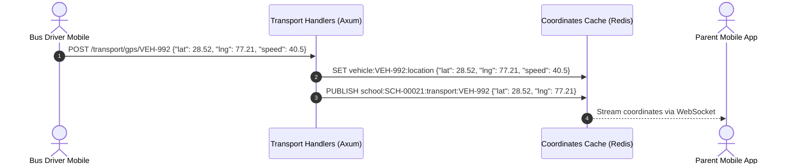

# 📋 Chapter 11: Operations Domain Manual

This manual staff assignments, versioned configuration changes, workload monitoring reports, live vehicle GPS locations, task board processes, aur student complaints ko explain karta hai.

---

## 📖 Overview aur Features (Udeshya aur Suvidhayein)

### 🎯 Feature Purpose (Kyun banaya gaya hai)
Daily operational works jaise transport tracking, task boards, aur helpdesk tickets handle karta hai. Iska goal transport protection aur administrative workflow maintain karna hai.


Operations domain school assets management, transport logistics, aur staff duty details ko manage karta hai:
- **Responsibilities Directory:** Duties (teaching, lab management, hallway check) register karta hai aur staff, rooms aur students ke sath sync rakhta hai.
- **Auditing & Version Rollbacks:** Configurations update details logs karta hai, snapshots record karta hai, aur history version par rollback ki facility deta hai.
- **Utilization & Capacity Metrics:** Staff workloads count, room availability distributions, aur operational costs calculate karta hai aur CSV/PDF export options deta hai.
- **Transport Logistics:** Vehicle live GPS route details stream karta hai aur student boarding (picked/dropped) status check karta hai.
- **Task Board:** Operations lists manage karta hai aur AI se custom checklists generate karta hai.
- **Discipline Complaints:** Student behavioral problems ko profile par update aur save karta hai.
- **System Reminders:** Operations process triggers aur general time alarms notify karta hai.

---

## 🏗️ Architecture aur Data Flow

### 🛠️ Tech Stack aur Dependencies
- **Framework:** Axum
- **Database:** Postgres (sqlx).
- **Real-time:** Redis for live GPS streams.
- **Background Tasks:** Tokio tasks for SLAs and reminders.

### 🌊 Deep Code aur Data Flow
1. **Request:** Transport driver app har kuch seconds mein GPS coordinates bhejta hai.
2. **Service Logic:** `services/operations/` Redis memory store mein vehicle ki live location update karta hai.
3. **Database:** Periodically live location database history logger mein save hoti hai.
4. **Response:** User mobile screen par live bus speed aur map updates dekh sakte hain.


- **Route Module:** `src/domain/operations/mod.rs`
- **Handler Files:** `src/domain/operations/responsibility.rs`, `src/domain/operations/responsibility_ws.rs`, `src/domain/operations/transport.rs`, `src/domain/operations/task.rs`, `src/domain/operations/complains.rs`, `src/domain/operations/reminder.rs`
- **Services:** `src/services/operations/`
- **Repositories:** `src/repository/operations/`
- **Database Tables:** `responsibilities`, `responsibility_assignments`, `responsibility_history`, `tasks`, `complains`, `reminders`, `bus_routes`, `gps_logs`



---

## 🚦 Developer Laws (Do's aur Don'ts - Kya karein aur kya na karein)

- **DO:** Check if total assigned periods for an employee exceed their contract workload capacity before validating bulk assignments.
- **DO:** Stream GPS vehicle coordinates to Redis Pub/Sub channels to avoid database bottlenecks during frequent tracker updates.
- **DON'T:** Never permit updating responsibility configs if the target version ID does not exist in the version history tables.
- **DON'T:** Never bypass school multitenancy context filters during complaints queries.

---

## 🔌 API Reference aur Specs (API Ki Jankari)

### 1. Operational Duties (Responsibilities)

#### A. Define Operational Duty
- **Endpoint:** `POST /api/school/:schoolId/operations/responsibility`
- **Request Body:**
  ```json
  {
    "name": "Class 10-A Teacher",
    "description": "Primary class educator responsibility",
    "weeklyPeriods": 30
  }
  ```
- **Success Response:**
  ```json
  {
    "success": true,
    "data": {
      "responsibilityId": "RES_9901"
    }
  }
  ```

#### B. Bulk Assign Duty to Staff
- **Endpoint:** `POST /api/school/:schoolId/operations/responsibility/:responsibilityId/bulk-assign`
- **Request Body:**
  ```json
  {
    "employeeIds": ["EMP-00109", "EMP-00302"]
  }
  ```

#### C. Roll Back Config to Historic Version
- **Endpoint:** `POST /api/school/:schoolId/operations/responsibility/:responsibilityId/rollback/:version`
- **Success Response:**
  ```json
  {
    "success": true,
    "message": "Configuration reverted to version 4"
  }
  ```

---

### 2. Operational Metrics & PDF Reports

#### A. Fetch Staff Workload Capacity Metrics
- **Endpoint:** `GET /api/school/:schoolId/operations/responsibility/metrics/workload`
- **Success Response:**
  ```json
  {
    "success": true,
    "data": [
      {
        "employeeId": "EMP-00109",
        "name": "Sunita Rao",
        "assignedPeriods": 28,
        "maxCapacityPeriods": 30,
        "loadPercentage": 93.3
      }
    ]
  }
  ```

#### B. Download Workload Report PDF
Generates an operational PDF breakdown.
- **Endpoint:** `GET /api/school/:schoolId/operations/responsibility/reports/workload/:startDate/:endDate/pdf`
- **Success Response:** Binary PDF Stream (`application/pdf`).

---

### 3. Transport GPS Vehicle Tracking

#### A. Update Vehicle GPS Coordinates
- **Endpoint:** `POST /api/school/:schoolId/operations/transport/gps/:vehicleId`
- **Request Body:**
  ```json
  {
    "lat": 28.6139,
    "lng": 77.2090,
    "speed": 35.8
  }
  ```
- **Success Response:**
  ```json
  {
    "success": true,
    "message": "Coordinates updated"
  }
  ```

#### B. List Route Passengers
Lists students linked to a driver's vehicle route.
- **Endpoint:** `GET /api/school/:schoolId/operations/transport/driver-students`
- **Success Response:**
  ```json
  {
    "success": true,
    "data": [
      { "studentId": "STD-99882", "name": "Jane Doe", "pickupStop": "East Crossing" }
    ]
  }
  ```

#### C. Mark Passenger Check-In
- **Endpoint:** `POST /api/school/:schoolId/operations/transport/mark-pickup`
- **Request Body:**
  ```json
  {
    "studentIds": ["STD-99882"],
    "status": "picked_up",
    "vehicleId": "VEH-992"
  }
  ```

---

### 4. Task Board Controls

#### A. Autogenerate Tasks via AI
- **Endpoint:** `POST /api/school/:schoolId/operations/tasks/ai/generate`
- **Request Body:**
  ```json
  {
    "prompt": "Prepare administrative checklist for school annual sports day."
  }
  ```
- **Success Response:**
  ```json
  {
    "success": true,
    "data": {
      "tasks": [
        { "taskId": "TSK-0091", "title": "Inspect sports equipment inventories", "status": "todo" }
      ]
    }
  }
  ```

#### B. Modify Task Status
- **Endpoint:** `PUT /api/school/:schoolId/operations/tasks/:taskId/status`
- **Request Body:**
  ```json
  {
    "status": "in_progress"
  }
  ```

---

### 5. Discipline Complaints & Reminders

#### A. File a Student Discipline Complaint
- **Endpoint:** `POST /api/school/:schoolId/operations/complains`
- **Request Body:**
  ```json
  {
    "studentId": "STD-99882",
    "category": "behavioral",
    "summary": "Disruptive conduct in physics laboratory.",
    "reportedBy": "EMP-00109"
  }
  ```
- **Success Response:**
  ```json
  {
    "success": true,
    "data": { "complaintId": "CMP-9982" }
  }
  ```

#### B. List Operational Reminders
- **Endpoint:** `GET /api/school/:schoolId/operations/reminders`

---

## 🕒 Update History aur Status (Badlavo ki History)

*Is section mein hum saare bade badlavo, design decisions, aur future plans ko track karte hain.*

- **Transport Passenger Pickup:** Driver endpoints `/transport/mark-pickup` now dispatch push notifications to parents automatically when a student is checked in present on the school bus coordinate.
- **AI Task Boards:** Added AI task generators `/tasks/ai/generate` and reorganizers `/tasks/ai/reorganize` to automatically group PTM checklist priorities based on class sections.
