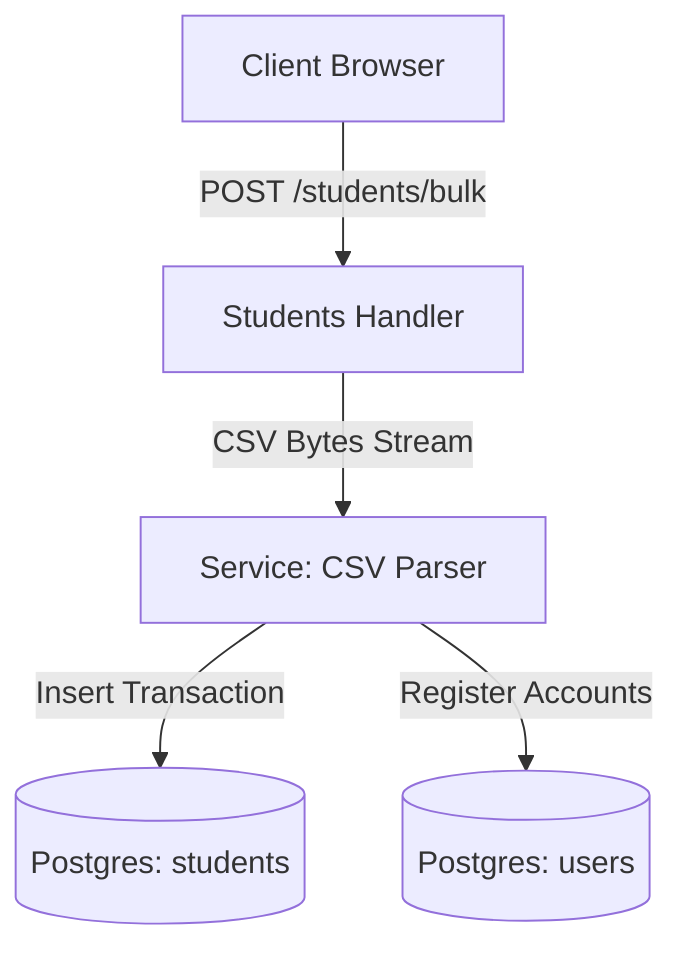

# 🧑‍🤝‍🧑 Chapter 5: People Domain Manual

Yeh manual student aur employee directories, bulk CSV imports, AI-assisted onboarding autocomplete, aur employee payroll ledger systems ko manage karne ke liye hai.

---

## 📖 Overview aur Features (Udeshya aur Suvidhayein)

### 🎯 Feature Purpose (Kyun banaya gaya hai)
Students, parents, aur staff ki central directory hai. Yeh master record ki tarah kaam karta hai jisme profiles, medical history, aur payroll information save hoti hai.


People domain profile directories, demographics, validations, aur monthly paycheck ledgers ko manage karta hai:
- **Student Directory:** Student details register karta hai, class assignments track karta hai, aur room spaces ke hisab se profiles show karta hai.
- **Employee Directory:** Employees (teachers, drivers, admins) ke profiles aur unki duties (responsibilities) manage karta hai.
- **AI Form Auto-fill:** Documents se parameters extract karke registration forms auto-fill karta hai.
- **Payroll Ledger:** Monthly salaries process karta hai, bonus/aid calculate karta hai, aur payroll close karta hai.

---

## 🏗️ Architecture aur Data Flow

### 🛠️ Tech Stack aur Dependencies
- **Framework:** Axum
- **Database:** Postgres (sqlx) with extensive JSONB for dynamic profiles.
- **Export:** csv crate for bulk uploads/downloads.

### 🌊 Deep Code aur Data Flow
1. **Request:** HR naya student ya staff member add karta hai.
2. **Validation:** Check hota hai ki ID ya email duplicate toh nahi hai.
3. **Service Logic:** `services/people/` user ko specific roles aur departments mein link karta hai.
4. **Database:** Database ke `users`, `students`, aur `employees` tables mein data insert hota hai.
5. **Events:** Background event trigger hota hai jo login credentials create karta hai.


- **Route Module:** `src/domain/people/mod.rs`
- **Handler Files:** `src/domain/people/students.rs`, `src/domain/people/student_forms.rs`, `src/domain/people/employees.rs`, `src/domain/people/emppay.rs`, `src/domain/people/user_api.rs`
- **Services:** `src/services/people/`
- **Repositories:** `src/repository/people/`
- **Database Tables:** `students`, `employees`, `employee_paychecks`, `user_device_tokens`



---

## 🚦 Developer Laws (Do's aur Don'ts - Kya karein aur kya na karein)

- **DO:** Student aur employee directories ko active tenant `school_id` ke hisab se strictly filter karein.
- **DO:** Registration se pehle database mein duplicate phone numbers ya Aadhaar check karein.
- **DON'T:** Payroll final balances kabhi client side par calculate na karein. Tampering se bachne ke liye hamesha backend services layer ka use karein.
- **DON'T:** Outstanding financial records wale students/employees ko delete na karein, balki `inactive` mark karein.

---

## 🔌 API Reference aur Specs (API Ki Jankari)

### 1. Student Directory APIs

#### A. Register New Student
- **Endpoint:** `POST /api/school/:schoolId/people/students`
- **Authentication:** Bearer Token
- **Request Body:**
  ```json
  {
    "name": "Arjun Sharma",
    "spaceId": "class_10a",
    "className": "10-A",
    "gender": "male",
    "dob": "2010-05-15",
    "contact": "9988776655",
    "email": "arjun@gmail.com",
    "aadhaarNumber": "123456789012",
    "parentName": "Dev Sharma",
    "parentContact": "9988776654",
    "addressCity": "New Delhi",
    "addressPincode": "110001",
    "studentType": "day_scholar",
    "totalFee": 15000.0
  }
  ```
- **Success Response:**
  ```json
  {
    "success": true,
    "data": {
      "studentId": "STD-99812",
      "name": "Arjun Sharma"
    }
  }
  ```

#### B. Bulk Import Students via CSV
- **Endpoint:** `POST /api/school/:schoolId/people/students/bulk`
- **Headers:** `Content-Type: text/csv`
- **Expected CSV Structure:**
  ```csv
  name,className,gender,dob,contact,email,aadhaarNumber,parentName,parentContact,addressCity,addressPincode,studentType
  Amit Sen,10-A,male,2010-02-12,9911223344,amit@mail.com,112233445566,Raj Sen,9911223345,Kolkata,700001,day_scholar
  ```
- **Success Response:**
  ```json
  {
    "success": true,
    "message": "Successfully imported 48 students. 0 errors."
  }
  ```

#### C. Get Form Auto-fill (AI Assisted)
Student details ko pre-populate karne ke liye metadata extract karta hai.
- **Endpoint:** `GET /api/school/:schoolId/people/students/:studentId/auto-fill`
- **Success Response:**
  ```json
  {
    "success": true,
    "data": {
      "name": "Arjun Sharma",
      "dob": "2010-05-15",
      "aadhaarNumber": "123456789012"
    }
  }
  ```

---

### 2. Employee Directory APIs

#### A. Register New Employee
- **Endpoint:** `POST /api/school/:schoolId/people/employees`
- **Request Body:**
  ```json
  {
    "name": "Sunita Rao",
    "fatherName": "K. Rao",
    "motherName": "M. Rao",
    "dob": "1988-08-20",
    "gender": "female",
    "category": "teaching",
    "employeeType": "teacher",
    "baseSalary": 45000.0,
    "email": "sunita.rao@school.com",
    "phone": "9922334455",
    "alternativeContact": "9922334456",
    "permanentAddress": "45 Lake Road, Bangalore",
    "temporaryAddress": "45 Lake Road, Bangalore",
    "aadhaarNumber": "987654321098",
    "responsibilities": [
      {
        "spaceId": "class_10a",
        "roleIds": ["class_teacher"]
      }
    ]
  }
  ```
- **Success Response:**
  ```json
  {
    "success": true,
    "data": {
      "employeeId": "EMP-00281",
      "name": "Sunita Rao"
    }
  }
  ```

#### B. Bulk Import Employees via CSV
- **Endpoint:** `POST /api/school/:schoolId/people/employees/bulk`
- **Headers:** `Content-Type: text/csv`
- **Success Response:**
  ```json
  {
    "success": true,
    "message": "Successfully imported 14 employees."
  }
  ```

---

### 3. Employee Payroll APIs

#### A. Set Employee Base Salary Parameters
- **Endpoint:** `POST /api/school/:schoolId/people/employees/:employeeId/salary`
- **Request Body:**
  ```json
  {
    "baseSalary": 48000.0
  }
  ```
- **Success Response:**
  ```json
  {
    "success": true,
    "message": "Contract salary updated"
  }
  ```

#### B. Award Bonus Payment Allocation
- **Endpoint:** `POST /api/school/:schoolId/people/employees/:employeeId/bonus`
- **Request Body:**
  ```json
  {
    "amount": 5000.0,
    "reason": "Exemplary curriculum coverage performance"
  }
  ```
- **Success Response:**
  ```json
  {
    "success": true,
    "message": "Bonus allocated to pending paycheck ledger"
  }
  ```

#### C. Grant Financial Allowance Aid
- **Endpoint:** `POST /api/school/:schoolId/people/employees/:employeeId/aid`
- **Request Body:**
  ```json
  {
    "amount": 1200.0,
    "reason": "Travel reimbursement allowance"
  }
  ```
- **Success Response:**
  ```json
  {
    "success": true,
    "message": "Allowance added"
  }
  ```

#### D. Close Monthly Payroll Ledger
Paycheck values lock karta hai aur bank transfers ke liye data prepare karta hai.
- **Endpoint:** `POST /api/school/:schoolId/people/employees/:employeeId/close-month`
- **Request Body:**
  ```json
  {
    "month": 6,
    "year": 2026
  }
  ```
- **Success Response:**
  ```json
  {
    "success": true,
    "data": {
      "paycheckId": "PCK_991823",
      "baseSalary": 45000.0,
      "bonuses": 5000.0,
      "allowances": 1200.0,
      "deductions": 500.0,
      "netPay": 50700.0,
      "status": "closed"
    }
  }
  ```

#### E. Record Salary Payout Transactions
Closed salary invoice ko fully paid mark karta hai.
- **Endpoint:** `POST /api/school/:schoolId/people/employees/:employeeId/pay`
- **Request Body:**
  ```json
  {
    "paycheckId": "PCK_991823",
    "paymentMode": "bank_transfer",
    "referenceNumber": "TXN_7761829"
  }
  ```
- **Success Response:**
  ```json
  {
    "success": true,
    "message": "Salary payment logged successfully"
  }
  ```

#### F. Get Employee Paycheck Monthly Breakdown
- **Endpoint:** `GET /api/school/:schoolId/people/employees/:employeeId/salary-breakdown`
- **Success Response:**
  ```json
  {
    "success": true,
    "data": {
      "employeeId": "EMP-00281",
      "baseSalary": 45000.0,
      "pendingBonus": 0.0,
      "pendingAid": 0.0,
      "closedPaychecks": []
    }
  }
  ```

---

### 4. External Integration / API-Key Protected Routes

Yeh routes integration keys ke zariye third-party apps ko student/employee sync karne ki suvidha dete hain:
- **`GET /api/school/:schoolId/people/user/students`**
- **`GET /api/school/:schoolId/people/user/students/search`**
- **`GET /api/school/:schoolId/people/user/students/:studentId`**
- **`GET /api/school/:schoolId/people/user/employees`**
- **`GET /api/school/:schoolId/people/user/employees/search`**
- **`GET /api/school/:schoolId/people/user/employees/:employeeId`**

*Headers Requirement:* `x-api-key: <integrationKey>`

---

## 🕒 Update History aur Status (Badlavo ki History)

*Is section mein hum saare bade badlavo, design decisions, aur future plans ko track karte hain.*

- **Address Coordinates:** Added states/countries structural keys to student registrations to prevent geo-mapping failures during bus route planning.
- **Closed state check:** Paycheck adjustment APIs (Bonus, Aid) now verify that the ledger status for the month is not already set to `closed` or `paid` before editing balances.
