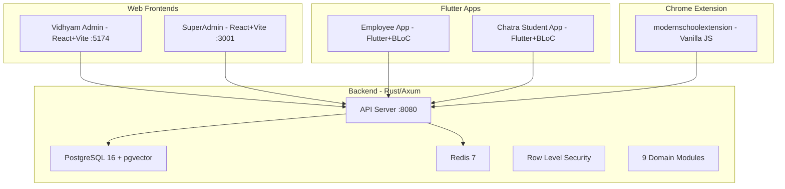
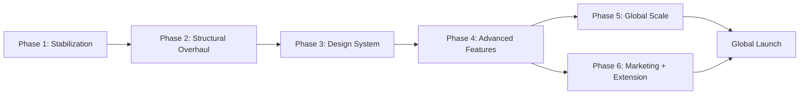

# Modern AI School SaaS — Global Transformation Master Plan

## Executive Summary

This document governs the complete transformation of the Modern AI School platform from its current non-standardized state to a globally scalable, premium SaaS platform capable of serving millions to billions of users. The plan is divided into 6 sequential phases, each with microscopic sub-tasks designed for flawless AI-builder execution.

---

## Current Architecture Snapshot



### Identified Critical Issues

| Category | Issue | Severity | Location |
|----------|-------|----------|----------|
| **Compilation** | `fix_imports_v3.dart` has 6 type errors - dynamic Function assigned to String | BLOCKER | Apps/chatra/lib/fix_imports_v3.dart |
| **Compilation** | `dashboard_stats_widget.dart` - broken imports for GlassCard and AppColors | BLOCKER | Apps/chatra/lib/features/home/widgets/ |
| **Compilation** | `timetable_widget.dart` - broken imports for GlassCard and AppColors | BLOCKER | Apps/chatra/lib/features/home/widgets/ |
| **Compilation** | `spotlight_search_widget.dart` - broken import for AppColors | BLOCKER | Apps/chatra/lib/features/home/widgets/ |
| **Deprecation** | 50+ uses of deprecated withOpacity across chatra app | HIGH | Apps/chatra/lib/ |
| **Unused Code** | Multiple unused imports across chatra BLoC files | MEDIUM | Apps/chatra/lib/features/ |
| **Unused Code** | `_buildActionButton` declared but never referenced | MEDIUM | Apps/chatra/home_screen.dart |
| **Architecture** | No shared design system between Vidhyam and SuperAdmin | HIGH | frontend/ |
| **Architecture** | Dark-first theme with incomplete light mode | HIGH | frontend/Vidhyam/ |
| **Architecture** | No monorepo or shared package strategy | HIGH | Project root |
| **Architecture** | Chrome extension uses vanilla JS, no build system | MEDIUM | modernschoolextension/ |
| **Architecture** | Employee app has flat screens/ structure vs chatra feature-based | MEDIUM | Apps/employee/ |
| **Schema** | 40+ migration files with some duplicates and conflicts | HIGH | Backend/migrations/ |
| **Security** | CSP allows unsafe-inline and unsafe-eval | HIGH | frontend/SuperAdmin/ |
| **Performance** | No CDN, no edge caching, no asset optimization pipeline | HIGH | Infrastructure |
| **Scalability** | Single PostgreSQL instance, no read replicas | CRITICAL | Backend/ |

---

## Phase Overview

| Phase | Name | Focus |
|-------|------|-------|
| 1 | **Stabilization and Bug Fixes** | Fix all compilation errors, broken imports, deprecation warnings, and critical bugs |
| 2 | **Structural Overhaul and Standardization** | Monorepo migration, shared packages, consistent architecture across all apps |
| 3 | **Design System and UI/UX Transformation** | Premium light theme, standardized color system, component library, maximum reusability |
| 4 | **Advanced Features and Feature Completion** | Implement all partially-built features, add missing features, AI integration refinement |
| 5 | **Global Scale Infrastructure** | Multi-region deployment, read replicas, CDN, edge caching, observability |
| 6 | **Marketing Website and Chrome Extension Rebuild** | Premium intro/marketing site, Chrome extension modernization with Manifest V3 |

---

## Target Tech Stack — Global Scale

### Backend
| Component | Current | Target | Rationale |
|-----------|---------|--------|-----------|
| Runtime | Rust/Axum 0.7 | Rust/Axum 0.7 | Keep - excellent performance |
| Database | PostgreSQL 16 | PostgreSQL 16 + Citus | Horizontal sharding for multi-tenant |
| Cache | Redis 7 | Redis 7 Cluster | Distributed caching |
| Search | None | Meilisearch | Full-text search across all entities |
| Queue | None | NATS JetStream | Async job processing, event bus |
| Storage | Local + GCS | Cloudflare R2 | S3-compatible, zero egress fees |
| Monitoring | Basic health | OpenTelemetry + Grafana | Full observability stack |
| CI/CD | None | GitHub Actions + ArgoCD | GitOps deployment |

### Web Frontends
| Component | Current | Target | Rationale |
|-----------|---------|--------|-----------|
| Framework | React 18 | React 19 | Latest features |
| Build | Vite 5 | Vite 6 + Turbopack | Faster builds |
| State | Redux Toolkit | Zustand + TanStack Query | Simpler, better caching |
| Styling | Tailwind 3 + CSS vars | Tailwind 4 + Design Tokens | Latest, CSS-native |
| Forms | react-hook-form | Conform | Type-safe, server-validated |
| Charts | Recharts | Tremor | Premium dashboard components |
| Monorepo | None | Turborepo + pnpm | Shared packages, atomic deploys |

### Mobile Apps
| Component | Current | Target | Rationale |
|-----------|---------|--------|-----------|
| Framework | Flutter 3.x | Flutter 3.x | Keep - cross-platform |
| State | flutter_bloc | flutter_bloc | Keep - well-structured |
| Navigation | go_router | go_router | Keep |
| DI | None | get_it + injectable | Proper dependency injection |
| Networking | http | dio | Interceptors, retry, caching |
| Local DB | sqflite | drift/SQLite | Type-safe ORM |
| Monorepo | None | Melos | Shared Dart packages |

### Chrome Extension
| Component | Current | Target | Rationale |
|-----------|---------|--------|-----------|
| Manifest | V2/V3 unknown | Manifest V3 | Required by Chrome |
| Build | None | Vite + CRXJS | Modern build, HMR |
| Framework | Vanilla JS | React + TypeScript | Consistency with web apps |
| Styling | style.css | Tailwind + Design Tokens | Consistent with platform |

---

## Premium UI/UX Design System — Light Theme

### Core Color Palette

```
PRIMARY PALETTE
─────────────────
Primary 50:  #EEF2FF    Background tint
Primary 100: #E0E7FF    Subtle highlights
Primary 200: #C7D2FE    Borders, dividers
Primary 300: #A5B4FC    Disabled states
Primary 400: #818CF8    Secondary text
Primary 500: #6366F1    Brand primary ★
Primary 600: #4F46E5    Hover states
Primary 700: #4338CA    Active/pressed
Primary 800: #3730A3    Deep accent
Primary 900: #312E81    Dark accent

NEUTRAL PALETTE
───────────────
Gray 50:  #F8FAFC    Page background
Gray 100: #F1F5F9    Card background
Gray 200: #E2E8F0    Borders
Gray 300: #CBD5E1    Dividers
Gray 400: #94A3B8    Placeholder text
Gray 500: #64748B    Secondary text
Gray 600: #475569    Body text
Gray 700: #334155    Heading text
Gray 800: #1E293B    Primary text
Gray 900: #0F172A    Emphasis text

SEMANTIC PALETTE
────────────────
Success: #059669    Green-600
Warning: #D97706    Amber-600
Error:   #DC2626    Red-600
Info:    #0284C7    Sky-600

SURFACE ELEVATIONS
──────────────────
Level 0: #F8FAFC    Page base
Level 1: #FFFFFF    Cards, modals
Level 2: #FFFFFF    Dropdowns, popovers
Level 3: #FFFFFF    Dialogs, overlays

SHADOWS
───────
SM:  0 1px 2px rgba(0,0,0,0.05)
MD:  0 4px 6px -1px rgba(0,0,0,0.07)
LG:  0 10px 15px -3px rgba(0,0,0,0.08)
XL:  0 20px 25px -5px rgba(0,0,0,0.1)

TYPOGRAPHY
──────────
Font:     Inter
Display:  36/40 semibold
H1:       30/36 semibold
H2:       24/28 semibold
H3:       20/24 medium
H4:       18/20 medium
Body:     16/24 regular
Small:    14/20 regular
Caption:  12/16 regular

SPACING SCALE
─────────────
4px → 8px → 12px → 16px → 20px → 24px → 32px → 40px → 48px → 64px → 80px → 96px

BORDER RADIUS
─────────────
SM: 6px  MD: 8px  LG: 12px  XL: 16px  2XL: 24px  Full: 9999px
```

### Design Principles
1. **Light-first**: Default theme is light; dark is opt-in
2. **Consistent elevation**: White cards on gray backgrounds
3. **Minimal color**: Primary used sparingly for CTAs and active states
4. **Data density**: Compact but breathable layouts
5. **Micro-interactions**: Subtle hover/focus states, no heavy animations
6. **Accessibility**: WCAG 2.1 AA minimum contrast ratios

---

## Phase Dependency Graph



---

## Detailed Phase Files

Each phase has its own dedicated `.md` file with microscopic sub-tasks:

1. [`01-PHASE-STABILIZATION.md`](01-PHASE-STABILIZATION.md)
2. [`02-PHASE-STRUCTURAL-OVERHAUL.md`](02-PHASE-STRUCTURAL-OVERHAUL.md)
3. [`03-PHASE-DESIGN-SYSTEM.md`](03-PHASE-DESIGN-SYSTEM.md)
4. [`04-PHASE-ADVANCED-FEATURES.md`](04-PHASE-ADVANCED-FEATURES.md)
5. [`05-PHASE-GLOBAL-SCALE.md`](05-PHASE-GLOBAL-SCALE.md)
6. [`06-PHASE-MARKETING-EXTENSION.md`](06-PHASE-MARKETING-EXTENSION.md)
