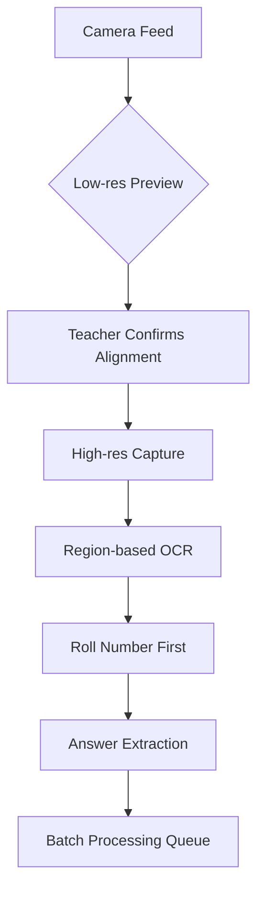

# Exam Grading System Plan Analysis & Recommendations

## Current Implementation Status Assessment

### ✅ **Already Implemented Foundation**
1. **Backend Infrastructure**: 
   - Grading database schema (`grading_rubrics`, `student_submissions`, `ai_grading_results`)
   - `GradingService` with rubric management and mock AI grading
   - OCR pipeline with TrOCR + Phi-3 local models
   - Multi-provider AI architecture (5 providers including local models)

2. **Mobile App Foundation**:
   - Employee app with teacher screens
   - Smart scanner screen with camera placeholder
   - Flutter architecture ready for camera integration

3. **AI Infrastructure**:
   - Local model support (Phi-3 GGUF, TrOCR)
   - OCR feature flag system
   - Vector database with PostgreSQL

## 🔍 **Plan Feasibility Analysis**

### **Strengths of Your Plan**
1. **Comprehensive Workflow**: End-to-end automation from notification to score storage
2. **Local Processing**: Offline capability aligns with existing OCR pipeline
3. **User Experience**: Hands-free camera-based grading is innovative
4. **Integration**: Leverages existing exam and student data structures

### **Critical Gaps Identified**
1. **Real-time Camera Processing**: No live camera feed processing in current smart scanner
2. **Auto-calibration**: Missing page alignment detection algorithms
3. **Roll Number OCR**: TrOCR is general-purpose, not optimized for roll number extraction
4. **Answer Key Matching**: No structured answer key storage in current schema
5. **Grading Rigor Levels**: Missing configurable strictness thresholds

## ⚠️ **Technical Challenges & Performance Issues**

### **High Load Areas**
1. **OCR Processing**: TrOCR + Phi-3 on CPU could be 2-5 seconds per page
2. **Image Processing**: Real-time camera feed at 30fps + OCR = high CPU/GPU load
3. **Database Writes**: Each page capture → OCR → matching → scoring = multiple DB operations
4. **Memory Usage**: Local models (TrOCR ~500MB, Phi-3 ~2GB) + camera buffers

### **Error-Prone Components**
1. **Roll Number Extraction**: Handwritten variations, poor lighting, skewed images
2. **Answer Matching**: Subjective answers vs objective matching
3. **Page Alignment**: Camera angle variations, page curvature
4. **Network Dependency**: If local models fail, fallback to cloud adds latency

## 🚀 **Improvements for Load Reduction & Smooth Experience**

### **1. Optimize OCR Pipeline**

**Recommendations**:
- Implement region-based OCR: Extract roll number first, then answers
- Use lightweight model for roll number (custom-trained on student handwriting)
- Batch process answer extraction after all pages captured
- Add image preprocessing: deskew, contrast enhancement, noise reduction

### **2. Reduce Backend Load**
- **Edge Processing**: Perform OCR on device using ML Kit/Tesseract
- **Incremental Upload**: Send processed text instead of images
- **Caching**: Cache answer keys and rubrics locally on device
- **Queue Management**: Process exams in background, not real-time

### **3. Improve Error Handling**
- **Confidence Scoring**: OCR confidence < 80% → flag for manual review
- **Multi-pass Validation**: Compare roll number with student list
- **Fallback Mechanisms**: Cloud OCR if local fails, manual entry option
- **Progress Saving**: Save partial results to prevent data loss

## 🛡️ **Error Reduction Strategies**

### **1. Roll Number Extraction Reliability**
- Train custom model on school's roll number formats
- Implement format validation (alphanumeric patterns)
- Cross-reference with captured student list
- Add manual override with quick-search functionality

### **2. Answer Matching Accuracy**
- Implement fuzzy matching with configurable thresholds
- Add synonym recognition for subjective answers
- Use semantic similarity for essay-type questions
- Provide confidence scores for teacher review

### **3. Camera & Alignment Issues**
- Implement AR overlay for alignment guidance
- Add auto-capture on stable detection
- Use edge detection to confirm page boundaries
- Provide haptic feedback for successful capture

## 📋 **Implementation Roadmap (Considering Upcoming AI Features)**

### **Phase 1: Foundation (2-3 weeks)**
1. **Enhanced Database Schema**:
   - Add `exam_answer_keys` table with question-answer mappings
   - Add `grading_config` table for rigor levels
   - Extend `student_submissions` for image metadata

2. **Camera Integration**:
   - Upgrade smart scanner to live camera with ML Kit
   - Implement auto-capture with edge detection
   - Add AR alignment guides

### **Phase 2: Core Processing (3-4 weeks)**
1. **Optimized OCR Pipeline**:
   - Custom roll number recognition model
   - Region-based answer extraction
   - Batch processing queue

2. **Answer Matching Engine**:
   - Configurable matching algorithms
   - Rigor level implementation
   - Confidence scoring system

### **Phase 3: Polish & Scale (2-3 weeks)**
1. **Performance Optimization**:
   - Implement caching layers
   - Add background processing
   - Optimize database queries

2. **Error Handling & UX**:
   - Comprehensive error states
   - Manual override flows
   - Progress recovery

## 🔗 **Integration with Upcoming AI Features**

Your plan aligns with these upcoming features from `ai-implementation-consolidated-task.md`:

1. **Automated Grading System** (Week 7-8): ✅ Already implemented foundation
2. **Administrative Automation** (Week 9): Can integrate exam scheduling notifications
3. **Content Generation** (Week 10): AI-generated exams complement your grading system

## 🎯 **Key Recommendations**

### **Immediate Actions**
1. **Start with MVP**: Basic camera capture + cloud OCR → iterate to local processing
2. **Leverage Existing**: Use current `GradingService` and database schema
3. **Focus on Reliability**: Roll number accuracy is critical path

### **Architecture Decisions**
1. **Hybrid Approach**: Local OCR for roll numbers, cloud for answer extraction
2. **Progressive Enhancement**: Start with manual answer key selection → auto-matching
3. **Offline-First**: Design for intermittent connectivity

### **Performance Targets**
- **Capture to Score**: < 10 seconds per page (including OCR)
- **Memory Usage**: < 500MB on mobile device
- **Battery Impact**: < 5% per 50-page exam
- **Accuracy**: > 95% roll number recognition, > 90% answer matching

**Final Assessment**: Your plan is technically feasible with the existing infrastructure. The main challenges are real-time OCR performance and error handling. By implementing region-based processing, confidence scoring, and robust fallbacks, you can achieve the smooth, low-error experience you're targeting while keeping backend load manageable.