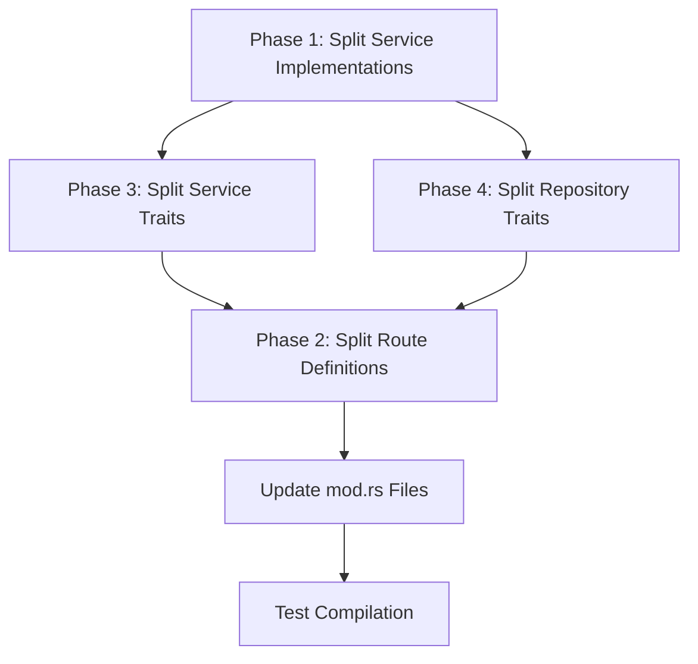

# Backend Codebase Refactoring Plan

## Current State Analysis

### Oversized Files (>500 lines)

| File | Lines | Content |
|------|-------|---------|
| `services/auxiliary_service.rs` | 1470 | 7+ service implementations |
| `routes/router.rs` | 870 | Main router aggregating all routes |
| `services/traits.rs` | 827 | All service traits |
| `repository/traits.rs` | 629 | All repository traits |

### Architecture Issues

1. **Monolithic service files** - [`auxiliary_service.rs`](Backend/src/services/auxiliary_service.rs) implements multiple unrelated services
2. **All traits in single files** - Difficult to find specific definitions
3. **Large files consume excessive AI tokens** - Reduces efficiency

---

## Refactoring Plan

### Phase 1: Split Service Implementations

**Target:** [`services/auxiliary_service.rs`](Backend/src/services/auxiliary_service.rs) (1470 lines)

Create separate service files:

| New File | Service | Est. Lines |
|----------|---------|------------|
| `services/award_service.rs` | AwardService impl | ~150 |
| `services/complain_service.rs` | ComplainService impl | ~150 |
| `services/reminder_service.rs` | ReminderService impl | ~150 |
| `services/documentbox_service.rs` | DocumentBoxService impl | ~200 |
| `services/school_service.rs` | SchoolService impl | ~200 |
| `services/responsibility_service.rs` | ResponsibilityService impl | ~400 |
| `services/task_service.rs` | TaskService impl | ~220 |

**Actions:**
1. Extract each `impl` block to separate file
2. Keep [`auxiliary_service.rs`](Backend/src/services/auxiliary_service.rs) for struct definition only
3. Update [`services/mod.rs`](Backend/src/services/mod.rs) to export new modules

---

### Phase 2: Split Route Definitions

**Target:** [`routes/router.rs`](Backend/src/routes/router.rs) (870 lines)

The routes directory already has individual route files. The router.rs file aggregates them.

**Strategy:** Group routes by domain into sub-routers:

| New File | Routes Grouped |
|----------|----------------|
| `routes/responsibility_router.rs` | All responsibility routes |
| `routes/student_router.rs` | All student routes |
| `routes/employee_router.rs` | All employee routes |
| `routes/academic_router.rs` | All academic routes |
| `routes/fee_router.rs` | All fee routes |
| `routes/admin_router.rs` | Super admin routes |

**Actions:**
1. Create domain-specific router modules
2. Move related routes from [`router.rs`](Backend/src/routes/router.rs) to sub-routers
3. Keep [`router.rs`](Backend/src/routes/router.rs) as main aggregator
4. Update [`routes/mod.rs`](Backend/src/routes/mod.rs)

---

### Phase 3: Split Service Traits

**Target:** [`services/traits.rs`](Backend/src/services/traits.rs) (827 lines)

Create trait module structure:

```
services/traits/
├── mod.rs              # Re-exports all traits
├── auxiliary.rs        # Award, Complain, Reminder, DocumentBox, School
├── responsibility.rs   # ResponsibilityService
├── task.rs             # TaskService
├── student.rs          # StudentService
├── employee.rs         # EmployeeService
├── academic.rs         # AcademicService
├── auth.rs             # AuthService
├── attendance.rs       # AttendanceService
├── fee.rs              # FeeService, CouponService
├── payroll.rs          # PayrollService
├── resource.rs         # ResourceService, OCRService
├── leave.rs            # LeaveService
├── ai.rs               # AiService
├── recovery.rs         # RecoveryService
└── setup.rs            # SetupService
```

**Actions:**
1. Create `services/traits/` directory
2. Split traits by domain
3. Create `services/traits/mod.rs` to re-export
4. Update imports across codebase

---

### Phase 4: Split Repository Traits

**Target:** [`repository/traits.rs`](Backend/src/repository/traits.rs) (629 lines)

Create repository trait module structure:

```
repository/traits/
├── mod.rs              # Re-exports all traits
├── auth.rs             # AuthRepository
├── student.rs          # StudentRepository
├── employee.rs         # EmployeeRepository
├── academic.rs         # AcademicRepository
├── attendance.rs       # AttendanceRepository
├── fee.rs              # FeeRepository, CouponRepository
├── payroll.rs          # PayrollRepository
├── transaction.rs      # TransactionRepository
├── resource.rs         # ResourceRepository, OCRRepository
├── auxiliary.rs        # Award, Complain, Reminder, DocumentBox, School
├── responsibility.rs   # ResponsibilityRepository
├── task.rs             # TaskRepository
├── leave.rs            # LeaveRepository
├── analytics.rs        # AnalyticsRepository
├── audit.rs            # AuditRepository
├── global_user.rs      # GlobalUserRepository
└── storage.rs          # StorageRepository
```

**Actions:**
1. Create `repository/traits/` directory
2. Split traits by domain
3. Create `repository/traits/mod.rs` to re-export
4. Update imports across codebase

---

## Implementation Order



**Rationale:**
1. Phase 1 first - Service implementations are independent
2. Phase 3 & 4 in parallel - Traits are independent
3. Phase 2 last - Routes depend on services
4. Update mod.rs after all splits
5. Test compilation at the end

---

## Benefits

| Benefit | Impact |
|---------|--------|
| Files <500 lines | ✅ Easier navigation |
| Reduced AI token consumption | ✅ Faster AI responses |
| Better separation of concerns | ✅ Clearer module boundaries |
| Parallel compilation | ✅ Faster build times |
| Easier maintenance | ✅ Smaller, focused files |

---

## File Structure After Refactoring

```
Backend/src/
├── services/
│   ├── traits/
│   │   ├── mod.rs
│   │   ├── auxiliary.rs
│   │   ├── responsibility.rs
│   │   ├── task.rs
│   │   ├── student.rs
│   │   ├── employee.rs
│   │   ├── academic.rs
│   │   ├── auth.rs
│   │   ├── attendance.rs
│   │   ├── fee.rs
│   │   ├── payroll.rs
│   │   ├── resource.rs
│   │   ├── leave.rs
│   │   ├── ai.rs
│   │   ├── recovery.rs
│   │   └── setup.rs
│   ├── award_service.rs          # NEW
│   ├── complain_service.rs       # NEW
│   ├── reminder_service.rs       # NEW
│   ├── documentbox_service.rs    # NEW
│   ├── school_service.rs         # NEW
│   ├── responsibility_service.rs # NEW
│   ├── task_service.rs           # NEW
│   └── auxiliary_service.rs      # Reduced to struct def only
├── repository/
│   ├── traits/
│   │   ├── mod.rs
│   │   ├── auth.rs
│   │   ├── student.rs
│   │   ├── employee.rs
│   │   ├── academic.rs
│   │   ├── attendance.rs
│   │   ├── fee.rs
│   │   ├── payroll.rs
│   │   ├── transaction.rs
│   │   ├── resource.rs
│   │   ├── auxiliary.rs
│   │   ├── responsibility.rs
│   │   ├── task.rs
│   │   ├── leave.rs
│   │   ├── analytics.rs
│   │   ├── audit.rs
│   │   ├── global_user.rs
│   │   └── storage.rs
│   └── traits.rs                 # Removed (moved to traits/)
└── routes/
    ├── responsibility_router.rs # NEW
    ├── student_router.rs         # NEW
    ├── employee_router.rs        # NEW
    ├── academic_router.rs        # NEW
    ├── fee_router.rs             # NEW
    ├── admin_router.rs           # NEW
    └── router.rs                 # Reduced to aggregator only
```
