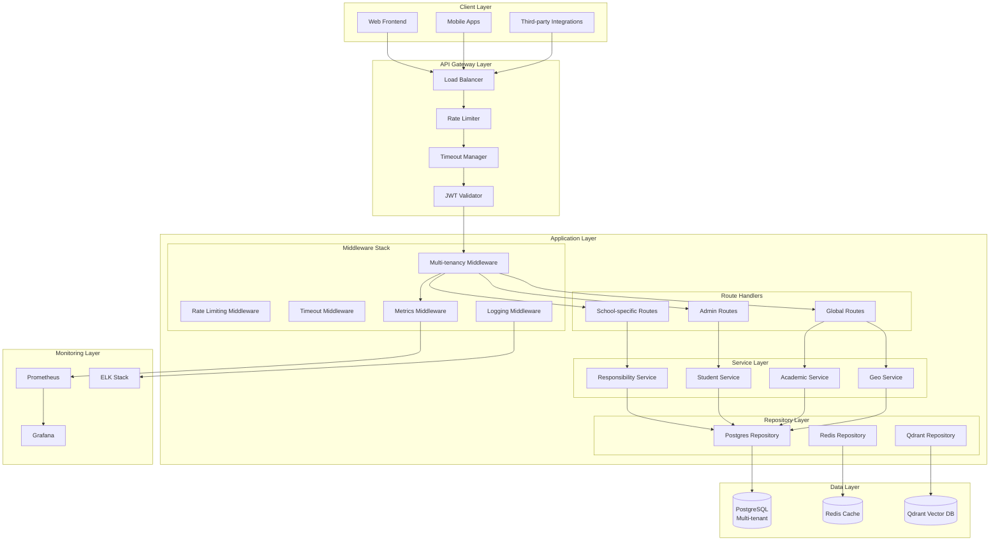
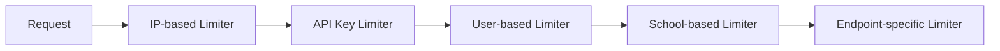
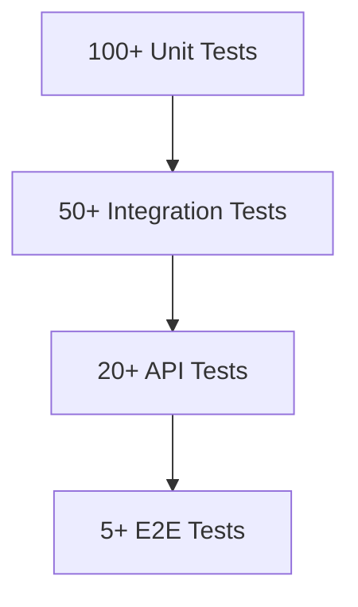

# Backend Rule Compliance Architecture Plan

## Executive Summary

This architecture plan addresses **3 critical rule violations** identified in the Modern School backend system. The plan provides a comprehensive solution for multi-tenancy compliance, security enhancements, and performance improvements while maintaining backward compatibility.

## Current State Analysis

### Identified Violations
1. **Multi-tenancy Inconsistency**: `/api/geo/countries` route violates `:schoolId` pattern
2. **Missing Rate Limiting**: No protection against abuse/DoS attacks  
3. **Missing Request Timeouts**: No timeout configuration for long-running requests

### Architecture Assessment
- ✅ Repository-Service-Route pattern properly implemented
- ✅ Error handling with `AppError` enum and proper HTTP status codes
- ✅ Multi-tenancy middleware exists but inconsistently applied
- ⚠️ Security features incomplete (rate limiting, timeouts missing)
- ⚠️ Monitoring and observability limited

## Target Architecture

### High-Level Architecture Diagram



## Phase 1: Multi-tenancy Compliance Architecture

### 1.1 Route Pattern Standardization

**Current Pattern**: Mixed (some routes use `:schoolId`, others don't)
**Target Pattern**: All non-admin routes MUST follow `/api/:schoolId/...`

#### Route Classification
| Route Type | Pattern | Example | Notes |
|------------|---------|---------|-------|
| School-specific | `/api/:schoolId/resource` | `/api/sch_123/responsibilities` | Requires school context |
| Admin-only | `/api/admin/resource` | `/api/admin/schools` | Super admin access |
| Global | `/api/global/resource` | `/api/global/notification` | System-wide resources |
| Public | `/api/public/resource` | `/api/public/health` | No authentication |

#### Geo Routes Migration
**Current**: `/api/geo/countries`
**Target**: `/api/geo/:schoolId/countries`

**Design Decision**: Geo data will be school-specific with ability to share common data via caching.

### 1.2 Tenant Context Propagation

```rust
// Enhanced TenantContext structure
#[derive(Clone, Debug)]
pub struct TenantContext {
    pub school_id: String,           // Required for all school-specific routes
    pub is_super_admin: bool,        // Admin privileges flag
    pub admin_id: String,            // Current admin/user ID
    pub user_permissions: Vec<String>, // Fine-grained permissions
    pub request_id: String,          // Unique request identifier
    pub tenant_schema: String,       // Database schema name
    pub rate_limit_key: String,      // Key for rate limiting
}
```

### 1.3 Database Schema Strategy

**Current**: Single database with RLS (Row Level Security)
**Enhanced**: Schema-per-tenant with shared common tables

```sql
-- Example schema structure
CREATE SCHEMA IF NOT EXISTS school_sch_123;
CREATE TABLE school_sch_123.responsibilities (...);
CREATE TABLE school_sch_123.students (...);

-- Common tables (shared across all schools)
CREATE TABLE public.countries (...);
CREATE TABLE public.states (...);
```

## Phase 2: Security Layer Architecture

### 2.1 Rate Limiting Design

#### Multi-level Rate Limiting


#### Implementation Strategy
```rust
// Hierarchical rate limiting
pub struct HierarchicalRateLimiter {
    ip_limiter: RateLimiter,      // 1000 req/min per IP
    api_key_limiter: RateLimiter, // 100 req/min per key  
    user_limiter: RateLimiter,    // 50 req/min per user
    school_limiter: RateLimiter,  // 5000 req/min per school
    endpoint_limiters: HashMap<String, RateLimiter>, // Custom per endpoint
}

// Redis-backed for distributed systems
pub struct RedisRateLimiter {
    redis_client: redis::Client,
    prefix: String,
    limits: HashMap<String, (u32, Duration)>,
}
```

### 2.2 Request Timeout Strategy

#### Timeout Configuration Matrix
| Request Type | Timeout | Retry Policy | Notes |
|--------------|---------|--------------|-------|
| API Requests | 30s | 0 retries | Fast fail for user requests |
| File Uploads | 300s | 0 retries | Large file processing |
| Database Queries | 10s | 1 retry | Query optimization required |
| External API Calls | 15s | 2 retries | Circuit breaker pattern |

#### Implementation
```rust
use tower_http::timeout::TimeoutLayer;
use std::time::Duration;

// Layer configuration
let timeout_layers = TimeoutLayer::new(Duration::from_secs(30))
    .with_response_timeout(Duration::from_secs(30))
    .with_request_timeout(Duration::from_secs(30));
```

### 2.3 Enhanced Authentication/Authorization

#### JWT Token Structure Enhancement
```json
{
  "sub": "admin_123",
  "school_id": "sch_456",
  "permissions": ["responsibility:read", "responsibility:write"],
  "rate_limit_tier": "premium",
  "exp": 1734567890,
  "iss": "modern-school-backend"
}
```

#### Permission Matrix
| Role | Responsibility Read | Responsibility Write | Student Read | Student Write |
|------|-------------------|-------------------|-------------|--------------|
| School Admin | ✅ | ✅ | ✅ | ✅ |
| Teacher | ✅ | ⚠️ (own only) | ✅ (own class) | ⚠️ (limited) |
| Parent | ✅ (child only) | ❌ | ✅ (child only) | ❌ |

## Phase 3: Monitoring & Observability Architecture

### 3.1 Metrics Collection

**Key Metrics to Track**:
- Request rate per school/endpoint
- Error rate (4xx, 5xx)
- Response time percentiles (p50, p95, p99)
- Database query performance
- Rate limit hits
- Cache hit/miss ratio

### 3.2 Structured Logging

```rust
#[derive(Serialize)]
pub struct StructuredLog {
    timestamp: DateTime<Utc>,
    level: LogLevel,
    request_id: String,
    school_id: String,
    admin_id: String,
    endpoint: String,
    method: String,
    status_code: u16,
    duration_ms: u64,
    user_agent: String,
    ip_address: String,
    error_type: Option<String>,
    error_message: Option<String>,
    additional_fields: HashMap<String, Value>,
}
```

### 3.3 Alerting Strategy

| Alert Condition | Severity | Notification Channel | Response Time |
|-----------------|----------|---------------------|---------------|
| Error rate > 5% | Critical | PagerDuty, Slack | 15 minutes |
| Response time p99 > 5s | High | Slack, Email | 1 hour |
| Rate limit hits > 100/min | Medium | Slack | 4 hours |
| Database connections > 80% | High | Slack, Email | 30 minutes |

## Phase 4: Performance Optimization Architecture

### 4.1 Caching Strategy

**Multi-layer Cache**:
1. **L1**: In-memory (per request) - short-lived data
2. **L2**: Redis (shared) - frequently accessed data
3. **L3**: Database (persistent) - source of truth

**Cache Invalidation Strategy**:
- Time-based TTL for static data
- Write-through for frequently updated data
- Manual invalidation for critical updates

### 4.2 Database Optimization

**Connection Pool Configuration**:
```rust
// Optimal pool settings for PostgreSQL
let pool_config = PgPoolOptions::new()
    .max_connections(100)           // Maximum connections
    .min_connections(10)            // Minimum idle connections
    .max_lifetime(Duration::from_secs(30 * 60))  // 30 minutes
    .idle_timeout(Duration::from_secs(10 * 60))  // 10 minutes
    .connect_timeout(Duration::from_secs(5));    // 5 seconds
```

**Query Optimization**:
- All queries must use indexes
- N+1 query prevention
- Batch operations for bulk data

## Phase 5: Testing Architecture

### 5.1 Test Pyramid Strategy



### 5.2 Test Environment Strategy

| Environment | Purpose | Data | Access |
|-------------|---------|------|--------|
| Local | Developer testing | Mock data | Developers only |
| CI | Automated testing | Test fixtures | CI system |
| Staging | Pre-production validation | Sanitized production data | QA team |
| Production | Live validation | Real data | Monitoring only |

## Implementation Roadmap

### Sprint 1: Foundation (Week 1-2)
1. Update geo routes to include `:schoolId`
2. Implement basic rate limiting middleware
3. Add request timeout configuration
4. Create comprehensive test suite

### Sprint 2: Security Enhancement (Week 3-4)
1. Implement hierarchical rate limiting
2. Add JWT token validation enhancements
3. Implement permission-based authorization
4. Add security audit logging

### Sprint 3: Performance & Monitoring (Week 5-6)
1. Implement caching layer
2. Add comprehensive metrics collection
3. Set up alerting system
4. Database optimization

### Sprint 4: Production Readiness (Week 7-8)
1. Load testing
2. Security penetration testing
3. Documentation completion
4. Deployment automation

## Success Metrics

### Quantitative Metrics
1. **Multi-tenancy Compliance**: 100% of non-admin routes follow `:schoolId` pattern
2. **Security**: < 0.1% unauthorized access attempts successful
3. **Performance**: p99 response time < 2 seconds
4. **Reliability**: 99.9% uptime
5. **Test Coverage**: > 80% code coverage

### Qualitative Metrics
1. **Developer Experience**: Reduced onboarding time for new developers
2. **Operational Excellence**: Mean time to detect (MTTD) < 5 minutes
3. **Security Posture**: No critical vulnerabilities in security scans
4. **Scalability**: System handles 10x current load without degradation

## Risk Mitigation

### Technical Risks
| Risk | Probability | Impact | Mitigation |
|------|------------|--------|------------|
| Breaking existing API clients | Medium | High | Versioned API, backward compatibility |
| Performance degradation | Low | Medium | Comprehensive load testing |
| Data corruption during migration | Low | High | Backup/restore strategy, dry runs |

### Operational Risks
| Risk | Probability | Impact | Mitigation |
|------|------------|--------|------------|
| Team skill gap | Medium | Medium | Training, documentation, pair programming |
| Timeline slippage | High | Medium | Agile sprints, MVP approach |
| Production incidents | Low | High | Blue-green deployment, rollback plan |

## Conclusion

This architecture plan provides a comprehensive solution for addressing the identified backend rule violations while enhancing security, performance, and maintainability. The phased approach ensures minimal disruption to existing services while systematically improving the system's compliance with architectural standards.

The plan balances immediate fixes for critical violations with long-term architectural improvements, ensuring the Modern School backend remains scalable, secure, and maintainable as the platform grows.

---

**Next Steps**:
1. Review and approve this architecture plan
2. Begin Sprint 1 implementation
3. Establish weekly progress reviews
4. Conduct security review before production deployment