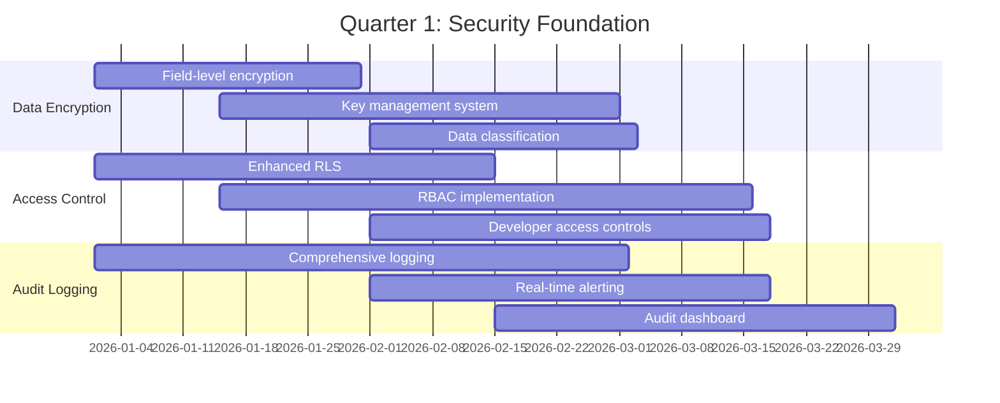
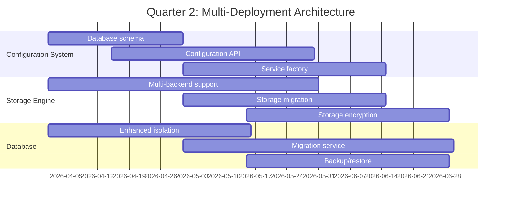
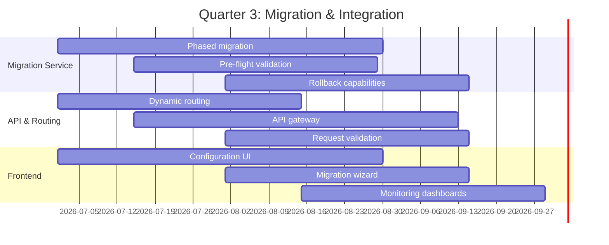
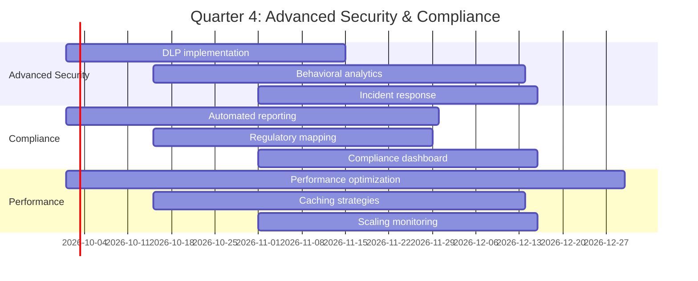

# Implementation Roadmap with Phases

## Overview
A comprehensive 12-month implementation roadmap for transforming the school management system into a secure, multi-deployment platform with configurable data safety options. This roadmap integrates all previous plans into a cohesive execution timeline.

## Executive Summary

### Vision
Transform Vidhyam from a single-tenant SaaS platform into a secure, multi-deployment school management system where schools can choose their data location (local server, favorite cloud, or Vidhyam's servers) while maintaining the highest levels of data safety, reliability, and trust.

### Key Objectives
1. **Data Safety**: Ensure school data remains under school control in their preferred location
2. **Reliability**: Guarantee data doesn't leak to other schools or developers
3. **Trust**: Build and maintain trust through transparency and security
4. **Flexibility**: Support configurable deployment options
5. **Compliance**: Meet DPDPA 2023, GDPR, and other regulatory requirements

## Phase 0: Preparation & Planning (Month 0-1)

### 0.1 Current State Assessment
- **Complete architecture analysis** (Task 1)
- **Gap analysis** against security and compliance requirements
- **Stakeholder interviews** with schools about deployment preferences
- **Technical feasibility study** for multi-deployment architecture

### 0.2 Team Formation
- **Security Team**: 2 security engineers + 1 compliance specialist
- **Platform Team**: 3 backend engineers + 1 DevOps engineer
- **Frontend Team**: 2 frontend engineers
- **Project Management**: 1 technical project manager

### 0.3 Tooling & Infrastructure Setup
- **Development Environment**: Set up isolated environments for each deployment model
- **CI/CD Pipeline**: Enhance existing pipeline for multi-deployment testing
- **Monitoring Stack**: Implement comprehensive monitoring for all environments
- **Security Tooling**: Deploy SAST, DAST, and secret scanning tools

## Phase 1: Foundation & Core Security (Month 1-3)

### 1.1 Data Encryption Foundation
- **Implement field-level encryption** for sensitive data (Aadhaar, medical records, salaries)
- **Deploy encryption key management** with HSM integration
- **Create data classification system** with automatic tagging
- **Implement encryption at rest** for all storage backends

### 1.2 Access Control Infrastructure
- **Enhance Row Level Security (RLS)** with finer-grained controls
- **Implement role-based access control** for all user types
- **Create developer access controls** with zero-trust principles
- **Deploy Just-In-Time access request system**

### 1.3 Audit Logging Framework
- **Implement comprehensive audit logging** for all data access
- **Create real-time alerting** for suspicious activities
- **Build audit trail visualization** dashboard
- **Implement log retention** with compliance requirements

## Phase 2: Multi-Deployment Architecture (Month 4-6)

### 2.1 Deployment Configuration System
- **Design and implement** deployment configuration database schema
- **Create configuration management API** with validation
- **Implement service factory pattern** for dynamic service creation
- **Build configuration templates** for quick setup

### 2.2 Storage Engine Enhancement
- **Extend storage engine** to support multiple backends (local, S3, GCS, Azure)
- **Implement content-addressed storage** with hash-sharding
- **Create storage migration service** between backends
- **Implement storage encryption** for all backends

### 2.3 Database Multi-Tenancy Enhancement
- **Enhance database isolation** between schools
- **Implement database connection pooling** per deployment model
- **Create database migration service** between deployment models
- **Implement database backup/restore** for all deployment models

## Phase 3: Migration & Integration (Month 7-9)

### 3.1 Data Migration Service
- **Implement phased migration service** between deployment models
- **Create pre-flight validation** for migration safety
- **Build rollback capabilities** for failed migrations
- **Implement migration monitoring** with progress tracking

### 3.2 API Gateway & Routing
- **Implement dynamic routing** based on deployment configuration
- **Create API gateway** with deployment-aware routing
- **Implement request validation** per deployment model
- **Build rate limiting** and throttling per school

### 3.3 Frontend Integration
- **Update frontend applications** to support multi-deployment
- **Implement configuration UI** for deployment settings
- **Create migration wizard** for school administrators
- **Build monitoring dashboards** for deployment health

## Phase 4: Advanced Security & Compliance (Month 10-12)

### 4.1 Advanced Security Features
- **Implement data loss prevention** (DLP) for sensitive data
- **Deploy behavioral analytics** for anomaly detection
- **Create incident response automation**
- **Implement forensic data collection** capabilities

### 4.2 Compliance Automation
- **Automate compliance reporting** for DPDPA 2023, GDPR
- **Implement regulatory requirement mapping**
- **Create audit evidence collection** system
- **Build compliance dashboard** for administrators

### 4.3 Performance & Scalability
- **Optimize performance** for all deployment models
- **Implement caching strategies** for configuration data
- **Scale monitoring systems** for large deployments
- **Optimize migration performance** for large datasets

## Phase 5: Production Readiness & Rollout (Month 13-15)

### 5.1 Testing & Validation
- **Comprehensive security testing** across all deployment models
- **Performance testing** for migration scenarios
- **Disaster recovery testing** for all deployment models
- **User acceptance testing** with pilot schools

### 5.2 Documentation & Training
- **Create administrator guides** for each deployment model
- **Develop training materials** for school IT staff
- **Build troubleshooting guides** for common issues
- **Create API documentation** for integration partners

### 5.3 Gradual Rollout
- **Pilot program** with 5-10 selected schools
- **Feedback collection** and iterative improvements
- **Gradual expansion** to more schools
- **Full production release** with all features

## Detailed Timeline

### Quarter 1 (Months 1-3): Security Foundation

### Quarter 2 (Months 4-6): Multi-Deployment Architecture

### Quarter 3 (Months 7-9): Migration & Integration

### Quarter 4 (Months 10-12): Advanced Security & Compliance

## Resource Allocation

### Team Structure
| Role | Count | Responsibilities |
|------|-------|------------------|
| **Security Engineers** | 2 | Encryption, access control, security testing |
| **Backend Engineers** | 3 | Core platform, API development, database |
| **DevOps Engineers** | 2 | Infrastructure, deployment, monitoring |
| **Frontend Engineers** | 2 | UI development, user experience |
| **QA Engineers** | 2 | Testing, validation, quality assurance |
| **Project Manager** | 1 | Timeline, coordination, stakeholder management |
| **Compliance Specialist** | 1 | Regulatory requirements, audit preparation |

### Technology Stack
- **Backend**: Rust/Axum (existing), enhanced with new security features
- **Database**: PostgreSQL with enhanced RLS and encryption
- **Storage**: Local filesystem, S3, GCS, Azure Blob Storage
- **Frontend**: React (existing), enhanced with configuration UI
- **Monitoring**: Prometheus, Grafana, ELK Stack
- **Security**: HashiCorp Vault, AWS KMS, OpenSSL
- **CI/CD**: GitHub Actions, Docker, Kubernetes

## Risk Management

### Identified Risks
1. **Technical Complexity Risk**
   - **Mitigation**: Phased implementation with frequent validation
   - **Contingency**: Rollback plan for each phase

2. **Performance Impact Risk**
   - **Mitigation**: Performance testing at each phase
   - **Contingency**: Performance optimization sprints

3. **Security Breach Risk**
   - **Mitigation**: Comprehensive security testing
   - **Contingency**: Incident response plan

4. **School Adoption Risk**
   - **Mitigation**: Pilot program with selected schools
   - **Contingency**: Extended support and training

### Success Criteria
1. **Technical Success**
   - All deployment models fully functional
   - Zero data loss during migrations
   - Performance within acceptable limits

2. **Security Success**
   - No security breaches during implementation
   - All compliance requirements met
   - Successful security audits

3. **Business Success**
   - High adoption rate among schools
   - Positive feedback from pilot schools
   - Increased trust and satisfaction

## Budget Estimate

### Development Costs
- **Personnel**: 13 team members × 15 months
- **Infrastructure**: Cloud resources for testing environments
- **Tools**: Security tools, monitoring solutions, compliance software
- **Training**: Team training on new technologies and security practices

### Operational Costs
- **Maintenance**: Ongoing support and updates
- **Monitoring**: Continuous security monitoring
- **Compliance**: Regular audits and certification renewals
- **Support**: Enhanced support for multiple deployment models

## Conclusion

This 15-month implementation roadmap provides a structured approach to transforming Vidhyam into a secure, multi-deployment school management platform. By following this phased approach, we can:

1. **Minimize risk** through incremental implementation
2. **Ensure quality** through comprehensive testing
3. **Maintain stability** for existing schools
4. **Deliver value** through gradual feature rollout

The success of this transformation will position Vidhyam as the most trusted school management platform, offering unparalleled data safety and deployment flexibility while maintaining the reliability and features that schools depend on.