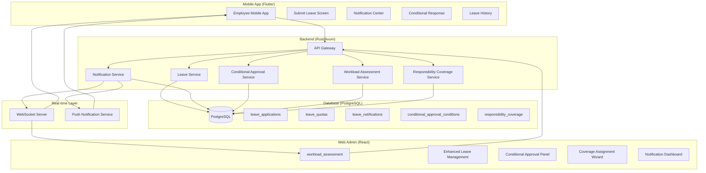
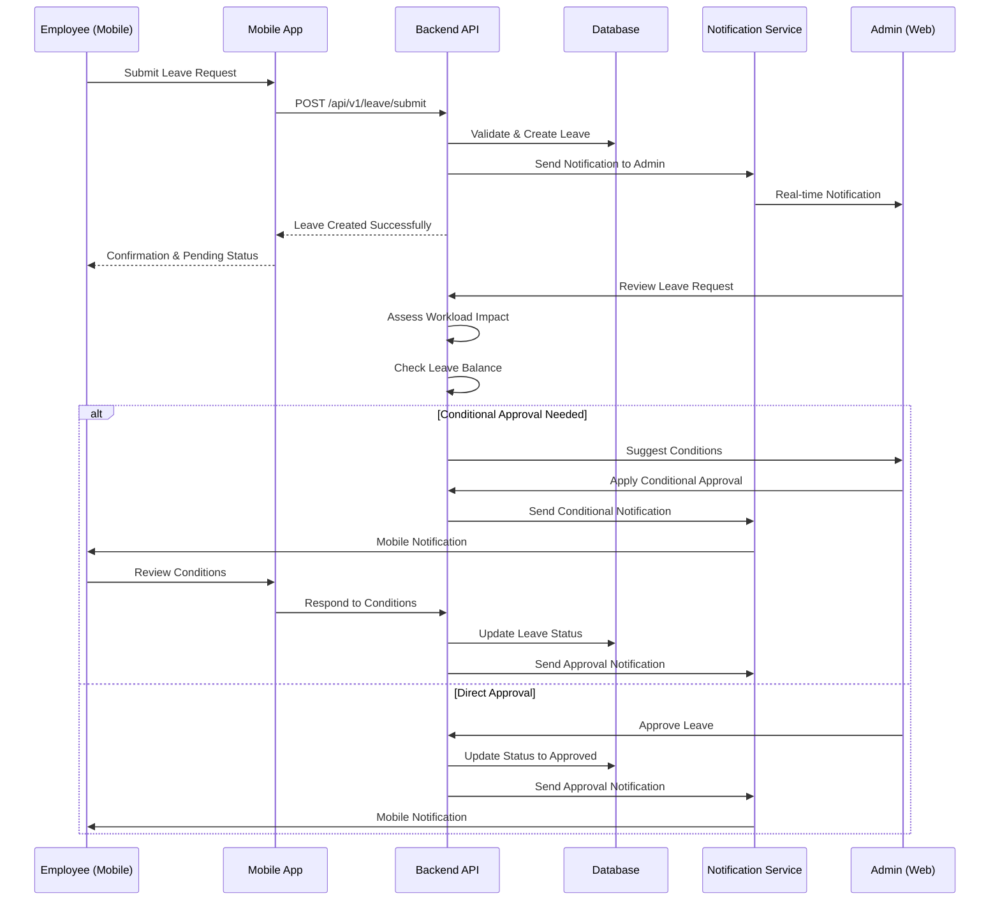
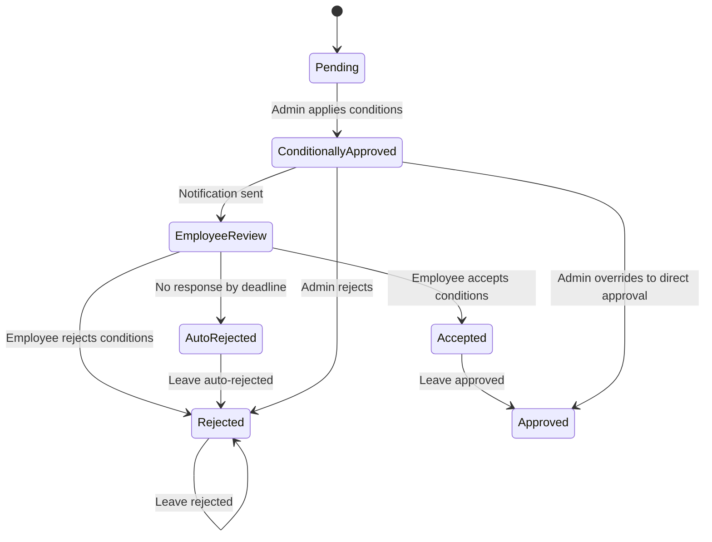
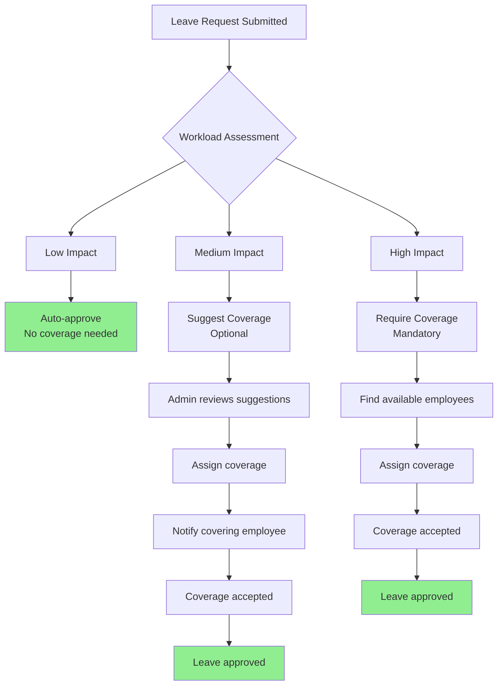

# Enhanced Employee Leave Management System - Complete Architecture & Workflow

## System Overview
A comprehensive employee leave management system with conditional approvals, real-time notifications, mobile submission, and responsibility coverage features for educational institutions.

## Architecture Diagram



## Core Components

### 1. Backend Services

#### 1.1 Leave Service (`leave_service.rs`)
- **Purpose**: Core leave management logic
- **Responsibilities**:
  - Create, read, update, delete leave applications
  - Validate leave requests against quotas
  - Calculate leave balances
  - Handle leave status transitions
- **Key Methods**:
  - `create_leave()` - Submit new leave request
  - `approve_leave()` - Approve leave request
  - `reject_leave()` - Reject leave request
  - `extend_leave()` - Extend approved leave
  - `reduce_leave()` - Reduce approved leave
  - `get_leave_balance()` - Calculate employee leave balance

#### 1.2 Conditional Approval Service (`conditional_approval_service.rs`)
- **Purpose**: Handle conditional approval workflows
- **Responsibilities**:
  - Create conditional approval templates
  - Apply conditions to leave requests
  - Track employee responses to conditions
  - Auto-reject expired conditional approvals
- **Key Methods**:
  - `apply_conditional_approval()` - Apply conditions to leave
  - `respond_to_conditions()` - Employee response handler
  - `check_expired_conditions()` - Auto-reject expired requests
  - `get_conditional_templates()` - Retrieve approval templates

#### 1.3 Notification Service (`notification_service.rs`)
- **Purpose**: Real-time notification delivery
- **Responsibilities**:
  - Send WebSocket notifications
  - Store notification history
  - Mark notifications as read
  - Support push notifications for mobile
- **Key Methods**:
  - `send_notification()` - Send notification to user/channel
  - `get_user_notifications()` - Retrieve user notifications
  - `mark_as_read()` - Mark notification as read
  - `subscribe_to_channel()` - WebSocket subscription

#### 1.4 Workload Assessment Service (`workload_service.rs`)
- **Purpose**: AI-powered workload feasibility assessment
- **Responsibilities**:
  - Analyze employee responsibilities
  - Calculate workload impact
  - Suggest coverage assignments
  - Predict school operation impact
- **Key Methods**:
  - `assess_workload()` - Analyze leave impact
  - `suggest_coverage()` - Suggest coverage assignments
  - `calculate_impact_score()` - Calculate workload impact score

#### 1.5 Responsibility Coverage Service (`coverage_service.rs`)
- **Purpose**: Manage responsibility coverage assignments
- **Responsibilities**:
  - Assign coverage for employee responsibilities
  - Track coverage completion
  - Notify covering employees
  - Validate coverage feasibility
- **Key Methods**:
  - `assign_coverage()` - Assign responsibilities
  - `get_available_coverages()` - Find available employees
  - `track_coverage_completion()` - Monitor coverage progress

### 2. Database Schema

#### 2.1 Core Tables
```sql
-- Extended leave_applications table
CREATE TABLE leave_applications (
    leave_id UUID PRIMARY KEY DEFAULT gen_random_uuid(),
    school_id VARCHAR NOT NULL,
    employee_id VARCHAR NOT NULL,
    from_date DATE NOT NULL,
    to_date DATE NOT NULL,
    leave_type VARCHAR NOT NULL,
    reason TEXT NOT NULL,
    status VARCHAR NOT NULL DEFAULT 'pending',
    -- New enhanced fields
    conditional_approval_id UUID REFERENCES conditional_approvals(id),
    coverage_assigned BOOLEAN DEFAULT FALSE,
    workload_assessment_score INTEGER,
    submitted_via VARCHAR(20),
    emergency_contact VARCHAR,
    attachments JSONB,
    created_at TIMESTAMP DEFAULT NOW(),
    updated_at TIMESTAMP DEFAULT NOW()
);

-- Leave quotas per employee
CREATE TABLE leave_quotas (
    quota_id UUID PRIMARY KEY DEFAULT gen_random_uuid(),
    school_id VARCHAR NOT NULL,
    employee_id VARCHAR NOT NULL,
    leave_type VARCHAR NOT NULL,
    annual_quota INTEGER NOT NULL,
    monthly_quota INTEGER,
    used INTEGER DEFAULT 0,
    remaining INTEGER GENERATED ALWAYS AS (annual_quota - used) STORED,
    reset_date DATE NOT NULL,
    created_at TIMESTAMP DEFAULT NOW()
);

-- Conditional approvals
CREATE TABLE conditional_approvals (
    id UUID PRIMARY KEY DEFAULT gen_random_uuid(),
    leave_id UUID REFERENCES leave_applications(leave_id),
    conditions JSONB NOT NULL,
    response_deadline TIMESTAMP NOT NULL,
    auto_reject BOOLEAN DEFAULT TRUE,
    admin_notes TEXT,
    employee_response JSONB,
    responded_at TIMESTAMP,
    status VARCHAR NOT NULL DEFAULT 'pending_response',
    created_at TIMESTAMP DEFAULT NOW()
);

-- Responsibility coverage assignments
CREATE TABLE responsibility_coverage (
    coverage_id UUID PRIMARY KEY DEFAULT gen_random_uuid(),
    leave_id UUID REFERENCES leave_applications(leave_id),
    original_employee_id VARCHAR NOT NULL,
    covering_employee_id VARCHAR NOT NULL,
    responsibility_id VARCHAR NOT NULL,
    coverage_period_start DATE NOT NULL,
    coverage_period_end DATE NOT NULL,
    status VARCHAR NOT NULL DEFAULT 'assigned',
    notes TEXT,
    created_at TIMESTAMP DEFAULT NOW()
);

-- Real-time notifications
CREATE TABLE leave_notifications (
    notification_id UUID PRIMARY KEY DEFAULT gen_random_uuid(),
    school_id VARCHAR NOT NULL,
    recipient_id VARCHAR NOT NULL,
    notification_type VARCHAR NOT NULL,
    title VARCHAR NOT NULL,
    body TEXT NOT NULL,
    data JSONB,
    read BOOLEAN DEFAULT FALSE,
    created_at TIMESTAMP DEFAULT NOW()
);
```

### 3. API Endpoints

#### 3.1 Leave Management Endpoints
```
POST   /api/v1/leave/submit           # Submit new leave request
GET    /api/v1/leave/history          # Get leave history
GET    /api/v1/leave/balance          # Get leave balance
POST   /api/v1/leave/approve          # Approve leave
POST   /api/v1/leave/reject           # Reject leave
POST   /api/v1/leave/extend           # Extend leave duration
POST   /api/v1/leave/reduce           # Reduce leave duration
```

#### 3.2 Enhanced Endpoints
```
POST   /api/v1/leave/conditional/approve      # Apply conditional approval
POST   /api/v1/leave/conditional/respond      # Respond to conditions
GET    /api/v1/leave/conditional/templates    # Get approval templates
POST   /api/v1/leave/coverage/assign         # Assign responsibility coverage
POST   /api/v1/leave/workload/assess         # Assess workload impact
GET    /api/v1/leave/queue                   # Get leave request queue
```

#### 3.3 Notification Endpoints
```
GET    /api/v1/notifications                 # Get user notifications
POST   /api/v1/notifications/mark-read       # Mark notification as read
WS     /ws/{school_id}                       # WebSocket for real-time updates
```

### 4. Frontend Architecture

#### 4.1 Web Admin Interface (Vidhyam)
- **EnhancedLeaveManagement.jsx** - Main admin dashboard
- **LeaveQueueTable.jsx** - Sortable/filterable leave queue
- **ConditionalApprovalPanel.jsx** - Conditional approval interface
- **CoverageAssignmentWizard.jsx** - Step-by-step coverage assignment
- **NotificationCenter.jsx** - Real-time notification panel
- **LeaveBalanceCard.jsx** - Visual leave balance display

#### 4.2 Mobile App Interface (Chatra)
- **LeaveDashboardScreen.dart** - Employee leave dashboard
- **SubmitLeaveScreen.dart** - Leave submission form
- **ConditionalResponseScreen.dart** - Respond to conditional approvals
- **NotificationCenterScreen.dart** - Mobile notification center
- **LeaveHistoryScreen.dart** - Leave request history
- **LeaveBalanceScreen.dart** - Leave balance visualization

### 5. Workflow Diagrams

#### 5.1 Employee Leave Submission Workflow


#### 5.2 Conditional Approval Workflow


#### 5.3 Responsibility Coverage Workflow


### 6. Integration Points

#### 6.1 Existing System Integration
- **Authentication**: Use existing JWT-based auth system
- **Employee Data**: Integrate with existing employee management
- **School Context**: Multi-tenant architecture support
- **Role-Based Access**: Admin vs Employee permissions

#### 6.2 External Integrations
- **Calendar Systems**: Sync with school calendar
- **Payroll System**: Salary deduction calculations
- **Attendance System**: Mark leave days as absent
- **Communication Systems**: Email/SMS notifications

### 7. Security & Compliance

#### 7.1 Security Measures
- **Authentication**: JWT tokens with school context
- **Authorization**: Role-based access control (RBAC)
- **Data Encryption**: At-rest and in-transit encryption
- **Audit Logging**: All actions logged for compliance
- **Input Validation**: SQL injection prevention
- **Rate Limiting**: API request throttling

#### 7.2 Compliance Features
- **Data Privacy**: GDPR/PDPA compliant data handling
- **Audit Trail**: Complete history of all actions
- **Consent Management**: Employee consent for data processing
- **Data Retention**: Configurable retention policies
- **Export Capability**: Data export for regulatory compliance

### 8. Performance Considerations

#### 8.1 Database Optimization
- **Indexing**: Strategic indexes on frequently queried columns
- **Partitioning**: Time-based partitioning for large tables
- **Caching**: Redis caching for frequently accessed data
- **Connection Pooling**: Efficient database connection management

#### 8.2 API Performance
- **Pagination**: All list endpoints support pagination
- **Caching**: Response caching for static data
- **Compression**: Gzip compression for API responses
- **CDN**: Static asset delivery via CDN

#### 8.3 Real-time System
- **WebSocket Scaling**: Connection pooling and load balancing
- **Message Queuing**: Redis Pub/Sub for notification delivery
- **Connection Management**: Automatic reconnection handling
- **Backpressure Handling**: Prevent system overload

### 9. Deployment Architecture

#### 9.1 Infrastructure
```
┌─────────────────────────────────────────────────────────┐
│                    Load Balancer                        │
└───────────────┬─────────────────────┬───────────────────┘
                │                     │
    ┌───────────▼─────────┐ ┌────────▼──────────┐
    │   Web Server Layer  │ │  API Server Layer  │
    │   (Nginx/Traefik)   │ │   (Rust/Axum)     │
    └───────────┬─────────┘ └────────┬──────────┘
                │                     │
    ┌───────────▼─────────────────────▼──────────┐
    │           Application Servers              │
    │  (Leave Service, Notification Service, etc)│
    └───────────┬─────────────────────┬──────────┘
                │                     │
    ┌───────────▼─────────┐ ┌────────▼──────────┐
    │     PostgreSQL      │ │       Redis       │
    │   (Primary/Replica) │ │  (Cache/PubSub)   │
    └─────────────────────┘ └───────────────────┘
```

#### 9.2 Scaling Strategy
- **Horizontal Scaling**: Stateless API servers
- **Database Read Replicas**: For read-heavy operations
- **Redis Cluster**: For caching and Pub/Sub
- **CDN**: For static frontend assets
- **Monitoring**: Prometheus + Grafana for metrics

### 10. Monitoring & Alerting

#### 10.1 Key Metrics
- **API Response Times**: P95, P99 latency
- **Error Rates**: 4xx, 5xx error percentages
- **Database Performance**: Query times, connection counts
- **WebSocket Connections**: Active connections, message rates
- **Queue Lengths**: Pending notifications, leave requests

#### 10.2 Alerting Rules
- **High Error Rate**: >1% error rate for 5 minutes
- **High Latency**: P99 > 500ms for 10 minutes
- **Database Issues**: Connection pool exhaustion
- **Service Down**: Health check failures
- **Notification Backlog**: >1000 pending notifications

## Conclusion

This enhanced employee leave management system provides a comprehensive solution for modern educational institutions with:

1. **Complete Workflow**: From submission to approval with conditional workflows
2. **Multi-platform Support**: Web admin interface + mobile app for employees
3. **Real-time Notifications**: Instant updates via WebSocket and push notifications
4. **AI-Powered Insights**: Workload assessment and coverage suggestions
5. **Scalable Architecture**: Designed for high performance and reliability
6. **Feature Flag Control**: Gradual rollout with per-school configuration

The system integrates seamlessly with the existing Vidhyam platform while providing enhanced capabilities for modern leave management needs.