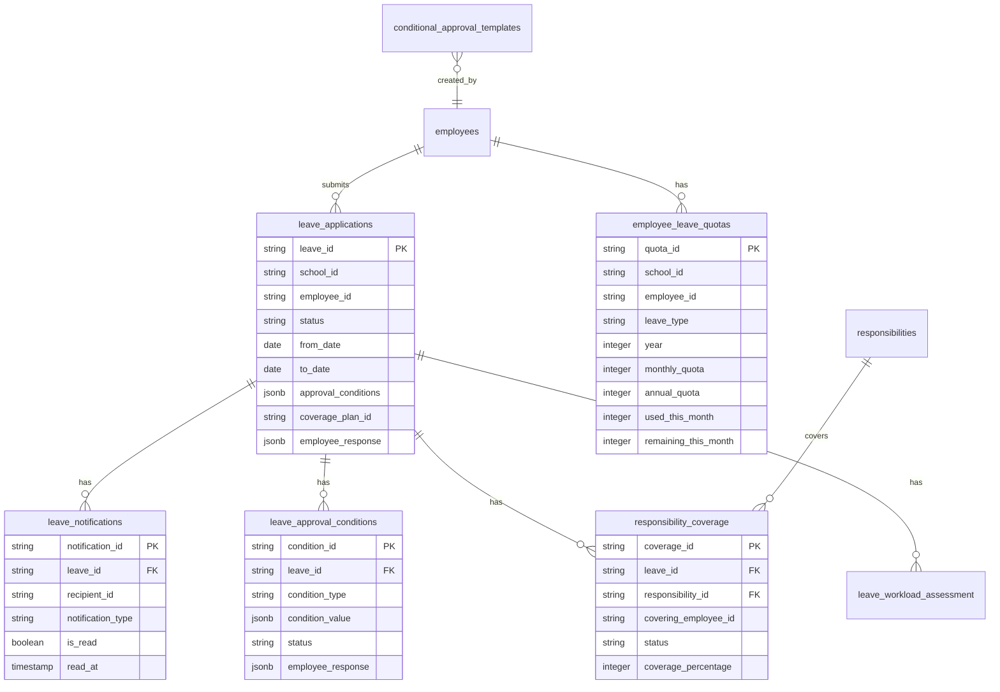

# Enhanced Employee Leave Management System - Database Design

## Overview
This document outlines the database schema extensions required for the enhanced employee leave management system with conditional approvals, notification system, leave balance tracking, and responsibility coverage features.

## Current Schema Analysis

### Existing Tables
1. **leave_applications** - Basic leave requests
2. **employees** - Employee master data
3. **audit_logs** - Action tracking
4. **timetable_notifications** - Notification system
5. **responsibilities** - Employee responsibilities

## Enhanced Schema Design

### 1. Extended `leave_applications` Table
```sql
-- Add new columns to existing table
ALTER TABLE leave_applications 
ADD COLUMN IF NOT EXISTS submitted_via VARCHAR(20) DEFAULT 'web', -- 'mobile' or 'web'
ADD COLUMN IF NOT EXISTS leave_balance_used INTEGER DEFAULT 0,
ADD COLUMN IF NOT EXISTS salary_adjustment DECIMAL(10,2) DEFAULT 0.00,
ADD COLUMN IF NOT EXISTS approved_days INTEGER DEFAULT NULL,
ADD COLUMN IF NOT EXISTS approval_conditions JSONB DEFAULT NULL,
ADD COLUMN IF NOT EXISTS coverage_plan_id VARCHAR(50) DEFAULT NULL,
ADD COLUMN IF NOT EXISTS admin_notes TEXT DEFAULT NULL,
ADD COLUMN IF NOT EXISTS employee_response JSONB DEFAULT NULL,
ADD COLUMN IF NOT EXISTS response_deadline DATE DEFAULT NULL,
ADD COLUMN IF NOT EXISTS notification_sent BOOLEAN DEFAULT FALSE,
ADD COLUMN IF NOT EXISTS priority_level VARCHAR(20) DEFAULT 'normal'; -- 'urgent', 'high', 'normal', 'low'
```

### 2. New Table: `employee_leave_quotas`
```sql
CREATE TABLE IF NOT EXISTS employee_leave_quotas (
    quota_id VARCHAR(50) PRIMARY KEY,
    school_id VARCHAR(50) NOT NULL,
    employee_id VARCHAR(50) NOT NULL,
    leave_type VARCHAR(20) NOT NULL, -- 'casual', 'sick', 'annual', 'emergency'
    year INTEGER NOT NULL,
    monthly_quota INTEGER DEFAULT 0,
    annual_quota INTEGER DEFAULT 0,
    used_this_month INTEGER DEFAULT 0,
    used_this_year INTEGER DEFAULT 0,
    remaining_this_month INTEGER DEFAULT 0,
    remaining_this_year INTEGER DEFAULT 0,
    carry_forward_from_previous INTEGER DEFAULT 0,
    created_at TIMESTAMPTZ DEFAULT CURRENT_TIMESTAMP,
    updated_at TIMESTAMPTZ DEFAULT CURRENT_TIMESTAMP,
    UNIQUE(school_id, employee_id, leave_type, year)
);

-- Indexes for performance
CREATE INDEX idx_employee_leave_quotas_school_employee ON employee_leave_quotas(school_id, employee_id);
CREATE INDEX idx_employee_leave_quotas_year ON employee_leave_quotas(year);
```

### 3. New Table: `leave_notifications`
```sql
CREATE TABLE IF NOT EXISTS leave_notifications (
    notification_id VARCHAR(50) PRIMARY KEY,
    school_id VARCHAR(50) NOT NULL,
    leave_id VARCHAR(50) NOT NULL,
    recipient_id VARCHAR(50) NOT NULL, -- Employee ID or 'admin'
    recipient_type VARCHAR(20) NOT NULL, -- 'employee', 'admin', 'covering_employee'
    notification_type VARCHAR(50) NOT NULL, -- 'leave_submitted', 'leave_approved', 'leave_rejected', 'conditional_approval', 'response_required'
    title VARCHAR(200) NOT NULL,
    message TEXT NOT NULL,
    metadata JSONB DEFAULT NULL,
    is_read BOOLEAN DEFAULT FALSE,
    read_at TIMESTAMPTZ DEFAULT NULL,
    action_required BOOLEAN DEFAULT FALSE,
    action_deadline TIMESTAMPTZ DEFAULT NULL,
    created_at TIMESTAMPTZ DEFAULT CURRENT_TIMESTAMP,
    delivered_at TIMESTAMPTZ DEFAULT NULL,
    
    FOREIGN KEY (leave_id) REFERENCES leave_applications(leave_id) ON DELETE CASCADE
);

-- Indexes for performance
CREATE INDEX idx_leave_notifications_recipient ON leave_notifications(recipient_id, recipient_type);
CREATE INDEX idx_leave_notifications_leave ON leave_notifications(leave_id);
CREATE INDEX idx_leave_notifications_unread ON leave_notifications(recipient_id, is_read) WHERE is_read = FALSE;
```

### 4. New Table: `leave_approval_conditions`
```sql
CREATE TABLE IF NOT EXISTS leave_approval_conditions (
    condition_id VARCHAR(50) PRIMARY KEY,
    school_id VARCHAR(50) NOT NULL,
    leave_id VARCHAR(50) NOT NULL,
    condition_type VARCHAR(50) NOT NULL, -- 'salary_deduction', 'day_reduction', 'alternative_arrangement', 'coverage_required', 'documentation_required'
    condition_value JSONB NOT NULL, -- Flexible structure for different condition types
    status VARCHAR(20) DEFAULT 'pending', -- 'pending', 'accepted', 'rejected', 'negotiated'
    employee_response JSONB DEFAULT NULL,
    admin_notes TEXT DEFAULT NULL,
    created_by VARCHAR(50) NOT NULL, -- Admin ID who set the condition
    created_at TIMESTAMPTZ DEFAULT CURRENT_TIMESTAMP,
    responded_at TIMESTAMPTZ DEFAULT NULL,
    
    FOREIGN KEY (leave_id) REFERENCES leave_applications(leave_id) ON DELETE CASCADE
);

-- Indexes
CREATE INDEX idx_leave_conditions_leave ON leave_approval_conditions(leave_id);
CREATE INDEX idx_leave_conditions_status ON leave_approval_conditions(status);
```

### 5. New Table: `responsibility_coverage`
```sql
CREATE TABLE IF NOT EXISTS responsibility_coverage (
    coverage_id VARCHAR(50) PRIMARY KEY,
    school_id VARCHAR(50) NOT NULL,
    leave_id VARCHAR(50) NOT NULL,
    original_employee_id VARCHAR(50) NOT NULL,
    covering_employee_id VARCHAR(50) NOT NULL,
    responsibility_id VARCHAR(50) NOT NULL,
    coverage_type VARCHAR(20) NOT NULL, -- 'full', 'partial', 'shared'
    start_date DATE NOT NULL,
    end_date DATE NOT NULL,
    coverage_percentage INTEGER DEFAULT 100, -- 0-100%
    status VARCHAR(20) DEFAULT 'proposed', -- 'proposed', 'accepted', 'rejected', 'active', 'completed'
    notification_sent BOOLEAN DEFAULT FALSE,
    covering_employee_response JSONB DEFAULT NULL,
    created_by VARCHAR(50) NOT NULL, -- Admin ID who assigned coverage
    created_at TIMESTAMPTZ DEFAULT CURRENT_TIMESTAMP,
    updated_at TIMESTAMPTZ DEFAULT CURRENT_TIMESTAMP,
    
    FOREIGN KEY (leave_id) REFERENCES leave_applications(leave_id) ON DELETE CASCADE,
    FOREIGN KEY (responsibility_id) REFERENCES responsibilities(responsibility_id) ON DELETE CASCADE
);

-- Indexes
CREATE INDEX idx_responsibility_coverage_leave ON responsibility_coverage(leave_id);
CREATE INDEX idx_responsibility_coverage_covering ON responsibility_coverage(covering_employee_id);
CREATE INDEX idx_responsibility_coverage_status ON responsibility_coverage(status);
```

### 6. New Table: `leave_workload_assessment`
```sql
CREATE TABLE IF NOT EXISTS leave_workload_assessment (
    assessment_id VARCHAR(50) PRIMARY KEY,
    school_id VARCHAR(50) NOT NULL,
    leave_id VARCHAR(50) NOT NULL,
    department_id VARCHAR(50) DEFAULT NULL,
    assessment_date DATE NOT NULL,
    current_workload_score INTEGER DEFAULT 0, -- 0-100 scale
    coverage_feasibility_score INTEGER DEFAULT 0, -- 0-100 scale
    available_coverage_count INTEGER DEFAULT 0,
    recommended_action VARCHAR(50) DEFAULT NULL, -- 'approve', 'reject', 'conditional', 'defer'
    assessment_notes TEXT DEFAULT NULL,
    assessed_by VARCHAR(50) NOT NULL, -- Admin ID
    created_at TIMESTAMPTZ DEFAULT CURRENT_TIMESTAMP,
    
    FOREIGN KEY (leave_id) REFERENCES leave_applications(leave_id) ON DELETE CASCADE
);

-- Indexes
CREATE INDEX idx_workload_assessment_leave ON leave_workload_assessment(leave_id);
CREATE INDEX idx_workload_assessment_date ON leave_workload_assessment(assessment_date);
```

### 7. New Table: `conditional_approval_templates`
```sql
CREATE TABLE IF NOT EXISTS conditional_approval_templates (
    template_id VARCHAR(50) PRIMARY KEY,
    school_id VARCHAR(50) NOT NULL,
    template_name VARCHAR(100) NOT NULL,
    template_type VARCHAR(50) NOT NULL, -- 'salary_deduction', 'day_reduction', 'coverage_required', 'combined'
    conditions JSONB NOT NULL, -- Array of condition definitions
    applicable_to JSONB DEFAULT NULL, -- Which employee types/departments this applies to
    is_active BOOLEAN DEFAULT TRUE,
    created_by VARCHAR(50) NOT NULL,
    created_at TIMESTAMPTZ DEFAULT CURRENT_TIMESTAMP,
    updated_at TIMESTAMPTZ DEFAULT CURRENT_TIMESTAMP
);

-- Indexes
CREATE INDEX idx_approval_templates_school ON conditional_approval_templates(school_id);
CREATE INDEX idx_approval_templates_active ON conditional_approval_templates(is_active) WHERE is_active = TRUE;
```

## Database Relationships



## Migration Strategy

### Phase 1: Schema Updates
1. Add new columns to `leave_applications` table
2. Create new tables in the order of dependencies
3. Add foreign key constraints after all tables are created
4. Create necessary indexes for performance

### Phase 2: Data Migration
1. Initialize `employee_leave_quotas` from existing leave records
2. Migrate existing notification data to new `leave_notifications` table
3. Set up default conditional approval templates

### Phase 3: Backfill Data
1. Calculate leave balances for all employees
2. Create coverage plans for active leaves
3. Update existing leave records with new metadata

## SQL Migration Scripts

```sql
-- Migration 001: Extend leave_applications table
DO $$ 
BEGIN
    IF NOT EXISTS (SELECT 1 FROM information_schema.columns 
                   WHERE table_name = 'leave_applications' 
                   AND column_name = 'submitted_via') THEN
        ALTER TABLE leave_applications 
        ADD COLUMN submitted_via VARCHAR(20) DEFAULT 'web',
        ADD COLUMN leave_balance_used INTEGER DEFAULT 0,
        ADD COLUMN salary_adjustment DECIMAL(10,2) DEFAULT 0.00,
        ADD COLUMN approved_days INTEGER DEFAULT NULL,
        ADD COLUMN approval_conditions JSONB DEFAULT NULL,
        ADD COLUMN coverage_plan_id VARCHAR(50) DEFAULT NULL,
        ADD COLUMN admin_notes TEXT DEFAULT NULL,
        ADD COLUMN employee_response JSONB DEFAULT NULL,
        ADD COLUMN response_deadline DATE DEFAULT NULL,
        ADD COLUMN notification_sent BOOLEAN DEFAULT FALSE,
        ADD COLUMN priority_level VARCHAR(20) DEFAULT 'normal';
    END IF;
END $$;

-- Migration 002: Create employee_leave_quotas table
CREATE TABLE IF NOT EXISTS employee_leave_quotas (
    -- table definition as above
);

-- Migration 003: Create leave_notifications table
CREATE TABLE IF NOT EXISTS leave_notifications (
    -- table definition as above
);

-- Continue with other tables...
```

## Performance Considerations

### Indexing Strategy
1. **Query Patterns to Optimize**:
   - Fetching pending leaves for admin dashboard
   - Retrieving employee leave balance
   - Loading notifications for specific users
   - Finding coverage assignments

2. **Recommended Indexes**:
   ```sql
   -- Composite indexes for common queries
   CREATE INDEX idx_leave_applications_pending 
   ON leave_applications(school_id, status) 
   WHERE status IN ('pending', 'under_review');
   
   CREATE INDEX idx_leave_notifications_unread_user 
   ON leave_notifications(recipient_id, is_read, created_at DESC) 
   WHERE is_read = FALSE;
   
   CREATE INDEX idx_employee_quotas_current 
   ON employee_leave_quotas(school_id, employee_id, year) 
   WHERE year = EXTRACT(YEAR FROM CURRENT_DATE);
   ```

### Partitioning Strategy
For large schools with high leave volume:
1. Partition `leave_applications` by `school_id`
2. Partition `leave_notifications` by `created_at` (monthly)
3. Partition `employee_leave_quotas` by `year`

## Data Consistency Rules

### Business Rules
1. **Leave Balance Validation**: Cannot submit leave if insufficient balance
2. **Conditional Approval**: Must have at least one condition if status is 'conditionally_approved'
3. **Coverage Assignment**: Must have coverage plan for teaching staff leaves
4. **Response Deadlines**: Employee must respond to conditional approvals within deadline
5. **Notification Chain**: Every status change must generate appropriate notifications

### Constraints
```sql
-- Example constraint for leave balance
ALTER TABLE leave_applications
ADD CONSTRAINT chk_leave_balance 
CHECK (leave_balance_used >= 0);

-- Constraint for conditional approval status
ALTER TABLE leave_applications
ADD CONSTRAINT chk_conditional_approval 
CHECK (
    (status != 'conditionally_approved') OR 
    (approval_conditions IS NOT NULL AND jsonb_array_length(approval_conditions) > 0)
);
```

## Backup and Recovery

### Backup Strategy
1. **Full Backup**: Daily backup of all leave-related tables
2. **Incremental Backup**: Hourly backup of notification and response tables
3. **Point-in-Time Recovery**: Maintain WAL logs for critical operations

### Data Retention Policy
1. **Active Data**: Last 3 years of leave records
2. **Archival**: Move older records to historical tables
3. **Notification Cleanup**: Remove read notifications older than 90 days

## Security Considerations

### Row-Level Security (RLS)
```sql
-- Enable RLS on all new tables
ALTER TABLE employee_leave_quotas ENABLE ROW LEVEL SECURITY;
ALTER TABLE leave_notifications ENABLE ROW LEVEL SECURITY;
ALTER TABLE leave_approval_conditions ENABLE ROW LEVEL SECURITY;

-- Create policies for multi-tenancy
CREATE POLICY school_isolation_policy ON employee_leave_quotas
FOR ALL USING (school_id = current_setting('app.current_school_id'));
```

### Data Encryption
1. Encrypt sensitive fields: `salary_adjustment`, `employee_response`
2. Use application-level encryption for condition values
3. Secure audit logs for all conditional approvals

## Monitoring and Maintenance

### Performance Monitoring
1. **Query Performance**: Monitor slow queries on leave-related tables
2. **Table Growth**: Track growth of notification and coverage tables
3. **Index Usage**: Regularly review index effectiveness

### Maintenance Tasks
1. **Weekly**: Update leave balances for new month
2. **Monthly**: Archive old notifications and completed coverage records
3. **Quarterly**: Rebuild indexes and update statistics
4. **Yearly**: Reset annual leave quotas and carry forward balances

## Integration Points with Existing System

### 1. Employee Management
- Link to existing `employees` table via `employee_id`
- Sync employee status changes (active/inactive/terminated)
- Update leave quotas on employee role changes

### 2. Payroll System
- Integrate `salary_adjustment` with payroll calculations
- Sync leave deductions with salary processing
- Provide leave balance reports for payroll

### 3. Timetable System
- Coordinate with `timetable_notifications` table
- Sync teacher leave with class schedule adjustments
- Integrate coverage assignments with timetable updates

### 4. Audit System
- Extend existing `audit_logs` for new leave operations
- Maintain audit trail for conditional approvals
- Track all notification deliveries and responses

This database design provides a robust foundation for the enhanced leave management system while maintaining compatibility with the existing codebase.