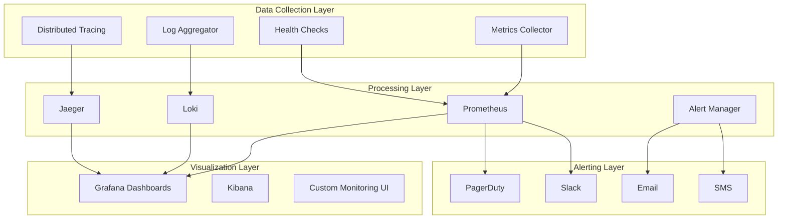

# Monitoring & Observability Architecture Design

## Problem Statement

The current backend lacks comprehensive monitoring and observability capabilities:
1. **Limited metrics collection**: Insufficient visibility into system performance
2. **Inadequate logging**: Security events and errors not properly tracked
3. **No real-time alerting**: Delayed detection of issues
4. **Poor debugging capabilities**: Difficult to trace request flows

## Design Goals

1. **Comprehensive Visibility**: Monitor all system components
2. **Real-time Insights**: Immediate detection of anomalies
3. **Actionable Alerts**: Timely notification of critical issues
4. **Performance Optimization**: Identify and fix bottlenecks
5. **Security Monitoring**: Detect and respond to threats

## Architecture Overview

### Observability Stack


## Component Design

### 1. Metrics Collection System

#### 1.1 Key Metrics Categories
```rust
pub enum MetricCategory {
    // Application Metrics
    RequestRate,
    ResponseTime,
    ErrorRate,
    ActiveConnections,
    
    // Business Metrics
    SchoolActivity,
    UserEngagement,
    RevenueMetrics,
    
    // System Metrics
    CpuUsage,
    MemoryUsage,
    DiskIo,
    NetworkTraffic,
    
    // Database Metrics
    QueryPerformance,
    ConnectionPool,
    CacheHitRate,
    
    // Security Metrics
    AuthenticationAttempts,
    RateLimitHits,
    SuspiciousActivities,
}
```

#### 1.2 Metrics Middleware
```rust
pub async fn metrics_middleware(
    request: Request,
    next: Next,
) -> Result<Response, AppError> {
    let start_time = Instant::now();
    let endpoint = request.uri().path().to_string();
    let method = request.method().to_string();
    
    // Increment request counter
    metrics::increment_counter!("http_requests_total", 
        "method" => method.clone(),
        "endpoint" => endpoint.clone()
    );
    
    // Process request
    let response = next.run(request).await;
    
    // Record response time
    let duration = start_time.elapsed();
    metrics::histogram!("http_request_duration_seconds", 
        duration.as_secs_f64(),
        "method" => method,
        "endpoint" => endpoint,
        "status" => response.status().as_str()
    );
    
    Ok(response)
}
```

#### 1.3 Custom Metrics Registry
```rust
pub struct BackendMetrics {
    // Request metrics
    pub request_duration: Histogram,
    pub request_total: Counter,
    pub error_total: Counter,
    
    // Business metrics
    pub school_activity: Gauge,
    pub user_sessions: Gauge,
    pub revenue_daily: Counter,
    
    // Database metrics
    pub query_duration: Histogram,
    pub connection_pool_size: Gauge,
    pub cache_hit_rate: Gauge,
    
    // Security metrics
    pub auth_failures: Counter,
    pub rate_limit_hits: Counter,
    pub threat_detections: Counter,
}

impl BackendMetrics {
    pub fn new() -> Self {
        let registry = metrics::global_registry();
        
        Self {
            request_duration: registry.histogram(
                "backend_request_duration_seconds",
                "Duration of HTTP requests in seconds"
            ),
            
            request_total: registry.counter(
                "backend_requests_total",
                "Total number of HTTP requests"
            ),
            
            // ... initialize other metrics
        }
    }
}
```

### 2. Structured Logging System

#### 2.1 Log Event Structure
```rust
#[derive(Debug, Serialize)]
pub struct StructuredLog {
    // Core fields
    pub timestamp: DateTime<Utc>,
    pub level: LogLevel,
    pub message: String,
    pub target: String, // Module/component name
    
    // Request context
    pub request_id: String,
    pub school_id: String,
    pub admin_id: String,
    pub session_id: String,
    
    // Technical context
    pub file: String,
    pub line: u32,
    pub thread_id: String,
    
    // Performance data
    pub duration_ms: Option<u64>,
    pub memory_usage_mb: Option<f64>,
    
    // Custom fields
    pub fields: HashMap<String, Value>,
    
    // Error details (if applicable)
    pub error_type: Option<String>,
    pub error_message: Option<String>,
    pub stack_trace: Option<String>,
}
```

#### 2.2 Logging Middleware
```rust
pub async fn logging_middleware(
    request: Request,
    next: Next,
) -> Result<Response, AppError> {
    let request_id = generate_request_id();
    let start_time = Instant::now();
    
    // Extract request context
    let school_id = extract_school_id(&request).unwrap_or_default();
    let admin_id = extract_admin_id(&request).unwrap_or_default();
    
    // Create log context
    let log_context = LogContext {
        request_id: request_id.clone(),
        school_id,
        admin_id,
        endpoint: request.uri().path().to_string(),
        method: request.method().to_string(),
        user_agent: extract_user_agent(&request),
        ip_address: extract_ip_address(&request),
    };
    
    // Store in request extensions
    request.extensions_mut().insert(log_context.clone());
    
    // Process request
    let response = next.run(request).await;
    
    // Calculate duration
    let duration = start_time.elapsed();
    
    // Log request completion
    let status = response.status();
    let log_level = if status.is_server_error() {
        LogLevel::Error
    } else if status.is_client_error() {
        LogLevel::Warn
    } else {
        LogLevel::Info
    };
    
    structured_log!(
        level: log_level,
        request_id: request_id,
        school_id: log_context.school_id,
        admin_id: log_context.admin_id,
        endpoint: log_context.endpoint,
        method: log_context.method,
        status_code: status.as_u16(),
        duration_ms: duration.as_millis() as u64,
        message: "Request completed"
    );
    
    Ok(response)
}
```

### 3. Distributed Tracing System

#### 3.1 Trace Context Propagation
```rust
pub struct TraceContext {
    pub trace_id: String,
    pub span_id: String,
    pub parent_span_id: Option<String>,
    pub sampled: bool,
    pub flags: u8,
}

impl TraceContext {
    pub fn extract_from_headers(headers: &HeaderMap) -> Option<Self> {
        // Extract from W3C Trace Context headers
        let traceparent = headers.get("traceparent")?;
        let tracestate = headers.get("tracestate");
        
        // Parse traceparent header
        let parts: Vec<&str> = traceparent.to_str().ok()?.split('-').collect();
        if parts.len() != 4 {
            return None;
        }
        
        Some(Self {
            trace_id: parts[1].to_string(),
            span_id: parts[2].to_string(),
            parent_span_span_id: None, // Will be set by parent
            sampled: parts[3] == "01",
            flags: 0,
        })
    }
    
    pub fn inject_into_headers(&self, headers: &mut HeaderMap) {
        let sampled = if self.sampled { "01" } else { "00" };
        let traceparent = format!("00-{}-{}-{}", 
            self.trace_id, self.span_id, sampled);
        
        headers.insert("traceparent", traceparent.parse().unwrap());
        
        if let Some(parent_id) = &self.parent_span_id {
            headers.insert("parent-span-id", parent_id.parse().unwrap());
        }
    }
}
```

#### 3.2 Tracing Middleware
```rust
pub async fn tracing_middleware(
    request: Request,
    next: Next,
) -> Result<Response, AppError> {
    // Extract or create trace context
    let trace_context = TraceContext::extract_from_headers(request.headers())
        .unwrap_or_else(|| TraceContext::new());
    
    // Start span
    let span = tracer.span_builder("http_request")
        .with_trace_id(trace_context.trace_id.clone())
        .with_span_id(trace_context.span_id.clone())
        .with_parent_span_id(trace_context.parent_span_id.clone())
        .start(&tracer);
    
    // Set span attributes
    span.set_attribute("http.method", request.method().to_string());
    span.set_attribute("http.url", request.uri().to_string());
    span.set_attribute("http.school_id", extract_school_id(&request).unwrap_or_default());
    
    // Store in request extensions
    request.extensions_mut().insert(span.clone());
    request.extensions_mut().insert(trace_context.clone());
    
    // Process request within span context
    let response = next.run(request).await;
    
    // Record span status
    let status = response.status();
    span.set_attribute("http.status_code", status.as_u16() as i64);
    
    if status.is_server_error() {
        span.set_status(StatusCode::Error, "Server error");
    }
    
    // End span
    span.end();
    
    Ok(response)
}
```

### 4. Health Check System

#### 4.1 Health Check Endpoints
```rust
pub async fn health_check() -> impl IntoResponse {
    let mut checks = HashMap::new();
    
    // Database health
    let db_health = check_database_health().await;
    checks.insert("database", db_health);
    
    // Redis health
    let redis_health = check_redis_health().await;
    checks.insert("redis", redis_health);
    
    // External services health
    let external_health = check_external_services().await;
    checks.insert("external_services", external_health);
    
    // System resources
    let system_health = check_system_resources().await;
    checks.insert("system", system_health);
    
    // Overall status
    let overall_healthy = checks.values().all(|h| h.is_healthy());
    let status = if overall_healthy {
        StatusCode::OK
    } else {
        StatusCode::SERVICE_UNAVAILABLE
    };
    
    (status, Json(json!({
        "status": if overall_healthy { "healthy" } else { "unhealthy" },
        "timestamp": Utc::now().to_rfc3339(),
        "checks": checks
    })))
}
```

#### 4.2 Health Check Implementation
```rust
pub struct HealthCheckResult {
    pub component: String,
    pub is_healthy: bool,
    pub latency_ms: Option<u64>,
    pub error: Option<String>,
    pub details: HashMap<String, Value>,
}

impl HealthCheckResult {
    pub async fn check_database() -> Self {
        let start_time = Instant::now();
        
        match sqlx::query("SELECT 1").execute(&db_pool).await {
            Ok(_) => Self {
                component: "database".to_string(),
                is_healthy: true,
                latency_ms: Some(start_time.elapsed().as_millis() as u64),
                error: None,
                details: hashmap! {
                    "connection_count".into() => db_pool.size().into(),
                    "idle_connections".into() => db_pool.num_idle().into(),
                },
            },
            Err(e) => Self {
                component: "database".to_string(),
                is_healthy: false,
                latency_ms: Some(start_time.elapsed().as_millis() as u64),
                error: Some(e.to_string()),
                details: HashMap::new(),
            },
        }
    }
}
```

### 5. Alerting System

#### 5.1 Alert Rules Configuration
```yaml
# config/alerts.yaml
alert_rules:
  # High severity alerts (immediate action required)
  critical:
    - name: "high_error_rate"
      condition: "error_rate > 5%"
      duration: "1m"
      severity: "critical"
      channels: ["pagerduty", "slack"]
      
    - name: "service_down"
      condition: "health_check_failed > 3"
      duration: "30s"
      severity: "critical"
      channels: ["pagerduty", "slack", "email"]
  
  # Medium severity alerts (investigation required)
  warning:
    - name: "high_response_time"
      condition: "response_time_p95 > 2s"
      duration: "5m"
      severity: "warning"
      channels: ["slack"]
      
    - name: "high_memory_usage"
      condition: "memory_usage > 80%"
      duration: "10m"
      severity: "warning"
      channels: ["slack"]
  
  # Low severity alerts (informational)
  info:
    - name: "rate_limit_hits"
      condition: "rate_limit_hits > 100"
      duration: "1h"
      severity: "info"
      channels: ["slack"]
```

#### 5.2 Alert Manager
```rust
pub struct AlertManager {
    rules: Vec<AlertRule>,
    notifiers: HashMap<String, Box<dyn Notifier>>,
    alert_history: VecDeque<Alert>,
}

impl AlertManager {
    pub async fn evaluate(&mut self, metrics: &MetricsSnapshot) -> Vec<Alert> {
        let mut triggered_alerts = Vec::new();
        
        for rule in &self.rules {
            if rule.evaluate(metrics).await {
                let alert = Alert {
                    id: generate_alert_id(),
                    rule_name: rule.name.clone(),
                    severity: rule.severity.clone(),
                    message: rule.message.clone(),
                    timestamp: Utc::now(),
                    metadata: rule.extract_metadata(metrics).await,
                };
                
                // Send notifications
                for channel in &rule.channels {
                    if let Some(notifier) = self.notifiers.get(channel) {
                        notifier.send(&alert).await;
                    }
                }
                
                triggered_alerts.push(alert);
            }
        }
        
        triggered_alerts
    }
}
```

## Implementation Strategy

### Phase 1: Foundation (Sprint 1-2)
1. Implement basic metrics collection
2. Add structured logging middleware
3. Create health check endpoints
4. Set up Prometheus and Grafana

### Phase 2: Enhancement (Sprint 3-4)
1. Implement distributed tracing
2. Add custom business metrics
3. Create comprehensive dashboards
4. Set up alerting system

### Phase 3: Optimization (Sprint 5-6)
1. Implement anomaly detection
2. Add predictive analytics
3. Create automated remediation
4. Conduct performance tuning

## Monitoring Dashboards

### Dashboard Categories
1. **System Health**: CPU, memory, disk, network
2. **Application Performance**: Request rate, response time, error rate
3. **Business Metrics**: School activity, user engagement, revenue
4. **Security Monitoring**: Authentication, rate limiting, threats
5. **Database Performance**: Query latency, connection pool, cache

### Key Performance Indicators (KPIs)
1. **Availability**: 99.9% uptime
2. **Performance**: p95 response time < 2s
3. **Reliability**: Error rate < 0.1%
4. **Efficiency**: CPU utilization < 70%
5. **Security**: Zero successful attacks

## Cost Optimization

### Monitoring Cost Management
1. **Data Retention**: 30 days for detailed metrics, 1 year for aggregates
2. **Sampling**: 10% sampling for high-volume traces
3. **Compression**: Use efficient encoding for logs
4. **Tiered Storage**: Hot/warm/cold storage based on access patterns

## Success Criteria

### Quantitative Metrics
1. **Mean Time to Detect (MTTD)**: < 5 minutes for critical issues
2. **Mean Time to Resolve (MTTR)**: < 30 minutes for critical issues
3. **Alert Accuracy**: > 95% true positive rate
4. **System Uptime**: > 99.9%
5. **Dashboard Load Time**: < 2 seconds

### Qualitative Metrics
1. **Operational Efficiency**: Reduced manual monitoring effort
2. **Proactive Detection**: Issues identified before user impact
3. **Actionable Insights**: Clear guidance for problem resolution
4. **User Confidence**: Trust in system reliability and performance

## Rollback Plan

### Immediate Rollback (5 minutes)
1. Disable new monitoring agents
2. Revert to previous logging configuration
3. Restore original health check endpoints

### Gradual Rollback (1 hour)
1. Roll back metric collection changes
2. Update alerting rules
3. Restore monitoring dashboards

## Conclusion

This monitoring and observability architecture provides comprehensive visibility into the backend system, enabling proactive issue detection, performance optimization, and security monitoring. The phased implementation approach ensures minimal disruption while delivering immediate value through improved operational insights.