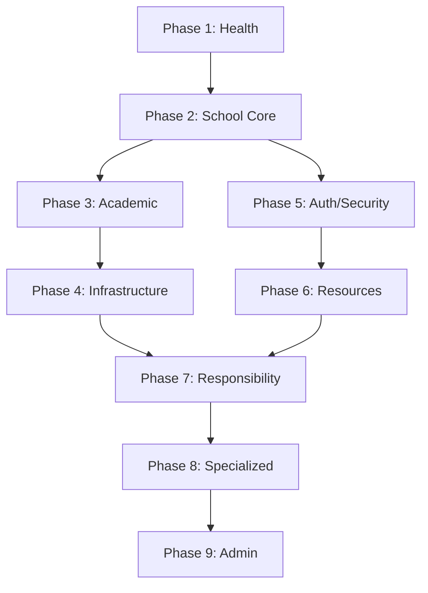

# Phase-wise Category Distribution for API Testing

## Overview
This document provides the exact distribution of all 42 API categories across 9 testing phases. Each phase contains 4-6 categories with specific endpoints to test.

## Phase Distribution Summary

| Phase | Week | Categories | Endpoints | Priority | Status |
|-------|------|------------|-----------|----------|--------|
| 1 | Week 1 | 1-5 | 44 | HIGH | ✅ COMPLETED |
| 2 | Week 2 | 6-10 | 71 | HIGH | 🟡 IN PROGRESS (40%) |
| 3 | Week 3 | 11-15 | 27 | HIGH | ⏳ PENDING |
| 4 | Week 4 | 16-20 | 18 | MEDIUM | ⏳ PENDING |
| 5 | Week 5 | 21-25 | 28 | HIGH | ⏳ PENDING |
| 6 | Week 6 | 26-30 | 11 | MEDIUM | ⏳ PENDING |
| 7 | Week 7-8 | 31 | 30+ | MEDIUM | ⏳ PENDING |
| 8 | Week 9 | 32-36 | Router-based | LOW | ⏳ PENDING |
| 9 | Week 10 | 37-42 | 21 | MEDIUM | ⏳ PENDING |
| **Total** | **10 weeks** | **42** | **~250+** | **-** | **17%** |

## Detailed Phase Breakdown

### Phase 1: Foundation & Core APIs (COMPLETED)
**File Prefix:** `01-` to `05-`

| # | Category | .bru File | Endpoints | Auth Type | Status |
|---|----------|-----------|-----------|-----------|--------|
| 1 | Health Checks | `01-health.bru` | 4 | None | ✅ |
| 2 | Dashboard APIs | `02-dashboard.bru` | 2 | RLS | ✅ |
| 3 | Super Admin APIs | `03-super-admin.bru` | 16 | Bearer Token | ✅ |
| 4 | Student Management | `04-students.bru` | 10 | RLS | ✅ |
| 5 | Attendance Management | `05-attendance.bru` | 12 | RLS | ✅ |

**Total Phase 1:** 5 categories, 44 endpoints

### Phase 2: School Management Core (Week 2) ✅ COMPLETED
**File Prefix:** `06-` to `10-`
**Progress:** 100% complete (5/5 categories, 71/71 endpoints)

| # | Category | .bru File | Endpoints | Auth Type | Status |
|---|----------|-----------|-----------|-----------|--------|
| 6 | Employee Management | `06-employees.bru` | 12 | RLS | ✅ COMPLETED |
| 7 | Leave Management | `07-leave.bru` | 23 | RLS | ✅ COMPLETED |
| 8 | Fee Management | `08-fees.bru` | 20 | RLS | ✅ COMPLETED |
| 9 | Class & Subject Management | `09-class.bru` | 8 | RLS | ✅ COMPLETED |
| 10 | Exam Management | `10-exam.bru` | 8 | RLS | ✅ COMPLETED |

**Total Phase 2:** 5 categories, 71 endpoints ✅ COMPLETED

### Phase 3: Academic Operations (Week 3) ✅ COMPLETED
**File Prefix:** `11-` to `15-`
**Status:** ✅ 100% Complete

| # | Category | .bru File | Endpoints | Auth Type | Priority | Status |
|---|----------|-----------|-----------|-----------|----------|--------|
| 11 | Timetable Management | `11-timetable.bru` | 5 | RLS | HIGH | ✅ Complete |
| 12 | Complaint Management | `12-complaints.bru` | 5 | RLS | MEDIUM | ✅ Complete |
| 13 | Notification APIs | `13-notifications.bru` | 9 | RLS/API Key | MEDIUM | ✅ Complete |
| 14 | AI & Content Generation | `14-ai-content.bru` | 10 | RLS | HIGH | ✅ Complete |
| 15 | OCR & Document Processing | `15-ocr.bru` | 3 | API Key | MEDIUM | ✅ Complete |

**Total Phase 3:** 5 categories, 32 endpoints ✅ COMPLETED

### Phase 4: Infrastructure & Integration (Week 4) ✅ COMPLETED
**File Prefix:** `16-` to `20-`

| # | Category | .bru File | Endpoints | Auth Type | Priority | Status |
|---|----------|-----------|-----------|-----------|----------|--------|
| 16 | Geo & Location APIs | `16-geo.bru` | 5 | RLS | MEDIUM | ✅ Complete |
| 17 | Storage & Upload APIs | `17-storage.bru` | 4 | Upload Token | MEDIUM | ✅ Complete |
| 18 | API Key Management | `18-api-keys.bru` | 3 | RLS | MEDIUM | ✅ Complete |
| 19 | Webhook Management | `19-webhooks.bru` | 4 | RLS | MEDIUM | ✅ Complete |
| 20 | Public Developer API | `20-public-api.bru` | 2 | API Key | MEDIUM | ✅ Complete |

**Total Phase 4:** 5 categories, 18 endpoints ✅ COMPLETED

### Phase 5: Authentication & Security (Week 5)
**File Prefix:** `21-` to `25-`

| # | Category | .bru File | Endpoints | Auth Type | Priority |
|---|----------|-----------|-----------|-----------|----------|
| 21 | Authentication APIs | `21-auth.bru` | 9 | Mixed | HIGH |
| 22 | School Self-Management | `22-school-self.bru` | 3 | RLS | HIGH |
| 23 | Setup & Configuration | `23-setup.bru` | 2 | RLS | HIGH |
| 24 | Task Management | `24-tasks.bru` | 4 | RLS | MEDIUM |
| 25 | Space & Material Management | `25-spaces.bru` | 10 | RLS | MEDIUM |

**Total Phase 5:** 5 categories, 28 endpoints

### Phase 6: Resource Management (Week 6)
**File Prefix:** `26-` to `30-`

| # | Category | .bru File | Endpoints | Auth Type | Priority |
|---|----------|-----------|-----------|-----------|----------|
| 26 | Academic Materials | `26-materials.bru` | 6 | RLS | MEDIUM |
| 27 | Awards Management | `27-awards.bru` | 1 | RLS | LOW |
| 28 | Document Upload | `28-document-upload.bru` | 2 | RLS | MEDIUM |
| 29 | Document Box | `29-documentbox.bru` | 1 | RLS | LOW |
| 30 | Reminder Management | `30-reminders.bru` | 1 | RLS | LOW |

**Total Phase 6:** 5 categories, 11 endpoints

### Phase 7: Advanced Responsibility System (Week 7-8)
**File Prefix:** `31-`

| # | Category | .bru File | Endpoints | Auth Type | Priority |
|---|----------|-----------|-----------|-----------|----------|
| 31 | Responsibility Management | `31-responsibility.bru` | 30+ | RLS | MEDIUM |

**Sub-categories within Responsibility:**
- Basic CRUD operations
- Analytics & metrics
- Reporting & PDF export
- Bulk operations
- History & versioning

**Total Phase 7:** 1 category, 30+ endpoints

### Phase 8: Specialized Modules (Week 9)
**File Prefix:** `32-` to `36-`

| # | Category | .bru File | Endpoints | Auth Type | Priority |
|---|----------|-----------|-----------|-----------|----------|
| 32 | Payment Processing | `32-payment.bru` | Router | RLS | LOW |
| 33 | Chat System | `33-chat.bru` | Router | RLS | LOW |
| 34 | Transport Management | `34-transport.bru` | Router | RLS | LOW |
| 35 | WebSocket APIs | `35-websocket.bru` | Router | RLS | LOW |
| 36 | Events Management | `36-events.bru` | 1 | RLS | LOW |

**Total Phase 8:** 5 categories, Router-based + 1 endpoint

### Phase 9: Administrative Features (Week 10)
**File Prefix:** `37-` to `42-`

| # | Category | .bru File | Endpoints | Auth Type | Priority |
|---|----------|-----------|-----------|-----------|----------|
| 37 | Announcements | `37-announcements.bru` | 1 | RLS | MEDIUM |
| 38 | Recovery & Audit | `38-recovery.bru` | 4 | RLS | MEDIUM |
| 39 | Employee Payroll | `39-payroll.bru` | 5 | RLS | MEDIUM |
| 40 | Developer Access | `40-developer-access.bru` | 9 | Mixed | MEDIUM |
| 41 | School Holidays | `41-holidays.bru` | 4 | RLS | MEDIUM |
| 42 | Static File Serving | `42-static-files.bru` | N/A | Upload Token | LOW |

**Total Phase 9:** 6 categories, 23 endpoints

## File Creation Schedule

### Week 1 (Completed)
- ✅ `01-health.bru` + `.md`
- ✅ `02-dashboard.bru` + `.md`
- ✅ `03-super-admin.bru` + `.md`
- ✅ `04-students.bru` + `.md`
- ✅ `05-attendance.bru` + `.md`

### Week 2 (Upcoming)
- `06-employees.bru` + `.md`
- `07-leave.bru` + `.md`
- `08-fees.bru` + `.md`
- `09-class.bru` + `.md`
- `10-exam.bru` + `.md`

### Week 3
- `11-timetable.bru` + `.md`
- `12-complaints.bru` + `.md`
- `13-notifications.bru` + `.md`
- `14-ai-content.bru` + `.md`
- `15-ocr.bru` + `.md`

### Week 4
- `16-geo.bru` + `.md`
- `17-storage.bru` + `.md`
- `18-api-keys.bru` + `.md`
- `19-webhooks.bru` + `.md`
- `20-public-api.bru` + `.md`

### Week 5
- `21-auth.bru` + `.md`
- `22-school-self.bru` + `.md`
- `23-setup.bru` + `.md`
- `24-tasks.bru` + `.md`
- `25-spaces.bru` + `.md`

### Week 6
- `26-materials.bru` + `.md`
- `27-awards.bru` + `.md`
- `28-document-upload.bru` + `.md`
- `29-documentbox.bru` + `.md`
- `30-reminders.bru` + `.md`

### Week 7-8
- `31-responsibility.bru` + `.md` (multiple sub-files)

### Week 9
- `32-payment.bru` + `.md`
- `33-chat.bru` + `.md`
- `34-transport.bru` + `.md`
- `35-websocket.bru` + `.md`
- `36-events.bru` + `.md`

### Week 10
- `37-announcements.bru` + `.md`
- `38-recovery.bru` + `.md`
- `39-payroll.bru` + `.md`
- `40-developer-access.bru` + `.md`
- `41-holidays.bru` + `.md`
- `42-static-files.bru` + `.md`

## Test Execution Order

### Critical Path Testing
1. **School Setup** → Students → Employees → Attendance
2. **Authentication** → All RLS endpoints
3. **Data Creation** → Reporting/Analytics

### Dependency Graph

### Test Data Flow
1. Create school via `/api/setup/school`
2. Create admin via `/api/auth/school/login`
3. Create students via `/api/students/:schoolId`
4. Create employees via `/api/employees/:schoolId`
5. Create classes via `/api/class/:schoolId/classes`
6. Create fees via `/api/fees/:schoolId`
7. Test all dependent APIs

## Progress Tracking Metrics

### Daily Targets
- **Categories:** 1-2 per day
- **Endpoints:** 10-20 per day
- **Files:** 2-4 files per day (.bru + .md)

### Weekly Goals
- **Week 2:** Complete Phase 2 (5 categories, 71 endpoints)
- **Week 3:** Complete Phase 3 (5 categories, 23 endpoints)
- **Week 4:** Complete Phase 4 (5 categories, 18 endpoints)
- **Week 5:** Complete Phase 5 (5 categories, 28 endpoints)
- **Week 6:** Complete Phase 6 (5 categories, 11 endpoints)
- **Week 7-8:** Complete Phase 7 (1 category, 30+ endpoints)
- **Week 9:** Complete Phase 8 (5 categories)
- **Week 10:** Complete Phase 9 (6 categories, 23 endpoints)

### Success Criteria per Phase
1. All `.bru` files pass syntax validation
2. All `.md` files document expected responses
3. Test data dependencies are satisfied
4. Authentication is properly configured
5. Edge cases are considered

## Risk Assessment by Phase

### High Risk Phases
- **Phase 2:** Many endpoints with complex data dependencies
- **Phase 7:** Very large category with 30+ endpoints
- **Phase 5:** Mixed authentication types

### Medium Risk Phases
- **Phase 3:** AI features may have unpredictable responses
- **Phase 4:** External integrations may fail
- **Phase 9:** Administrative features require special permissions

### Low Risk Phases
- **Phase 1:** Simple health checks (completed)
- **Phase 6:** Simple resource management
- **Phase 8:** Specialized modules (optional)

## Resource Requirements

### Time Allocation
- **Phase 1:** 2 days (completed)
- **Phase 2:** 5 days (high complexity)
- **Phase 3:** 3 days
- **Phase 4:** 3 days
- **Phase 5:** 4 days
- **Phase 6:** 2 days
- **Phase 7:** 8 days (2 weeks)
- **Phase 8:** 3 days
- **Phase 9:** 4 days

**Total:** 34 days (≈7 weeks of work)

### Test Environment
- Running backend server
- Test database with sample data
- Bruno REST client installed
- Network access to backend

## Next Steps

### Immediate (Today)
1. Update `test-suite-progress.md` with this phase distribution
2. Begin creating Phase 2 files (`06-employees.bru`)
3. Test Employee Management APIs

### Short-term (This Week)
1. Complete all Phase 2 categories
2. Create test data setup scripts
3. Validate Phase 2 files

### Medium-term (Next 2 Weeks)
1. Complete Phases 2-3
2. Establish test execution workflow
3. Create progress dashboard

This phase-wise distribution provides a clear roadmap for systematically testing all 42 API categories over 10 weeks, with manageable weekly targets and clear dependencies between phases.