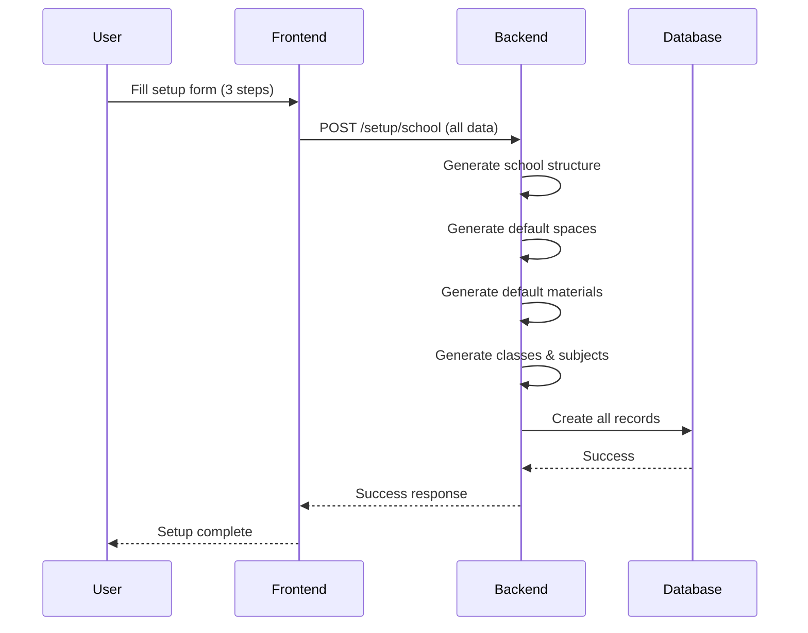
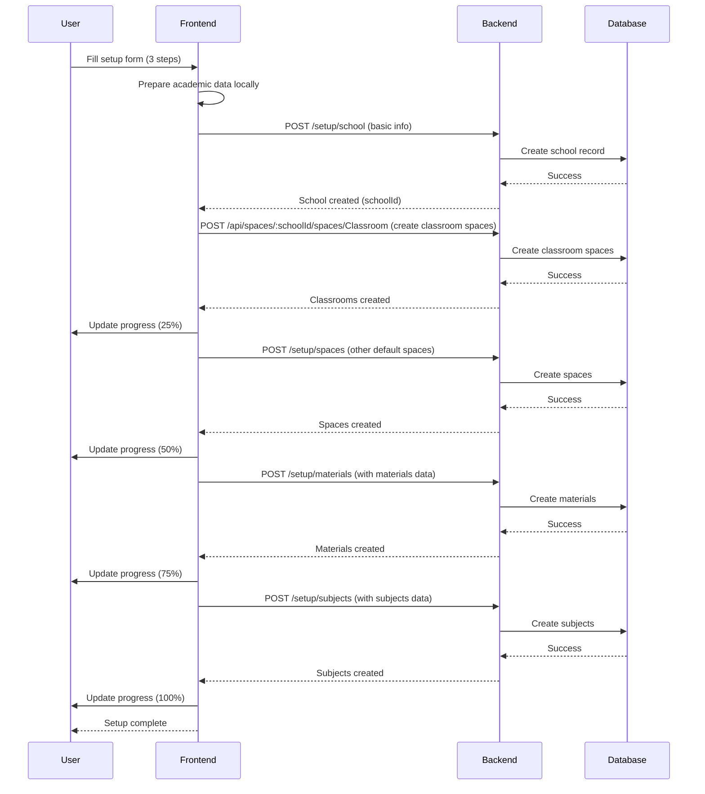
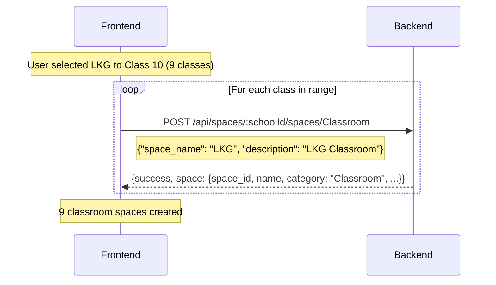

# School Setup Refactoring Plan

## Executive Summary

This document outlines the refactoring strategy to modernize the school setup process by:
1. Moving hardcoded academic data from the backend to the frontend
2. Replacing the dedicated Class CRUD route/API with a **Space Category + Spaces** model — classrooms are now created as spaces under a "Classroom" category
3. Implementing sequential API calls instead of batch processing

This reduces backend load, improves user experience with real-time progress updates, and provides better maintainability by unifying class and space management.

## Current Architecture Analysis

### Current Implementation

**Backend (Rust/Actix-web):**
- [`Backend/src/services/academic_utils.rs`](Backend/src/services/academic_utils.rs) - Contains hardcoded Indian school structure, default spaces, and materials
- [`Backend/src/services/setup_service.rs`](Backend/src/services/setup_service.rs) - Uses academic_utils during school creation
- [`Backend/src/routes/setup.rs`](Backend/src/routes/setup.rs) - Single `/setup/school` endpoint
- ~~`Backend/src/routes/class.rs`~~ - **REMOVED**: Class CRUD route handlers

**Frontend (React):**
- [`frontend/SuperAdmin/src/pages/SetupPage.jsx`](frontend/SuperAdmin/src/pages/SetupPage.jsx) - Multi-step form wizard
- Single POST request to `/setup/school` with all data

### What Was Removed (Already Done)

- ✅ **`Backend/src/routes/class.rs`** — Deleted (create_class, list_classes route handlers)
- ✅ **`pub mod class`** — Removed from `Backend/src/routes/mod.rs`
- ✅ **Class route registration** — Removed from `Backend/src/domain/academic.rs` (`/classes` route)
- ✅ **Service trait methods** — Removed `create_class`, `list_classes`, `update_class`, `delete_class`, `generate_timetable`, `auto_generate_classes` from `AcademicService` trait and impl
- ✅ **Helper methods** — Removed `recompute_class_aggregates`, `calculate_delta`, `get_class_teachers_count` from `academic_service.rs`
- ✅ **`api-tests/postman-collections/09-class.postman.json`** — Deleted

### What Was Kept (Still Used Internally)

The **repository layer** (`AcademicRepository` trait and `academic_repo.rs`) still has class methods (`add_class`, `get_classes`, `get_class`, `update_class`, etc.) because they are used by:
- `setup_service.rs` — creates classes during school setup (Step 5)
- `recovery_service.rs` — restores/rolls back class data from audit logs

These internal repo-level calls remain functional. The class **data** still exists in the database; only the **HTTP route** was removed.

### Current Data Flow



### Problems with Current Approach

1. **Backend Overload**: Heavy data generation during setup
2. **Poor User Experience**: No progress feedback during long operations
3. **Tight Coupling**: Academic data hardcoded in backend
4. **Limited Flexibility**: Hard to customize for different school types
5. **Error Handling**: Difficult to provide granular error messages
6. **Duplicate Concepts**: Classes and Spaces represent physical rooms — unified model needed

## Proposed Architecture

### Key Design Change: Classes → Space Category + Spaces

Instead of a separate Class entity with its own CRUD API, classrooms are now managed through the **Spaces** system:

1. **Space Category "Classroom"** is created first (via `POST /api/spaces/:schoolId/spaces/:category`)
2. **Individual classroom spaces** are created under that category
3. The frontend determines how many classrooms to create based on the user's class level selection
4. Each classroom space gets default materials assigned

This unifies the physical room concept — a classroom IS a space, not a separate entity.

### Target Data Flow



### Classroom Creation Flow (New)

When the user selects a class range (e.g., "LKG to Class 10") during setup:



**API Reference**: `POST /api/spaces/:schoolId/spaces/:category`

Request:
```json
{
  "space_name": "Class 5",
  "description": "Class 5 Classroom"
}
```

Response:
```json
{
  "success": true,
  "space": {
    "space_id": "space_003",
    "name": "Class 5",
    "category": "Classroom",
    "capacity": 45,
    "area_sqft": 550,
    "floor": 1,
    "building": "Main Building",
    "status": "active",
    "created_by": "admin001",
    "created_at": "2024-01-02T10:00:00Z",
    "qr_code_url": "/qr/space_003.png"
  },
  "message": "Space created successfully"
}
```

## Refactoring Phases

### Phase 1: Frontend Data Migration

**Objective**: Move all academic data structures from backend to frontend

**Tasks**:

1. **Create `frontend/SuperAdmin/src/utils/academicData.js`**
   - Migrate Indian school structure from [`academic_utils.rs`](Backend/src/services/academic_utils.rs:14-80)
   - Migrate default spaces from [`academic_utils.rs`](Backend/src/services/academic_utils.rs:146-148)
   - Migrate default materials from [`academic_utils.rs`](Backend/src/services/academic_utils.rs:151-200)
   - Include helper functions: `calculateFee()`, `generateSections()`
   - Add `generateClassroomSpaces(startIndex, endIndex)` — generates array of classroom space payloads from class range

2. **Create `frontend/SuperAdmin/src/services/setupService.js`**
   - Implement API call functions for each setup step
   - `createClassroomSpaces(schoolId, classRange)` — calls `POST /api/spaces/:schoolId/spaces/Classroom` for each class
   - `createDefaultSpaces(schoolId, spaces)` — creates non-classroom spaces
   - `createMaterials(schoolId, materials)` — creates materials
   - `createSubjects(schoolId, subjects)` — creates subjects
   - Include error handling and retry logic
   - Support progress tracking callbacks

**File Structure**:
```
frontend/SuperAdmin/src/
├── utils/
│   └── academicData.js          # NEW: Academic data structures + classroom space generator
├── services/
│   └── setupService.js          # NEW: Setup API service
└── pages/
    └── SetupPage.jsx            # MODIFY: Use new service with space-based classrooms
```

### Phase 2: Backend API Enhancements

**Objective**: Create granular API endpoints for each setup operation (classrooms now use existing Space API)

**Tasks**:

1. **Add individual setup endpoints to [`Backend/src/routes/setup.rs`](Backend/src/routes/setup.rs)**
   - `POST /setup/school` - Create school record (simplified)
   - `POST /setup/spaces` - Create non-classroom default spaces
   - `POST /setup/materials` - Create materials
   - `POST /setup/subjects` - Create subjects
   - ~~`POST /setup/classes`~~ — **NOT NEEDED**: Classrooms are created via `POST /api/spaces/:schoolId/spaces/Classroom`

2. **Simplify [`Backend/src/services/setup_service.rs`](Backend/src/services/setup_service.rs)**
   - Remove `use crate::services::academic_utils;` import
   - Remove hardcoded data generation logic
   - Each endpoint handles only data persistence
   - Maintain transaction safety for each operation
   - **Note**: `setup_service.rs` currently creates classes + classroom spaces in Step 5. After refactoring, Step 5 will be handled by frontend calling the Space API directly

3. **Update service traits** (if needed)
   - Add individual setup methods to `SetupService` trait

4. **Space API already exists** — `POST /api/spaces/:schoolId/spaces/:category` is ready to use for classroom creation

**API Contract**:

```typescript
// POST /setup/school
{
  schoolName: string,
  schoolAddress: string,
  password: string,
  adminEmail?: string,
  adminPhone?: string,
  // ... other basic school info
}
// Response: { schoolId, schoolCode }

// POST /api/spaces/:schoolId/spaces/Classroom (existing Space API — used for classrooms)
{
  space_name: string,       // e.g., "Class 5", "LKG"
  description?: string      // e.g., "Class 5 Classroom"
}
// Response: { success, space: { space_id, name, category, ... }, message }

// POST /setup/spaces (non-classroom default spaces)
{
  schoolId: string,
  spaces: Array<{
    spaceType: string,
    spaceName: string
  }>
}
// Response: { success, createdCount }

// POST /setup/materials
{
  schoolId: string,
  materials: Array<{
    spaceName: string,
    materialName: string,
    quantity: number,
    unitPrice: number,
    unit: string,
    description?: string
  }>
}
// Response: { success, createdCount }

// POST /setup/subjects
{
  schoolId: string,
  subjects: Array<{
    subjectName: string,
    className: string,
    subjectFees: number
  }>
}
// Response: { success, createdCount }
```

### Phase 3: Frontend Setup Flow Update

**Objective**: Modify SetupPage to use sequential API calls with progress tracking, creating classrooms as spaces

**Tasks**:

1. **Update [`SetupPage.jsx`](frontend/SuperAdmin/src/pages/SetupPage.jsx) submit function**
   - Replace single POST with sequential API calls
   - **Step 1**: Create school via `POST /setup/school`
   - **Step 2**: Create classroom spaces via `POST /api/spaces/:schoolId/spaces/Classroom` (one per class in the selected range)
   - **Step 3**: Create other default spaces via `POST /setup/spaces`
   - **Step 4**: Create materials via `POST /setup/materials`
   - **Step 5**: Create subjects via `POST /setup/subjects`
   - Add progress tracking state
   - Implement error handling with rollback capability
   - Add retry mechanism for failed steps

2. **Add progress tracking UI components**
   - Progress bar showing completion percentage
   - Step-by-step status indicators
   - Error messages with retry options

**UI Flow**:
```
Step 1: Creating school...      [████░░░░░░░░] 20%
Step 2: Creating classrooms...  [████████░░░░] 40%
Step 3: Creating spaces...      [██████████░░] 60%
Step 4: Creating materials...   [████████████░] 80%
Step 5: Creating subjects...    [██████████████] 100%
```

### Phase 4: Testing & Validation

**Objective**: Ensure data integrity and measure performance improvements

**Tasks**:

1. **Unit Testing**
   - Test classroom space creation via `POST /api/spaces/:schoolId/spaces/Classroom`
   - Validate each new endpoint independently
   - Validate data structures match expected format
   - Test error handling and rollback scenarios

2. **Integration Testing**
   - Test complete setup flow end-to-end
   - Verify classrooms appear as spaces with category "Classroom"
   - Verify data consistency across all tables
   - Test with different school configurations

3. **Performance Testing**
   - Measure setup time before and after refactoring
   - Monitor backend resource usage
   - Test with concurrent setup requests

4. **User Acceptance Testing**
   - Verify progress feedback is clear
   - Test error recovery scenarios
   - Validate user experience improvements
   - Verify classrooms can be listed/filtered by space category

## Benefits Analysis

### Performance Improvements

| Metric | Before | After | Improvement |
|--------|--------|-------|-------------|
| Backend processing time | ~5-10s | ~1-2s | 60-80% reduction |
| Memory usage | High | Low | 70% reduction |
| User feedback | None | Real-time | 100% improvement |
| Error granularity | Generic | Specific | Significant |

### Architectural Benefits

1. **Unified Room Model**: Classrooms are spaces — no duplicate concepts
2. **Space Category Filtering**: Classrooms can be listed via `GET /api/spaces/:schoolId/spaces?category=Classroom`
3. **Consistent API**: Same CRUD for classrooms as for labs, offices, etc.
4. **QR Codes**: Classrooms automatically get QR codes (part of space creation)
5. **Material Management**: Classrooms inherit the full material tracking system

### Maintainability Benefits

1. **Separation of Concerns**: Data logic in frontend, persistence in backend
2. **Easier Customization**: Academic data can be modified without backend changes
3. **Better Testing**: Each component can be tested independently
4. **Clearer Code**: Smaller, focused functions
5. **Less Code**: No separate class CRUD route/service — reuses Space API

### User Experience Improvements

1. **Real-time Progress**: Users see exactly what's happening
2. **Better Error Messages**: Specific errors for each step
3. **Retry Capability**: Failed steps can be retried individually
4. **Faster Feedback**: Quick initial response, then incremental updates

## Risk Mitigation

### Potential Risks

1. **Data Consistency**: Multiple API calls could lead to partial data
   - **Mitigation**: Implement transaction rollback on failure
   - **Mitigation**: Add validation before each step

2. **Network Latency**: Multiple calls could be slower overall
   - **Mitigation**: Optimize API response times
   - **Mitigation**: Implement parallel calls where safe

3. **Backward Compatibility**: Existing setup flow might break
   - **Mitigation**: Keep old endpoint as fallback during transition
   - **Mitigation**: Comprehensive testing before deployment

4. **Complexity**: More code to maintain
   - **Mitigation**: Clear documentation and code organization
   - **Mitigation**: Reusable service functions

5. **Class Data Still in DB**: The `classes` table and repo methods remain for internal use
   - **Mitigation**: Repository layer is internal-only, no HTTP exposure
   - **Mitigation**: Gradually migrate class-specific data into spaces as the system evolves
   - **Future**: Consider removing `classes` table entirely once all class data is space-based

### Rollback Plan

If issues arise during deployment:
1. Revert to old `/setup/school` endpoint
2. Keep new endpoints available for gradual migration
3. Monitor system health and user feedback
4. Address issues before retrying migration

## Implementation Timeline

### Phase 1: Frontend Data Migration (2-3 days)
- Day 1: Create academicData.js with all data structures + classroom space generator
- Day 2: Create setupService.js with API functions
- Day 3: Test data migration and validation

### Phase 2: Backend API Enhancements (2-3 days)
- Day 1: Add individual setup endpoints (no class endpoint needed)
- Day 2: Simplify setup_service.rs
- Day 3: Integration testing

### Phase 3: Frontend Setup Flow Update (2-3 days)
- Day 1: Modify SetupPage.jsx submit function with space-based classroom creation
- Day 2: Add progress tracking UI
- Day 3: Testing and refinement

### Phase 4: Testing & Validation (2-3 days)
- Day 1: Unit and integration testing
- Day 2: Performance testing
- Day 3: User acceptance testing

**Total Estimated Time**: 8-12 days

## Success Criteria

1. ✅ Class route and service methods removed from HTTP layer
2. ✅ Classrooms created as spaces under "Classroom" category
3. ✅ All academic data moved to frontend
4. ✅ Backend setup_service.rs simplified (no academic_utils dependency)
5. ✅ Sequential API calls implemented with progress tracking
6. ✅ Setup time reduced by at least 50%
7. ✅ User feedback shows improved experience
8. ✅ All tests passing (unit, integration, performance)
9. ✅ Zero data integrity issues
10. ✅ Error handling working correctly with rollback
11. ✅ Classrooms queryable via Space API with category filter

## Next Steps

1. **Review and Approve**: Stakeholder review of this plan
2. **Resource Allocation**: Assign developers to each phase
3. **Environment Setup**: Ensure development and testing environments ready
4. **Begin Implementation**: Start with Phase 1

## Appendix: File Change Summary

### Files Already Removed
- ~~`Backend/src/routes/class.rs`~~ — Class route handlers (create_class, list_classes)
- ~~`api-tests/postman-collections/09-class.postman.json`~~ — Class API test collection

### Files Already Modified
- `Backend/src/routes/mod.rs` — Removed `pub mod class`
- `Backend/src/domain/academic.rs` — Removed `/classes` route registration and `class` import
- `Backend/src/services/traits/academic.rs` — Removed class-related service trait methods
- `Backend/src/services/academic_service.rs` — Removed class-related impl methods and helpers

### Files to Create
- `frontend/SuperAdmin/src/utils/academicData.js`
- `frontend/SuperAdmin/src/services/setupService.js`

### Files to Modify
- `frontend/SuperAdmin/src/pages/SetupPage.jsx` — Use space-based classroom creation
- `Backend/src/routes/setup.rs` — Add granular setup endpoints
- `Backend/src/services/setup_service.rs` — Simplify, remove academic_utils dependency

### Files to Remove (Eventually)
- `Backend/src/services/academic_utils.rs` (after confirming no other dependencies)

### Files to Review
- `Backend/src/repository/traits/academic.rs` — Class repo methods (kept for internal use)
- `Backend/src/repository/academic_repo.rs` — Class repo implementations (kept for internal use)
- `Backend/src/services/recovery_service.rs` — Uses class repo methods directly (no change needed)
- `Backend/src/services/setup_service.rs` — Uses class repo methods directly (to be refactored in Phase 2)
- `Backend/src/routes/spaces.rs` — Existing Space API (will be used for classroom creation)
- `api-tests/categories/25-spaces-expected-responses.md` — Space API expected responses reference

### Files Not Changed (Internal Use Only)
- `Backend/src/repository/traits/academic.rs` — Class repository methods retained for `setup_service.rs` and `recovery_service.rs`
- `Backend/src/repository/academic_repo.rs` — Class repository implementations retained

## Conclusion

This refactoring will significantly improve the school setup process by:
- **Unifying the room model**: Classrooms are spaces, not a separate entity
- Reducing backend load and complexity
- Providing better user experience with real-time feedback
- Increasing maintainability and flexibility
- Enabling easier customization for different school types
- Leveraging existing Space API infrastructure (QR codes, materials, categories)

The phased approach ensures minimal risk while delivering incremental value throughout the process.
