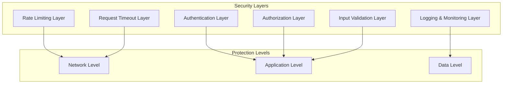

# Security Layer Architecture Design Specification

## Problem Statement

The current backend lacks critical security features:
1. **No rate limiting**: Vulnerable to abuse/DoS attacks
2. **No request timeouts**: Long-running requests can exhaust resources
3. **Incomplete input validation**: Potential security vulnerabilities
4. **Limited monitoring**: Insufficient visibility into security events

## Design Goals

1. **Defense in Depth**: Multiple layers of security protection
2. **Zero Trust**: Verify every request, trust no one
3. **Least Privilege**: Minimum permissions required for functionality
4. **Observability**: Comprehensive logging and monitoring
5. **Performance**: Minimal impact on legitimate requests

## Architecture Overview

### Security Layer Stack


## Component Design

### 1. Rate Limiting System

#### 1.1 Hierarchical Rate Limiting Design
```rust
pub struct HierarchicalRateLimiter {
    // Multiple levels of rate limiting
    ip_limiter: RateLimiter,      // IP-based: 1000 req/min
    api_key_limiter: RateLimiter, // API Key: 100 req/min
    user_limiter: RateLimiter,    // User-based: 50 req/min
    school_limiter: RateLimiter,  // School-based: 5000 req/min
    endpoint_limiters: HashMap<String, RateLimiter>, // Per-endpoint limits
}

impl HierarchicalRateLimiter {
    pub async fn check(&self, context: &RateLimitContext) -> RateLimitResult {
        // Check each level in sequence
        if !self.ip_limiter.check(&context.ip).await {
            return RateLimitResult::IpLimited;
        }
        
        if !self.api_key_limiter.check(&context.api_key).await {
            return RateLimitResult::ApiKeyLimited;
        }
        
        if !self.user_limiter.check(&context.user_id).await {
            return RateLimitResult::UserLimited;
        }
        
        if !self.school_limiter.check(&context.school_id).await {
            return RateLimitResult::SchoolLimited;
        }
        
        if let Some(limiter) = self.endpoint_limiters.get(&context.endpoint) {
            if !limiter.check(&context.composite_key).await {
                return RateLimitResult::EndpointLimited;
            }
        }
        
        RateLimitResult::Allowed
    }
}
```

#### 1.2 Rate Limit Configuration
```yaml
# config/rate_limits.yaml
rate_limits:
  # Global defaults
  default:
    requests_per_minute: 100
    burst_size: 10
    
  # IP-based limits
  ip:
    requests_per_minute: 1000
    burst_size: 100
    
  # API Key tiers
  api_key_tiers:
    free:
      requests_per_minute: 100
      burst_size: 10
    premium:
      requests_per_minute: 1000
      burst_size: 100
    enterprise:
      requests_per_minute: 10000
      burst_size: 1000
      
  # Endpoint-specific limits
  endpoints:
    "/api/:schoolId/responsibilities":
      create:
        requests_per_minute: 20
        burst_size: 5
      list:
        requests_per_minute: 100
        burst_size: 20
        
    "/api/:schoolId/students":
      import:
        requests_per_minute: 5
        burst_size: 1
```

#### 1.3 Redis-backed Distributed Rate Limiting
```rust
pub struct RedisRateLimiter {
    redis: RedisPool,
    prefix: String,
}

impl RedisRateLimiter {
    pub async fn check(&self, key: &str, limit: u32, window: Duration) -> Result<bool, RedisError> {
        let redis_key = format!("{}:{}", self.prefix, key);
        let now = Utc::now().timestamp_millis();
        let window_ms = window.as_millis() as i64;
        
        // Use Redis sorted set for sliding window
        let result: Option<i64> = redis::cmd("EVAL")
            .arg(LUA_SLIDING_WINDOW_SCRIPT)
            .arg(1)
            .arg(&redis_key)
            .arg(now)
            .arg(window_ms)
            .arg(limit)
            .query_async(&mut self.redis.get().await?)
            .await?;
            
        Ok(result.map(|count| count < limit as i64).unwrap_or(true))
    }
}

// Lua script for atomic operations
const LUA_SLIDING_WINDOW_SCRIPT: &str = r#"
local key = KEYS[1]
local now = tonumber(ARGV[1])
local window = tonumber(ARGV[2])
local limit = tonumber(ARGV[3])

-- Remove old entries
redis.call('ZREMRANGEBYSCORE', key, 0, now - window)

-- Count current requests
local current = redis.call('ZCARD', key)

if current < limit then
    -- Add new request
    redis.call('ZADD', key, now, now)
    redis.call('EXPIRE', key, math.ceil(window / 1000))
    return current + 1
else
    return current
end
"#;
```

### 2. Request Timeout System

#### 2.1 Layered Timeout Configuration
```rust
pub struct TimeoutConfig {
    // Global timeout (applies to all requests)
    global: Duration,
    
    // Per-endpoint timeouts (override global)
    endpoints: HashMap<String, Duration>,
    
    // Per-method timeouts
    methods: HashMap<HttpMethod, Duration>,
    
    // Dynamic timeouts based on request characteristics
    dynamic: DynamicTimeoutConfig,
}

pub struct DynamicTimeoutConfig {
    // Timeout based on request size
    size_based: Vec<(u64, Duration)>, // (size_bytes, timeout)
    
    // Timeout based on user tier
    user_tier_based: HashMap<String, Duration>,
    
    // Adaptive timeouts based on system load
    adaptive: AdaptiveTimeoutConfig,
}
```

#### 2.2 Timeout Middleware Implementation
```rust
pub async fn timeout_middleware(
    request: Request,
    next: Next,
) -> Result<Response, AppError> {
    let timeout = determine_timeout(&request).await;
    
    match tokio::time::timeout(timeout, next.run(request)).await {
        Ok(response) => Ok(response),
        Err(_) => {
            // Log timeout event
            tracing::warn!(
                "Request timeout after {:?}",
                timeout
            );
            
            Err(AppError::Timeout(format!(
                "Request timed out after {:?}",
                timeout
            )))
        }
    }
}

async fn determine_timeout(request: &Request) -> Duration {
    // Check endpoint-specific timeout
    let path = request.uri().path();
    if let Some(timeout) = ENDPOINT_TIMEOUTS.get(path) {
        return *timeout;
    }
    
    // Check method-specific timeout
    let method = request.method();
    if let Some(timeout) = METHOD_TIMEOUTS.get(method) {
        return *timeout;
    }
    
    // Dynamic timeout based on request size
    if let Some(content_length) = request.headers().get("content-length") {
        if let Ok(size_str) = content_length.to_str() {
            if let Ok(size) = size_str.parse::<u64>() {
                return calculate_size_based_timeout(size);
            }
        }
    }
    
    // Default timeout
    Duration::from_secs(30)
}
```

### 3. Enhanced Authentication & Authorization

#### 3.1 JWT Token Enhancement
```rust
#[derive(Debug, Serialize, Deserialize)]
pub struct EnhancedJwtClaims {
    // Standard claims
    pub sub: String,           // Subject (user/admin ID)
    pub exp: i64,              // Expiration time
    pub iat: i64,              // Issued at
    pub iss: String,           // Issuer
    
    // Custom claims for multi-tenancy
    pub school_id: String,     // School identifier
    pub school_role: String,   // Role within school
    pub permissions: Vec<String>, // Fine-grained permissions
    
    // Security context
    pub device_id: Option<String>, // Device fingerprint
    pub ip_address: Option<String>, // Client IP
    pub user_agent: Option<String>, // Client user agent
    
    // Rate limiting tier
    pub rate_limit_tier: String, // free/premium/enterprise
    
    // Session management
    pub session_id: String,    // Unique session identifier
    pub refresh_token_id: String, // Refresh token identifier
}

impl EnhancedJwtClaims {
    pub fn has_permission(&self, permission: &str) -> bool {
        self.permissions.contains(&permission.to_string())
    }
    
    pub fn has_any_permission(&self, permissions: &[&str]) -> bool {
        permissions.iter().any(|p| self.has_permission(p))
    }
    
    pub fn has_all_permissions(&self, permissions: &[&str]) -> bool {
        permissions.iter().all(|p| self.has_permission(p))
    }
}
```

#### 3.2 Permission-Based Authorization Middleware
```rust
pub struct PermissionMiddleware {
    required_permissions: Vec<String>,
    require_all: bool, // true = AND, false = OR
}

impl PermissionMiddleware {
    pub fn new(permissions: &[&str], require_all: bool) -> Self {
        Self {
            required_permissions: permissions.iter().map(|s| s.to_string()).collect(),
            require_all,
        }
    }
    
    pub async fn check(
        &self,
        request: &Request,
    ) -> Result<(), AppError> {
        let claims = extract_jwt_claims(request)
            .ok_or_else(|| AppError::Unauthorized("Invalid token".to_string()))?;
        
        let has_access = if self.require_all {
            self.required_permissions.iter()
                .all(|p| claims.has_permission(p))
        } else {
            self.required_permissions.iter()
                .any(|p| claims.has_permission(p))
        };
        
        if !has_access {
            return Err(AppError::Forbidden(format!(
                "Insufficient permissions. Required: {:?}",
                self.required_permissions
            )));
        }
        
        Ok(())
    }
}

// Usage in route definitions
let router = Router::new()
    .route(
        "/api/:schoolId/responsibilities",
        post(create_responsibility)
            .layer(PermissionMiddleware::new(
                &["responsibility:write", "admin:full"],
                false // OR condition
            ))
    )
    .route(
        "/api/:schoolId/students/import",
        post(import_students)
            .layer(PermissionMiddleware::new(
                &["student:import", "admin:full"],
                true // AND condition
            ))
    );
```

### 4. Input Validation System

#### 4.1 Schema-Based Validation
```rust
pub struct ValidationSchema {
    fields: HashMap<String, FieldValidation>,
    custom_validators: Vec<Box<dyn CustomValidator>>,
}

pub struct FieldValidation {
    required: bool,
    data_type: DataType,
    min_length: Option<usize>,
    max_length: Option<usize>,
    pattern: Option<Regex>,
    min_value: Option<f64>,
    max_value: Option<f64>,
    allowed_values: Option<Vec<String>>,
    custom_validator: Option<Box<dyn FieldValidator>>,
}

// Example validation schema for responsibility creation
pub fn responsibility_validation_schema() -> ValidationSchema {
    let mut fields = HashMap::new();
    
    fields.insert("name".to_string(), FieldValidation {
        required: true,
        data_type: DataType::String,
        min_length: Some(3),
        max_length: Some(100),
        pattern: Some(Regex::new(r"^[a-zA-Z0-9\s\-_]+$").unwrap()),
        min_value: None,
        max_value: None,
        allowed_values: None,
        custom_validator: None,
    });
    
    fields.insert("monthly_price".to_string(), FieldValidation {
        required: false,
        data_type: DataType::Number,
        min_length: None,
        max_length: None,
        pattern: None,
        min_value: Some(0.0),
        max_value: Some(1000000.0),
        allowed_values: None,
        custom_validator: Some(Box::new(PriceValidator)),
    });
    
    ValidationSchema {
        fields,
        custom_validators: vec![
            Box::new(ResponsibilityUniquenessValidator),
        ],
    }
}
```

#### 4.2 Validation Middleware
```rust
pub async fn validation_middleware<T>(
    request: Request,
    next: Next,
    schema: &'static ValidationSchema,
) -> Result<Response, AppError> {
    // Extract and validate request body
    let body_bytes = hyper::body::to_bytes(request.into_body()).await?;
    let body_str = String::from_utf8_lossy(&body_bytes);
    
    let value: serde_json::Value = serde_json::from_str(&body_str)
        .map_err(|e| AppError::Validation(format!("Invalid JSON: {}", e)))?;
    
    // Validate against schema
    let validation_result = schema.validate(&value).await;
    
    match validation_result {
        Ok(_) => {
            // Reconstruct request with validated body
            let (parts, _) = request.into_parts();
            let validated_request = Request::from_parts(parts, Body::from(body_bytes));
            Ok(next.run(validated_request).await)
        }
        Err(errors) => {
            Err(AppError::Validation(
                errors.join("; ")
            ))
        }
    }
}
```

### 5. Security Monitoring & Logging

#### 5.1 Security Event Structure
```rust
#[derive(Debug, Serialize)]
pub struct SecurityEvent {
    pub event_id: String,
    pub event_type: SecurityEventType,
    pub timestamp: DateTime<Utc>,
    pub severity: SecuritySeverity,
    
    // Request context
    pub request_id: String,
    pub school_id: String,
    pub user_id: String,
    pub ip_address: String,
    pub user_agent: String,
    pub endpoint: String,
    pub method: String,
    
    // Event details
    pub description: String,
    pub metadata: HashMap<String, Value>,
    
    // Response context
    pub status_code: Option<u16>,
    pub response_time_ms: Option<u64>,
    
    // Threat intelligence
    pub threat_score: Option<f32>,
    pub mitigation_action: Option<String>,
}

#[derive(Debug, Serialize)]
pub enum SecurityEventType {
    RateLimitExceeded,
    AuthenticationFailure,
    AuthorizationFailure,
    InputValidationFailure,
    RequestTimeout,
    SuspiciousActivity,
    DataAccessViolation,
    SystemIntrusionAttempt,
}
```

#### 5.2 Real-time Threat Detection
```rust
pub struct ThreatDetector {
    rules: Vec<ThreatRule>,
    anomaly_detector: AnomalyDetector,
    threat_intelligence: ThreatIntelligenceFeed,
}

impl ThreatDetector {
    pub async fn analyze(&self, event: &SecurityEvent) -> ThreatAnalysis {
        let mut analysis = ThreatAnalysis::default();
        
        // Rule-based detection
        for rule in &self.rules {
            if rule.matches(event).await {
                analysis.add_rule_match(rule);
            }
        }
        
        // Anomaly detection
        let anomaly_score = self.anomaly_detector.detect(event).await;
        if anomaly_score > 0.7 {
            analysis.add_anomaly(anomaly_score);
        }
        
        // Threat intelligence correlation
        let ti_matches = self.threat_intelligence.check(event).await;
        analysis.add_threat_intelligence(ti_matches);
        
        analysis
    }
}
```

## Implementation Strategy

### Phase 1: Foundation (Sprint 1-2)
1. Implement basic rate limiting middleware
2. Add request timeout configuration
3. Create input validation framework
4. Set up security event logging

### Phase 2: Enhancement (Sprint 3-4)
1. Implement hierarchical rate limiting
2. Add permission-based authorization
3. Enhance JWT token structure
4. Implement threat detection

### Phase 3: Optimization (Sprint 5-6)
1. Add Redis-backed distributed rate limiting
2. Implement adaptive timeouts
3. Add real-time monitoring dashboard
4. Conduct security penetration testing

## Performance Considerations

### Caching Strategy
- Cache rate limit counters in Redis with TTL
- Cache validation schemas in memory
- Cache permission checks per user session

### Resource Management
- Connection pooling for Redis/database
- Async/await for all I/O operations
- Circuit breakers for external dependencies

## Monitoring & Alerting

### Key Metrics
- Rate limit hits per endpoint/school
- Authentication/authorization failure rates
- Request timeout frequency
- Input validation failure patterns

### Alert Conditions
- Rate limit hits > 100/minute for any endpoint
- Authentication failures > 10/minute from single IP
- Authorization failures > 5/minute for sensitive endpoints
- Suspicious activity patterns detected

## Rollback Plan

### Immediate Rollback (5 minutes)
1. Disable new security middleware via feature flag
2. Revert to previous authentication mechanism
3. Restore original rate limiting configuration

### Gradual Rollback (1 hour)
1. Roll back database schema changes
2. Update client configurations
3. Restore monitoring dashboards

## Success Criteria

### Quantitative Metrics
1. **Rate Limiting**: < 0.1% legitimate requests blocked
