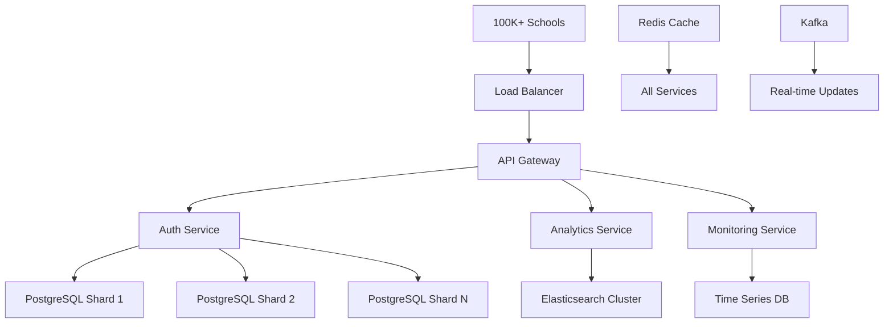

# Comprehensive Analysis & Task Plan: SuperAdmin Premium SaaS Monitoring Frontend

## Current State Analysis

### ✅ **Current Strengths**
1. **Basic Multi-tenant Architecture**: PostgreSQL RLS with school isolation
2. **Core Functionality**: School management, billing, sessions, backup/restore
3. **Dark Theme UI**: Modern dark theme with basic animations
4. **API Structure**: RESTful backend with JWT authentication
5. **Analytics Foundation**: Basic dashboard with charts

### ⚠️ **Critical Problems Identified**

## 🚨 **UI/UX Problems (Current)**

### 1. **Performance Issues**
- No pagination/virtualization for school lists (breaks with lakhs of schools)
- No lazy loading for charts/data visualizations
- Synchronous data fetching blocks UI
- No caching strategy (re-fetches all data on every navigation)

### 2. **User Experience Gaps**
- No real-time updates (WebSocket/Polling)
- No keyboard shortcuts for power users
- Poor mobile responsiveness
- No offline capability
- Limited accessibility features (WCAG compliance)

### 3. **Visual Design Limitations**
- Static charts with limited interactivity
- No theme customization
- Poor data density (wastes screen space)
- No dashboard customization
- Limited visualization types

## 🚨 **Backend Scalability Issues**

### 1. **Database Performance**
- No sharding strategy for lakhs of schools
- Missing composite indexes on critical queries
- No query optimization for large datasets
- Synchronous analytics calculations block API

### 2. **API Architecture**
- No rate limiting or request throttling
- Missing bulk operations (batch updates)
- No async job processing for heavy tasks
- Inefficient data serialization

### 3. **Monitoring & Observability**
- No comprehensive logging
- Missing performance metrics
- No alerting system
- Limited error tracking

## 🚨 **Security Vulnerabilities**

### 1. **Authentication Issues**
- Weak token generation (base64 encoded timestamp)
- No MFA support
- Missing session management
- No brute force protection

### 2. **Authorization Gaps**
- No role-based access control (RBAC)
- Missing audit logging
- No API key management
- Limited permission granularity

### 3. **Data Security**
- No encryption at rest for sensitive data
- Missing data masking in logs
- No compliance controls (GDPR, etc.)
- Weak password policies

## 🎯 **Premium SaaS Monitoring Requirements**

### **Target Scale**: 100,000+ Schools (Lakhs)

### **Performance Targets**
- Dashboard load: < 2 seconds with 100K schools
- Search response: < 500ms across all schools
- Real-time updates: < 1 second latency
- 99.9% uptime SLA

### **Business Intelligence Features**
1. **Predictive Analytics**
   - Churn prediction with ML models
   - Revenue forecasting
   - Usage pattern analysis
   - Growth trend identification

2. **Operational Intelligence**
   - System health monitoring
   - Performance benchmarking
   - Cost optimization insights
   - Resource utilization tracking

## 🏗️ **High-Performance Architecture Design**

### **Frontend Architecture**
```
┌─────────────────────────────────────────┐
│           Premium SuperAdmin UI          │
├─────────────────────────────────────────┤
│  • React 18 + TypeScript                │
│  • Vite (Build Optimization)            │
│  • TanStack Query (Server State)        │
│  • Zustand (Client State)               │
│  • React Virtual (Virtual Lists)        │
│  • WebSocket Client (Real-time)         │
└─────────────────────────────────────────┘
```

### **Backend Architecture**
```
┌─────────────────────────────────────────┐
│        Scalable Backend Services        │
├─────────────────────────────────────────┤
│  • Rust/Axum (Microservices)           │
│  • PostgreSQL (Sharded by Region)      │
│  • Redis Cluster (Caching)             │
│  • Kafka (Event Streaming)             │
│  • Elasticsearch (Analytics Search)    │
│  • Prometheus + Grafana (Monitoring)   │
└─────────────────────────────────────────┘
```

### **Data Flow for Lakhs of Schools**


## 🎨 **Premium UI/UX Specifications**

### **1. Enterprise Dashboard**
- **Real-time Metrics Wall**: Live counters, charts, alerts
- **Customizable Widgets**: Drag-drop dashboard builder
- **Multi-view Layouts**: Grid, list, kanban, timeline
- **Themes**: Light/dark/system + custom branding

### **2. Advanced Analytics**
- **Interactive Visualizations**: D3.js charts with drill-down
- **Predictive Models**: ML-powered insights
- **Comparative Analysis**: Benchmark against peers
- **Export Options**: PDF, Excel, PNG, CSV

### **3. Power User Features**
- **Keyboard Shortcuts**: VSCode-style command palette
- **Bulk Operations**: Mass updates, imports, exports
- **Saved Views**: Custom filters and layouts
- **Collaboration**: Team notes, assignments, alerts

## 🔒 **Security Enhancement Plan**

### **1. Authentication & Authorization**
- **OAuth 2.0 + OpenID Connect**
- **Multi-factor Authentication** (TOTP, SMS, Email)
- **Role-Based Access Control** (Granular permissions)
- **Session Management** (Device tracking, revocation)

### **2. Data Protection**
- **Encryption at Rest** (AES-256 for sensitive data)
- **Field-level Encryption** for PII
- **Audit Logging** (Immutable, tamper-proof)
- **Compliance Controls** (GDPR, CCPA, FERPA)

### **3. API Security**
- **Rate Limiting** (Dynamic, per-client)
- **API Key Management** (Rotation, scopes)
- **Request Validation** (Schema-based)
- **Security Headers** (CSP, HSTS, etc.)

## 🚀 **Implementation Roadmap**

### **Phase 1: Foundation (Weeks 1-4)**
1. **Performance Infrastructure**
   - Implement Redis caching layer
   - Add database connection pooling
   - Set up CDN for static assets
   - Configure monitoring (Prometheus)

2. **Security Baseline**
   - Upgrade authentication system
   - Implement RBAC framework
   - Add audit logging
   - Set up security headers

### **Phase 2: Scalability (Weeks 5-8)**
1. **Database Optimization**
   - Implement sharding strategy
   - Add composite indexes
   - Set up read replicas
   - Configure connection management

2. **Frontend Performance**
   - Implement virtual scrolling
   - Add lazy loading
   - Set up service worker caching
   - Optimize bundle size

### **Phase 3: Premium Features (Weeks 9-12)**
1. **Analytics Engine**
   - Real-time data pipeline
   - Predictive models
   - Interactive visualizations
   - Export functionality

2. **Enterprise UI**
   - Customizable dashboard
   - Advanced search/filter
   - Bulk operations
   - Team collaboration

### **Phase 4: Polish & Scale (Weeks 13-16)**
1. **Performance Tuning**
   - Load testing optimization
   - Caching strategy refinement
   - CDN optimization
   - Database query optimization

2. **Monitoring & Alerting**
   - Comprehensive observability
   - Automated alerting
   - Performance dashboards
   - SLA monitoring

## 📊 **Success Metrics**

### **Technical KPIs**
- Dashboard load time: < 2s (95th percentile)
- API response time: < 200ms (95th percentile)
- Uptime: 99.9% SLA
- Concurrent users: 1000+ without degradation

### **Business KPIs**
- School onboarding: < 5 minutes
- Issue resolution: < 1 hour (critical)
- User satisfaction: > 4.5/5 rating
- Feature adoption: > 80% of premium features

## 💡 **Key Technology Recommendations**

### **Frontend Stack**
- **Framework**: React 18 + TypeScript
- **Build Tool**: Vite + SWC
- **State Management**: TanStack Query + Zustand
- **UI Library**: Radix UI + Tailwind CSS
- **Charts**: Recharts + D3.js
- **Maps**: Mapbox/Leaflet

### **Backend Stack**
- **Language**: Rust (existing) + Go for microservices
- **Database**: PostgreSQL (sharded) + TimescaleDB
- **Cache**: Redis Cluster
- **Search**: Elasticsearch
- **Queue**: Apache Kafka
- **Monitoring**: Prometheus + Grafana + Loki

### **DevOps**
- **Containerization**: Docker + Kubernetes
- **CI/CD**: GitHub Actions
- **Infrastructure**: Terraform
- **Monitoring**: Datadog/Sentry

## 🎯 **Immediate Action Items**

1. **Critical Security Fixes** (Week 1)
   - Replace weak token generation with JWT
   - Implement rate limiting
   - Add audit logging

2. **Performance Hotfixes** (Week 1-2)
   - Add pagination to school lists
   - Implement basic caching
   - Optimize database queries

3. **UX Improvements** (Week 2-3)
   - Add loading states
   - Improve error handling
   - Enhance mobile responsiveness

This comprehensive plan transforms your SuperAdmin from a basic management tool into a premium SaaS monitoring platform capable of handling lakhs of schools with enterprise-grade performance, security, and user experience.