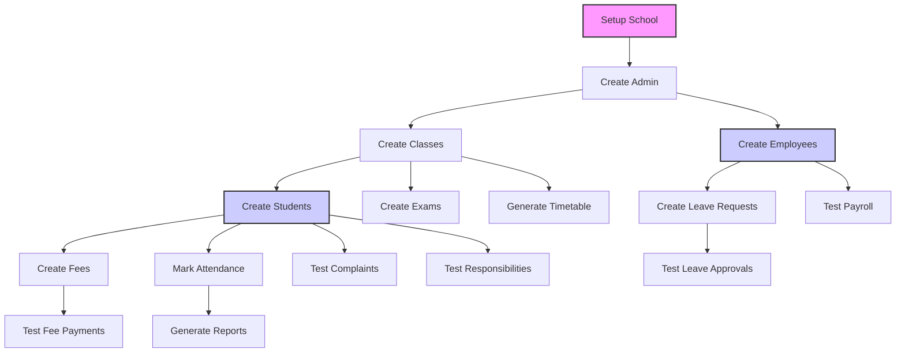

# Test Data Dependencies and Prerequisites

## Overview
This document outlines the test data requirements, dependencies, and prerequisites for testing all 42 API categories. It provides a systematic approach to creating and managing test data across the multi-phase testing plan.

## Core Test Data Entities

### 1. School Entity (Foundation)
**Required for:** 38/42 categories (all RLS-authenticated endpoints)

| Field | Test Value | Source |
|-------|------------|--------|
| `schoolId` | `test-school-001` | Created via `/api/setup/school` |
| `schoolName` | `Modern Test School` | Setup payload |
| `adminId` | `test-admin-001` | Created via auth APIs |
| `adminEmail` | `admin@testschool.com` | Auth payload |
| `adminPassword` | `TestPass123!` | Environment variable |

### 2. Student Entities
**Required for:** 15 categories (Students, Fees, Attendance, etc.)

| Field | Test Value | Notes |
|-------|------------|-------|
| `studentId` | `STU-001` to `STU-010` | Auto-generated |
| `studentName` | `Test Student {n}` | Varies by test |
| `className` | `Class 10A` | Must match created class |
| `rollNumber` | `1001` to `1010` | Sequential |
| `parentPhone` | `+911234567890` | Valid Indian format |

### 3. Employee Entities
**Required for:** 12 categories (Employees, Leave, Payroll, etc.)

| Field | Test Value | Notes |
|-------|------------|-------|
| `employeeId` | `EMP-001` to `EMP-005` | Auto-generated |
| `employeeName` | `Test Teacher {n}` | Varies by test |
| `role` | `teacher`, `principal`, `staff` | Different roles |
| `department` | `mathematics`, `science`, `admin` | Department mapping |
| `salary` | `35000.00` | Base salary for payroll |

### 4. Class & Subject Entities
**Required for:** 8 categories (Classes, Exams, Timetable, etc.)

| Field | Test Value | Notes |
|-------|------------|-------|
| `className` | `Class 10A`, `Class 9B` | Multiple classes |
| `subjectName` | `Mathematics`, `Science`, `English` | Core subjects |
| `teacherId` | `EMP-001` (references employee) | Teacher assignment |

## Dependency Graph



## Phase-wise Data Requirements

### Phase 1: Foundation (COMPLETED)
**Data Needed:** None (health checks are stateless)

### Phase 2: School Management Core
**Categories:** 6-10 (Employees, Leave, Fees, Class, Exam)

| Category | Prerequisites | Test Data to Create |
|----------|---------------|---------------------|
| Employee Management | School, Admin | 5 employees with different roles |
| Leave Management | School, Admin, Employees | 3 leave requests per employee |
| Fee Management | School, Admin, Students | Fee structure, 10 student fees |
| Class Management | School, Admin | 3 classes, 5 subjects each |
| Exam Management | School, Admin, Classes | 2 exams per class |

### Phase 3: Academic Operations
**Categories:** 11-15 (Timetable, Complaints, Notifications, AI, OCR)

| Category | Prerequisites | Test Data to Create |
|----------|---------------|---------------------|
| Timetable Management | School, Admin, Classes, Employees | Weekly timetable for each class |
| Complaint Management | School, Admin, Students | 5 complaints from students |
| Notification APIs | School, Admin | System notifications |
| AI & Content Generation | School, Admin, Classes | Lesson plans, exam questions |
| OCR Processing | School, Admin | Sample document files |

### Phase 4: Infrastructure & Integration
**Categories:** 16-20 (Geo, Storage, API Keys, Webhooks, Public API)

| Category | Prerequisites | Test Data to Create |
|----------|---------------|---------------------|
| Geo & Location APIs | School, Admin | Country/state/district data |
| Storage & Upload APIs | School, Admin | Test files (PDF, images) |
| API Key Management | School, Admin | 3 API keys with different scopes |
| Webhook Management | School, Admin | 2 webhook endpoints |
| Public Developer API | School, Admin, Students, API Key | Public data access |

### Phase 5: Authentication & Security
**Categories:** 21-25 (Auth, School Self, Setup, Tasks, Spaces)

| Category | Prerequisites | Test Data to Create |
|----------|---------------|---------------------|
| Authentication APIs | None (creates data) | Multiple user types |
| School Self-Management | School, Admin | School profile data |
| Setup & Configuration | None (initial setup) | Complete school setup |
| Task Management | School, Admin | 10 system tasks |
| Space & Material Management | School, Admin | 5 spaces, 10 materials |

### Phase 6: Resource Management
**Categories:** 26-30 (Materials, Awards, Documents, Reminders)

| Category | Prerequisites | Test Data to Create |
|----------|---------------|---------------------|
| Academic Materials | School, Admin, Classes | 10 teaching materials |
| Awards Management | School, Admin, Students | 5 student awards |
| Document Upload | School, Admin, Students | Student documents |
| Document Box | School, Admin | Document repository |
| Reminder Management | School, Admin | System reminders |

### Phase 7: Advanced Responsibility System
**Categories:** 31 (Responsibility Management)

| Category | Prerequisites | Test Data to Create |
|----------|---------------|---------------------|
| Responsibility Management | School, Admin, Employees, Students, Spaces | 20 responsibility assignments |

### Phase 8: Specialized Modules
**Categories:** 32-36 (Payment, Chat, Transport, WebSocket, Events)

| Category | Prerequisites | Test Data to Create |
|----------|---------------|---------------------|
| Payment Processing | School, Admin, Students, Fees | Payment transactions |
| Chat System | School, Admin, Employees, Students | Chat messages |
| Transport Management | School, Admin | Transport routes |
| WebSocket APIs | School, Admin | Real-time connections |
| Events Management | School, Admin | School events |

### Phase 9: Administrative Features
**Categories:** 37-42 (Announcements, Recovery, Payroll, Developer, Holidays)

| Category | Prerequisites | Test Data to Create |
|----------|---------------|---------------------|
| Announcements | School, Admin | System announcements |
| Recovery & Audit | School, Admin, Students, Employees | Audit log entries |
| Employee Payroll | School, Admin, Employees | Salary records |
| Developer Access | School, Admin | Developer accounts |
| School Holidays | School, Admin | Holiday calendar |
| Static File Serving | School, Admin | Uploaded files |

## Test Data Creation Scripts

### 1. Master Setup Script
```javascript
// setup-test-data.js
// Creates all foundational test data
const steps = [
  "Create school via /api/setup/school",
  "Create admin user via /api/auth/school/login",
  "Create classes via /api/class/:schoolId/classes",
  "Create employees via /api/employees/:schoolId",
  "Create students via /api/students/:schoolId",
  "Create fee structure via /api/fees/:schoolId",
  "Create materials via /api/materials/:schoolId"
];
```

### 2. Phase-specific Setup Scripts
```javascript
// setup-phase2.js
// Creates Phase 2 test data
const phase2Data = {
  employees: 5,
  leaveRequests: 3,
  feeRecords: 10,
  classes: 3,
  exams: 2
};
```

### 3. Cleanup Script
```javascript
// cleanup-test-data.js
// Cleans up test data after testing
const cleanupSteps = [
  "Delete all test students",
  "Delete all test employees",
  "Delete all test classes",
  "Reset fee records",
  "Clear audit logs"
];
```

## Environment Variables Strategy

### Master Environment (`environment.bru`)
```json
{
  "baseUrl": "http://localhost:3000",
  "schoolId": "test-school-001",
  "adminId": "test-admin-001",
  "superAdminToken": "{{SUPER_ADMIN_TOKEN}}",
  "apiKey": "{{DEV_API_KEY}}",
  "uploadToken": "{{UPLOAD_TOKEN}}"
}
```

### Category-specific Variables
```json
{
  "studentIds": ["STU-001", "STU-002", "STU-003"],
  "employeeIds": ["EMP-001", "EMP-002", "EMP-003"],
  "classNames": ["Class 10A", "Class 9B", "Class 8C"],
  "feeStructureId": "FEE-2025-001"
}
```

### Dynamic Variables (Created during testing)
```json
{
  "createdStudentId": "",
  "createdEmployeeId": "",
  "createdLeaveId": "",
  "createdFeeId": "",
  "createdExamId": ""
}
```

## Data Dependency Resolution

### Order of Creation
1. **School & Admin** (Foundation)
2. **Classes & Subjects** (Academic structure)
3. **Employees** (Teaching staff)
4. **Students** (Learners)
5. **Fees & Payments** (Financial)
6. **Attendance & Leave** (Operations)
7. **Materials & Resources** (Teaching aids)
8. **Assessments & Exams** (Evaluation)
9. **Reports & Analytics** (Insights)

### Circular Dependencies Handling
**Problem:** Some APIs require data that depends on other APIs
**Solution:** Use mock data or create minimal valid data first

Example: Employee payroll needs employee, which needs school
```javascript
// Step 1: Create school (minimal data)
const school = await createSchool({name: "Test School"});

// Step 2: Create employee (references school)
const employee = await createEmployee({
  schoolId: school.id,
  name: "Test Employee"
});

// Step 3: Test payroll (references employee)
await testPayroll({
  schoolId: school.id,
  employeeId: employee.id
});
```

## Test Data Quality Requirements

### Validity Requirements
1. **Realistic Data:** Use realistic names, emails, phone numbers
2. **Valid Formats:** Dates in ISO format, phones with country codes
3. **Consistent References:** IDs must reference existing entities
4. **Business Logic Compliance:** Data must follow business rules

### Volume Requirements
1. **Minimum:** Enough to test all scenarios (3-5 records per type)
2. **Edge Cases:** Include boundary values (empty, max length, special chars)
3. **Variety:** Different data types for comprehensive testing

### Cleanup Requirements
1. **Isolation:** Test data should not affect production
2. **Clean State:** Start each test phase with clean data
3. **Idempotency:** Setup scripts should be re-runnable

## Common Test Data Patterns

### 1. Student Creation Pattern
```json
{
  "name": "Test Student {{$randomFirstName}} {{$randomLastName}}",
  "email": "student{{$randomInt 1 100}}@testschool.com",
  "phone": "+91{{$randomPhoneNumber}}",
  "className": "{{className}}",
  "rollNumber": "{{$randomInt 1000 9999}}"
}
```

### 2. Employee Creation Pattern
```json
{
  "name": "Test {{$randomEmployeeRole}} {{$randomFirstName}}",
  "email": "{{role}}.{{$randomInt 1 50}}@testschool.com",
  "role": "{{$randomEmployeeRole}}",
  "department": "{{$randomDepartment}}",
  "salary": "{{$randomInt 25000 75000}}.00"
}
```

### 3. Fee Creation Pattern
```json
{
  "studentId": "{{studentId}}",
  "feeType": "{{$randomFeeType}}",
  "amount": "{{$randomInt 1000 5000}}.00",
  "dueDate": "{{$timestamp addDays 30}}",
  "description": "{{$randomFeeDescription}}"
}
```

## Error Case Test Data

### 1. Invalid Data Tests
```json
{
  "invalidEmails": ["not-an-email", "missing@", "@domain.com"],
  "invalidPhones": ["123", "abc", "+"],
  "invalidDates": ["2025-13-45", "not-a-date", ""],
  "invalidAmounts": ["-100", "not-a-number", "100.1234"]
}
```

### 2. Boundary Value Tests
```json
{
  "maxLengthNames": "A".repeat(255),
  "minLengthNames": "A",
  "emptyStrings": "",
  "nullValues": null,
  "veryLargeNumbers": "999999999999.99"
}
```

### 3. Security Test Data
```json
{
  "sqlInjection": "'; DROP TABLE students; --",
  "xssPayload": "<script>alert('xss')</script>",
  "pathTraversal": "../../../etc/passwd",
  "jsonInjection": {"__proto__": {"admin": true}}
}
```

## Data Reset Strategies

### 1. Full Reset (Between Phases)
```bash
# Reset database to clean state
npm run db:reset
npm run db:seed-test
```

### 2. Partial Reset (Between Categories)
```javascript
// Delete only test data, keep configuration
await deleteTestStudents();
await deleteTestEmployees();
await deleteTestFees();
```

### 3. Incremental Reset (Between Tests)
```javascript
// Rollback only the last test's data
const transaction = startTransaction();
// Run test
if (testFailed) {
  transaction.rollback();
}
```

## Monitoring Test Data Health

### Health Checks
1. **Referential Integrity:** All foreign keys reference valid rows
2. **Data Freshness:** Test data is not too old
3. **Consistency:** Data follows business rules
4. **Completeness:** All required fields have values

### Validation Script
```javascript
// validate-test-data.js
const checks = [
  "Verify school exists",
  "Verify admin can authenticate",
  "Verify student count > 0",
  "Verify employee count > 0",
  "Verify class count > 0"
];
```

## Backup and Recovery

### Test Data Backup
```bash
# Backup test data before major changes
pg_dump test_db > test-data-backup.sql
```

### Test Data Recovery
```bash
# Restore test data if corrupted
psql test_db < test-data-backup.sql
```

## Next Steps for Test Data Implementation

### Immediate (Week 2)
1. Create master setup script for Phase 2 data
2. Define environment variables for employee/student IDs
3. Create sample request bodies for each endpoint
4. Set up data validation checks

### Short-term (Weeks 3-4)
1. Expand setup scripts for Phases 3-4
2. Create error case test data
3. Implement data cleanup procedures
4. Add monitoring for test data health

### Long-term (Weeks 5-10)
1. Create comprehensive test data management system
2. Implement data versioning for different test scenarios
3. Add performance test data (large volumes)
4. Create data migration scripts for schema changes

This test data dependencies plan ensures that each phase has the necessary prerequisites and that test data is created, managed, and cleaned up systematically throughout the testing process.